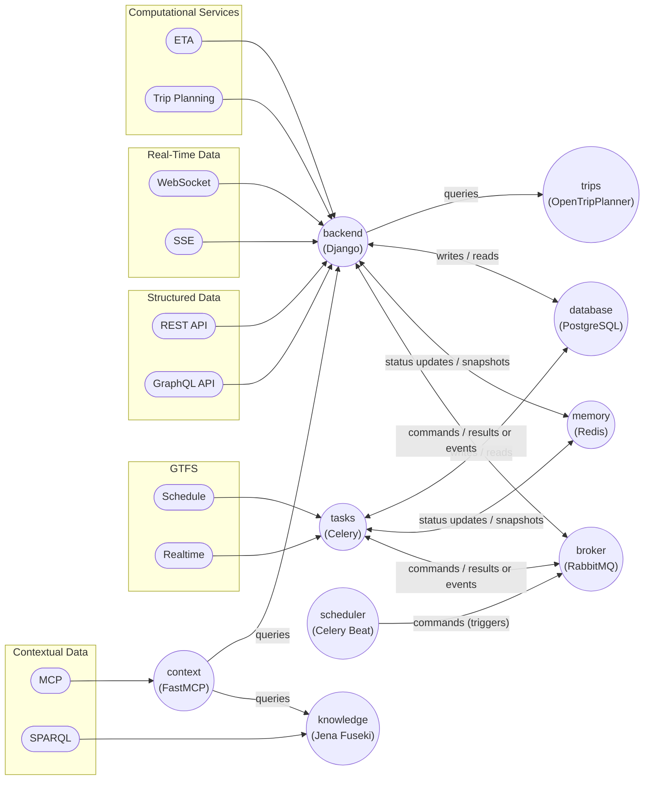

# Infobús Architecture

```mermaid
flowchart LR
    subgraph GTFS
        schedule([Schedule])
        realtime([Realtime])
    end
    subgraph Structured Data
        api([REST API])
        graphql([GraphQL API])
    end
    subgraph Real-Time Data
        ws([WebSocket])
        sse([SSE])
    end
    subgraph Contextual Data
        mcp([MCP])
        sparql([SPARQL])
    end
    subgraph Computational Services
        eta([ETA])
        tp([Trip Planning])
    end
    
    backend(("backend<br/>(Django)"))
    tasks(("tasks<br/>(Celery)"))
    broker(("broker<br/>(RabbitMQ)"))
    scheduler(("scheduler<br/>(Celery Beat)"))
    memory(("memory<br/>(Redis)"))
    database(("database<br/>(PostgreSQL)"))
    context(("context<br/>(FastMCP)"))
    knowledge(("knowledge<br/>(Jena Fuseki)"))
    trips(("trips<br/>(OpenTripPlanner)"))

    schedule --> tasks
    realtime --> tasks
    tasks <--"commands / results or events"--> broker
    tasks <--"status updates / snapshots"--> memory
    tasks <--"writes / reads"--> database
    scheduler --"commands (triggers)"--> broker
    backend <--"commands / results or events"--> broker
    backend <--"status updates / snapshots"--> memory
    backend <--"writes / reads"--> database
    backend --"queries"--> trips
    context --"queries"--> knowledge
    context --"queries"--> backend
    mcp --> context
    sparql --> knowledge
    api --> backend
    graphql --> backend
    ws --> backend
    sse --> backend
    tp --> backend
    eta --> backend

```