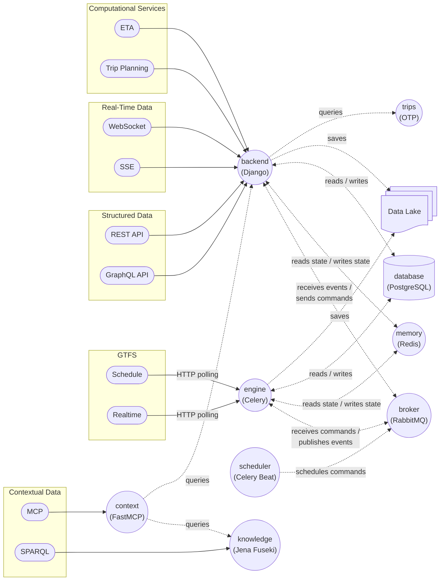

# Infobús Architecture

`core` is a folder with the codebase for `backend`, `engine` and `scheduler`. It contains the Django project and the Celery Worker and Celery Beat apps. This way, `engine` has access to the Django models and utilities.

