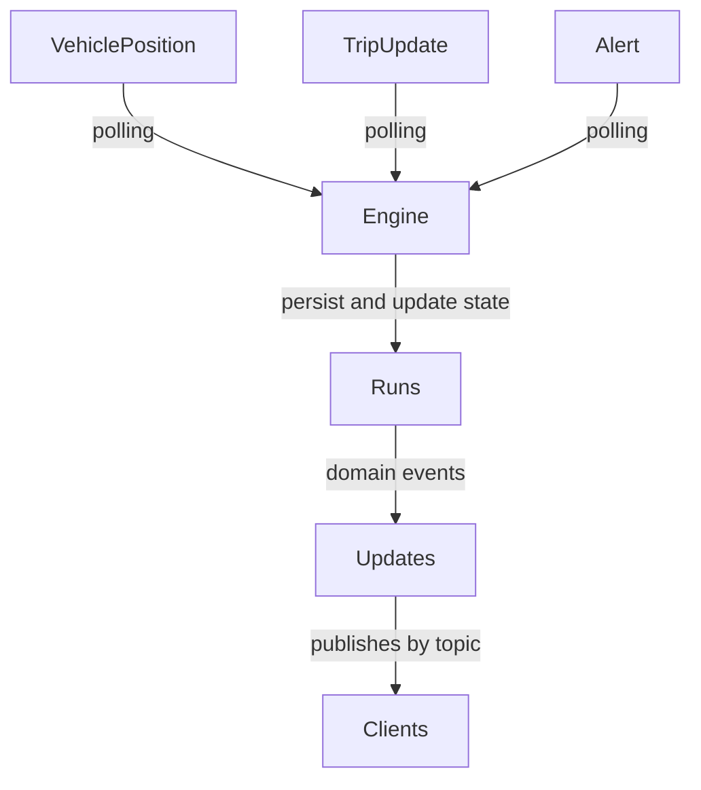
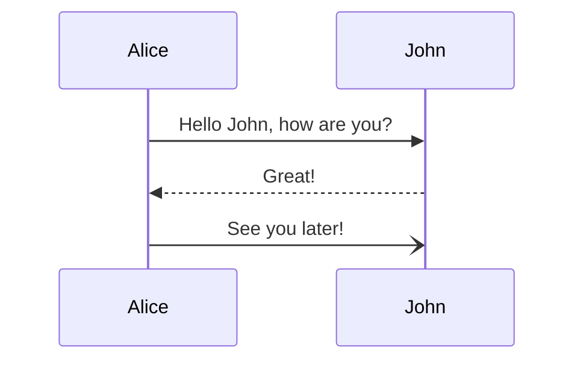
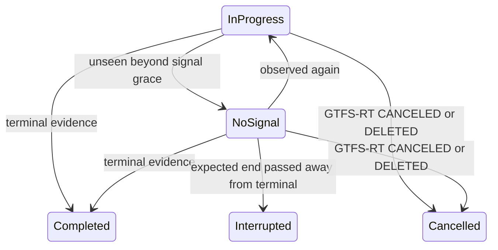

# Backend (`orchestrator` container)

This is a Django project with the following apps:

- `api`: Exposes REST API endpoints with most of the data in the database.
- `engine`: Executes asynchronous, periodical tasks with Celery.
- `feed`: Creates the GTFS database models.
- `runs`: Implements a mirror finite-state machine of the active runs (trips) and handles domain events.
- `updates`: Builds and delivers real-time messages to subscribers.
- `website`: Miscellaneous sites (like the homepage).



Sequence diagram:



## API (`api`)

## Engine (`engine`)

In `tasks.py`, this app registers all periodic actions and some other asynchronous tasks, notably the fetch of GTFS Schedule (every few hours) and GTFS Realtime (every few seconds).

## Feed (`feed`)

By subclassing the base GTFS models from `gtfs-django`, this app creates and handles the GTFS data and some utility functions.

## Runs (`runs`)

This app defines the states of the finite-state machine that models the lifecycle of a trip.

### Run Registration

A run is registered in the `Run` model in the database when a new trip is observed in the GTFS Realtime feed.

Previous life of a run: a driver or dispatcher starts a run (instance of a trip) and Databús starts publishing the corresponding entity in `TripUpdate` and `VehiclePosition`.

#### Characteristics and assumptions

- When no data is available (e.g., out of mobile coverage), GTFS Realtime will not publish data related to that run, even if it's still active, thus we need to process that and keep the run "alive".


### Redis Keys

The anatomy of the key is `trip:<run_id>:<field_name>`, where:

| Field          | Description                                       |
| -------------- | ------------------------------------------------- |
| `trip`         | The entity type, in this case a trip.             |
| `<run_id>`     | The UUIDv7 of the run (an instance of a trip).    |
| `<field_name>` | The name of the GTFS Realtime field being stored. |

#### Active runs

A transit-system-scoped set of runs that may still be operating. It includes
both `In Progress` and `No Signal` runs. Only terminal lifecycle transitions
remove a run from this set.

| Key        | Value                                             |
| ---------- | ------------------------------------------------- |
| Redis key  | `<transit_system>:runs:active`                    |
| Redis type | set                                               |
| Values     | `run_id`                                          |
| Update     | on successful observation or lifecycle transition |

The former `trip:in_progress` key is legacy data and is removed by the
`reconcile_active_runs` management command.

#### Run observation and feed health

| Key                                                                        | Type       | Purpose                                                         |
| -------------------------------------------------------------------------- | ---------- | --------------------------------------------------------------- |
| `<transit_system>:runs:last_seen`                                          | sorted set | Server receipt time for each observed run, scored as Unix time. |
| `<transit_system>:publisher:<publisher_id>:vehicle_positions:last_success` | string     | Last successful VehiclePositions poll.                          |
| `<transit_system>:publisher:<publisher_id>:trip_updates:last_success`      | string     | Last successful TripUpdates poll.                               |
| `<transit_system>:run:<run_id>:lifecycle_state`                            | string     | Current persisted lifecycle state mirrored in Redis.            |

Server receipt time is used for silence detection. The GTFS entity timestamp is
kept as telemetry but is not trusted as the lifecycle heartbeat.

### Run lifecycle detection

The task `engine.tasks.evaluate_run_lifecycles` runs every 60 seconds. It only
uses absence as evidence when every configured run-bearing realtime source for
the publisher has a recent successful poll. A publisher outage therefore does
not age its runs.



The evaluator combines feed health, server-side observation time, current stop
sequence and status, final stop sequence, expected final arrival/departure, and
explicit `CANCELED` or `DELETED` relationships.

| Setting                              | Default | Purpose                                                   |
| ------------------------------------ | ------: | --------------------------------------------------------- |
| `RUN_FEED_HEALTH_MAX_AGE_SECONDS`    |      75 | Suspend absence evaluation when source health is older.   |
| `RUN_NO_SIGNAL_AFTER_SECONDS`        |     120 | Silence before an observed run becomes `No Signal`.       |
| `RUN_TERMINAL_SILENCE_GRACE_SECONDS` |     120 | Silence after stopping at the terminal before completion. |
| `RUN_EXPECTED_END_GRACE_SECONDS`     |     900 | Grace after expected end before terminal classification.  |
| `RUN_UNKNOWN_TIMEOUT_SECONDS`        |    1800 | Silence before interrupting a run with no expected end.   |
| `RUN_TERMINAL_STATE_TTL_SECONDS`     |   86400 | Retention of terminal Redis state.                        |
| `RUN_LIFECYCLE_EVALUATION_LOCK_SECONDS` | 120 | Renewable TTL preventing overlapping lifecycle evaluations. |
| `GTFS_RT_STOP_TIME_UPDATE_PAST_TOLERANCE_SECONDS` | 120 | Past-time tolerance for public stop prediction snapshots. |

`No Signal` is nonterminal and remains active. Reappearance publishes
`RunSignalRestored`. Terminal transitions persist `ended_at` and
`completion_reason`, remove active membership, clean stop indexes, retain state
with a TTL, and publish `RunCompleted`, `RunInterrupted`, or `RunCancelled`.

Preview legacy reconciliation after canonical tracking has accumulated healthy
polls:

```bash
python manage.py reconcile_active_runs --minimum-age-minutes 60
```

Apply only after reviewing the dry-run count:

```bash
python manage.py reconcile_active_runs --minimum-age-minutes 60 --apply
```

#### Vehicle Positions GTFS Realtime Feed Message

Realtime positioning information for a given vehicle.

##### Trip

| Key          | Value                                                                                          |
| ------------ | ---------------------------------------------------------------------------------------------- |
| Redis key    | `trip:<run_id>:trip`                                                                           |
| Redis type   | hash                                                                                           |
| GTFS message | `TripDescriptor`                                                                               |
| GTFS fields  | `trip_id`, `route_id`, `direction_id?`, `schedule_relationship?`, `start_time?`, `start_date?` |
| Update       | on run registration                                                                            |

##### Vehicle

| Key          | Value                                                       |
| ------------ | ----------------------------------------------------------- |
| Redis key    | `trip:<run_id>:vehicle`                                     |
| Redis type   | hash                                                        |
| GTFS message | `VehicleDescriptor`                                         |
| GTFS fields  | `id?`, `label?`, `license_plate?`, `wheelchair_accessible?` |
| Update       | on run registration                                         |

##### Position

| Key          | Value                                                      |
| ------------ | ---------------------------------------------------------- |
| Redis key    | `trip:<run_id>:position`                                   |
| Redis type   | hash                                                       |
| GTFS message | `Position`                                                 |
| GTFS fields  | `latitude`, `longitude`, `bearing?`, `odometer?`, `speed?` |
| Update       | on each fetch                                              |

##### Current stop sequence

| Key        | Value                                 |
| ---------- | ------------------------------------- |
| Redis key  | `trip:<run_id>:current_stop_sequence` |
| Redis type | string                                |
| GTFS field | `current_stop_sequence`               |
| GTFS type  | uint32                                |
| Update     | on event `CurrentStopSequenceChanged` |

##### Stop ID

| Key        | Value                    |
| ---------- | ------------------------ |
| Redis key  | `trip:<run_id>:stop_id`  |
| Redis type | string                   |
| GTFS field | `stop_id`                |
| GTFS type  | string                   |
| Update     | on event `StopIdChanged` |

##### Current status

| Key              | Value                                        |
| ---------------- | -------------------------------------------- |
| Redis key        | `trip:<run_id>:current_status`               |
| Redis type       | string                                       |
| GTFS field       | `current_status`                             |
| GTFS enum        | VehicleStopStatus                            |
| GTFS enum values | `INCOMING_AT`, `STOPPED_AT`, `IN_TRANSIT_TO` |
| Update           | on event `CurrentStatusChanged`              |

##### Timestamp

| Key        | Value                     |
| ---------- | ------------------------- |
| Redis key  | `trip:<run_id>:timestamp` |
| Redis type | string                    |
| GTFS field | `timestamp`               |
| GTFS type  | uint64                    |
| Update     | on each fetch             |

##### Congestion level

| Key              | Value                                                                                            |
| ---------------- | ------------------------------------------------------------------------------------------------ |
| Redis key        | `trip:<run_id>:congestion_level`                                                                 |
| Redis type       | string                                                                                           |
| GTFS field       | `congestion_level`                                                                               |
| GTFS enum        | `CongestionLevel`                                                                                |
| GTFS enum values | `UNKNOWN_CONGESTION_LEVEL`, `RUNNING_SMOOTHLY`, `STOP_AND_GO`, `CONGESTION`, `SEVERE_CONGESTION` |
| Update           | on event `CongestionLevelChanged`                                                                |

##### Occupancy status

| Key              | Value                                                                                                                                                                                |
| ---------------- | ------------------------------------------------------------------------------------------------------------------------------------------------------------------------------------ |
| Redis key        | `trip:<run_id>:occupancy_status`                                                                                                                                                     |
| Redis type       | string                                                                                                                                                                               |
| GTFS field       | `occupancy_status`                                                                                                                                                                   |
| GTFS enum        | `OccupancyStatus`                                                                                                                                                                    |
| GTFS enum values | `EMPTY`, `MANY_SEATS_AVAILABLE`, `FEW_SEATS_AVAILABLE`, `STANDING_ROOM_ONLY`, `CRUSHED_STANDING_ROOM_ONLY`, `FULL`, `NOT_ACCEPTING_PASSENGERS`, `NO_DATA_AVAILABLE`, `NOT_BOARDABLE` |
| Update           | on event `OccupancyStatusChanged`                                                                                                                                                    |

##### Occupancy percentage

| Key        | Value                                 |
| ---------- | ------------------------------------- |
| Redis key  | `trip:<run_id>:occupancy_percentage`  |
| Redis type | string                                |
| GTFS field | `occupancy_percentage`                |
| GTFS type  | uint32                                |
| Update     | on event `OccupancyPercentageChanged` |

##### Carriage details

| Key          | Value                                  |
| ------------ | -------------------------------------- |
| Redis key    | `trip:<run_id>:multi_carriage_details` |
| Redis type   | JSON                                   |
| GTFS field   | `multi_carriage_details`               |
| GTFS message | `CarriageDetails`                      |
| Update       | on each fetch                          |

#### Trip Updates GTFS Realtime Feed Message

Realtime update on the progress of a vehicle along a trip.

Note: `trip:<run_id>:trip`, `trip:<run_id>:vehicle`, and `trip:<run_id>:timestamp` are the same for both `VehiclePosition` and `TripUpdate` messages.

##### Stop time updates

| Key          | Value                             |
| ------------ | --------------------------------- |
| Redis key    | `trip:<run_id>:stop_time_updates` |
| Redis type   | JSON                              |
| GTFS field   | `stop_time_updates`               |
| GTFS message | `StopTimeUpdate`                  |
| Update       | on each fetch                     |

##### Delay

| Key        | Value                   |
| ---------- | ----------------------- |
| Redis key  | `trip:<run_id>:delay`   |
| Redis type | string                  |
| GTFS field | `delay`                 |
| GTFS type  | int32                   |
| Update     | on event `DelayChanged` |

##### Trip properties

| Key          | Value                                                                                       |
| ------------ | ------------------------------------------------------------------------------------------- |
| Redis key    | `trip:<run_id>:trip_properties`                                                             |
| Redis type   | hash                                                                                        |
| GTFS field   | `trip_properties`                                                                           |
| GTFS message | `TripProperties`                                                                            |
| GTFS fields  | `trip_id?`, `start_date?`, `start_time?`, `trip_headsign?`, `trip_short_name?`, `shape_id?` |
| Update       | on event `TripPropertiesChanged`                                                            |

#### Alerts GTFS Realtime Feed Message

##### Active period

| Key          | Value                             |
| ------------ | --------------------------------- |
| Redis key    | `alert:<entity_id>:active_period` |
| Redis type   | hash                              |
| GTFS field   | `active_period`                   |
| GTFS message | `TimeRange`                       |
| GTFS fields  | `start?`, `end?`                  |
| Update       | on event `ActivePeriodChanged`    |

### Domain Events

The `runs` app emits the following domain events for trips:

- `CurrentStopSequenceChanged`
- `StopIdChanged`
- `CurrentStatusChanged`
- `CongestionLevelChanged`
- `OccupancyStatusChanged`
- `OccupancyPercentageChanged`
- `DelayChanged`
- `TripPropertiesChanged`

And the following domain events for alerts:

- `ActivePeriodChanged`

## Updates (`updates`)

This apps implements a Django Channels service with WebSocket in a pub-sub fashion for clients (websites, screens, others) to connect with a real-time topic update service.

The topics follow this pattern:

```python
<entity>.<info>.<primary_selector>.<primary_value>[.<qualifier_selector>.<qualifier_value>]
```

The projection stage creates a registry with, for example:

```python
ProjectionSpec(
    name="route_alerts_by_route",
    topic_pattern="route.alerts.by_route.{route_id}",
    triggers=[AlertChanged, AlertRemoved],
    resolve_topics=affected_route_alert_topics,
    build=RouteAlertsBuilder,
    policy="on_change",
)
```

using a typed topic key like

```python
TopicKey(
    entity="route",
    info="alerts",
    primary_selector="by_route",
    primary_value=route_id,
    qualifier_selector="by_direction",
    qualifier_value=direction_id,
)
```

The projections and builders follow the same directory structure:

```bash
[projections, builders]/<entity>/<info>.py
```

where the `primary_value` and `qualifier_value` are resolved inside.
