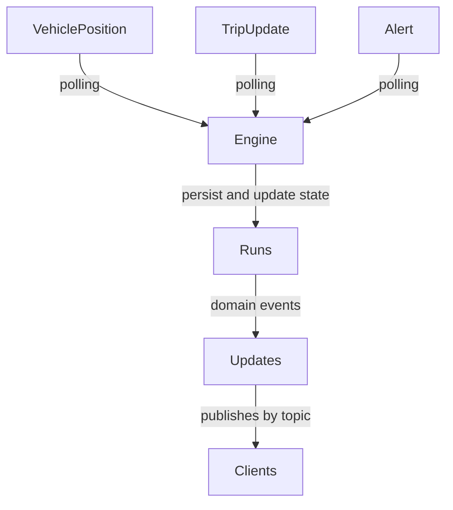
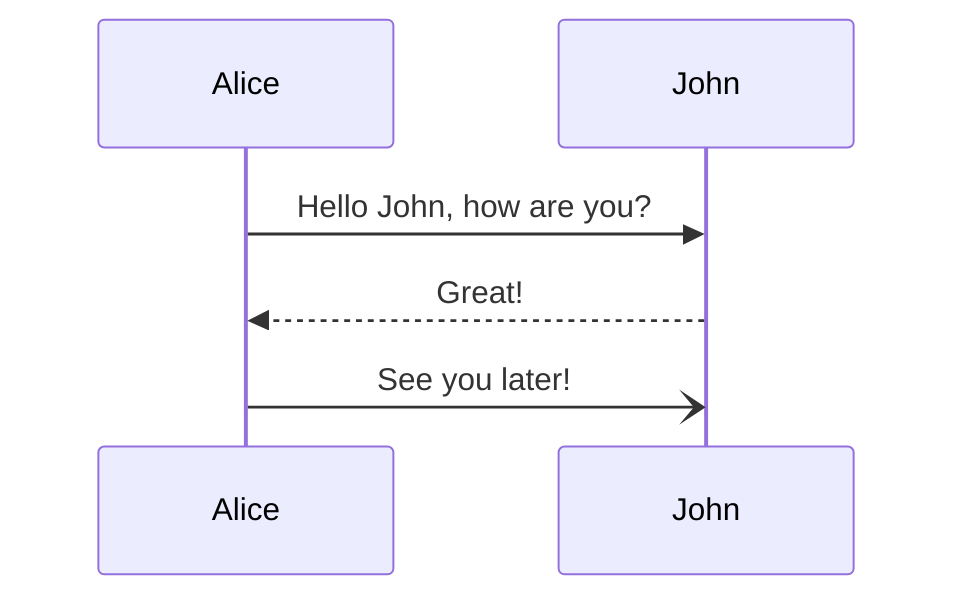
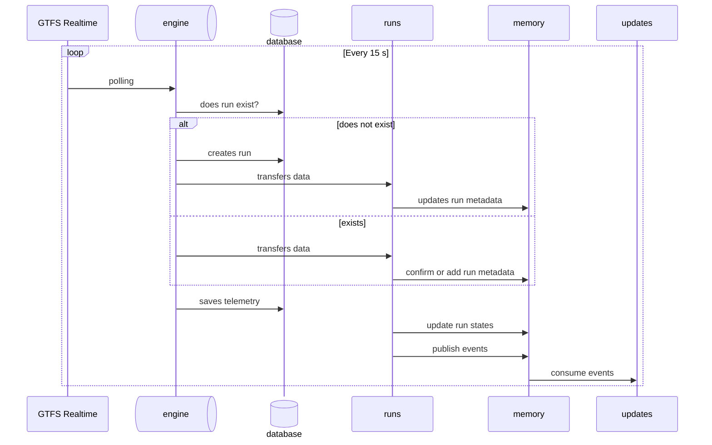

# Backend (`orchestrator` container)

This is a Django project with the following apps:

- `api`: Exposes REST API endpoints with most of the data in the database.
- `engine`: Executes asynchronous, periodical tasks with Celery.
- `feed`: Creates the GTFS database models.
- `runs`: Implements a mirror finite-state machine of the active runs (trips) and handles domain events.
- `updates`: Builds and delivers real-time messages to subscribers.
- `website`: Miscellaneous sites (like the homepage).
- `screens`: Test screens (to be removed, migrate test screen to `website`).



Sequence diagram:



## API (`api`)

## Engine (`engine`)

In `tasks.py`, this app registers all periodic actions and some other asynchronous tasks, notably the fetch of GTFS Schedule (every few hours) and GTFS Realtime (every few seconds).

## Feed (`feed`)

By subclassing the base GTFS models from `gtfs-django`, this app creates and handles the GTFS data and some utility functions.

## Runs (`runs`)

This app defines the states of the finite-state machine that models the lifecycle of a trip.

### Run Registration

A run is registered in the `Run` model in the database when a new trip is observed in the GTFS Realtime feed.

Previous life of a run: a driver or dispatcher starts a run (instance of a trip) and Databús starts publishing the corresponding entity in `TripUpdate` and `VehiclePosition`.

#### Characteristics and assumptions

- When no data is available (e.g., out of mobile coverage), GTFS Realtime will not publish data related to that run, even if it's still active, thus we need to process that and keep the run "alive".



### Domain Events

The `runs` app emits domain events, like:

```
VehiclePositionObserved
RunOccupancyChanged
RunCongestionChanged
RunVehicleStopStatusChanged
StopTimeUpdateChanged
AlertChanged
AlertRemoved
VehicleChanged
```

## Updates (`updates`)

This apps implements a Django Channels service with WebSocket in a pub-sub fashion for clients (websites, screens, others) to connect with a real-time topic update service.

The topics follow this pattern:

```python
<entity>.<info>.<primary_selector>.<primary_value>[.<qualifier_selector>.<qualifier_value>]
```

The projection stage creates a registry with, for example:

```python
ProjectionSpec(
    name="route_alerts_by_route",
    topic_pattern="route.alerts.by_route.{route_id}",
    triggers=[AlertChanged, AlertRemoved],
    resolve_topics=affected_route_alert_topics,
    build=RouteAlertsBuilder,
    policy="on_change",
)
```

using a typed topic key like

```python
TopicKey(
    entity="route",
    info="alerts",
    primary_selector="by_route",
    primary_value=route_id,
    qualifier_selector="by_direction",
    qualifier_value=direction_id,
)
```

The projections and builders follow the same directory structure:

```bash
[projections, builders]/<entity>/<info>.py
```

where the `primary_value` and `qualifier_value` are resolved inside.
