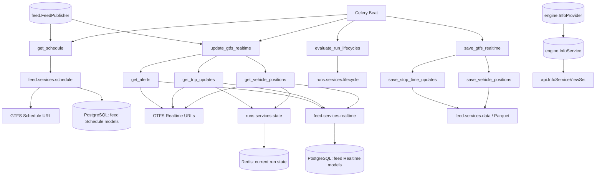
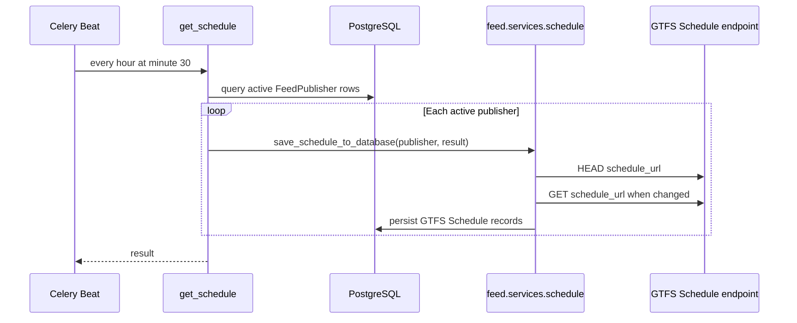
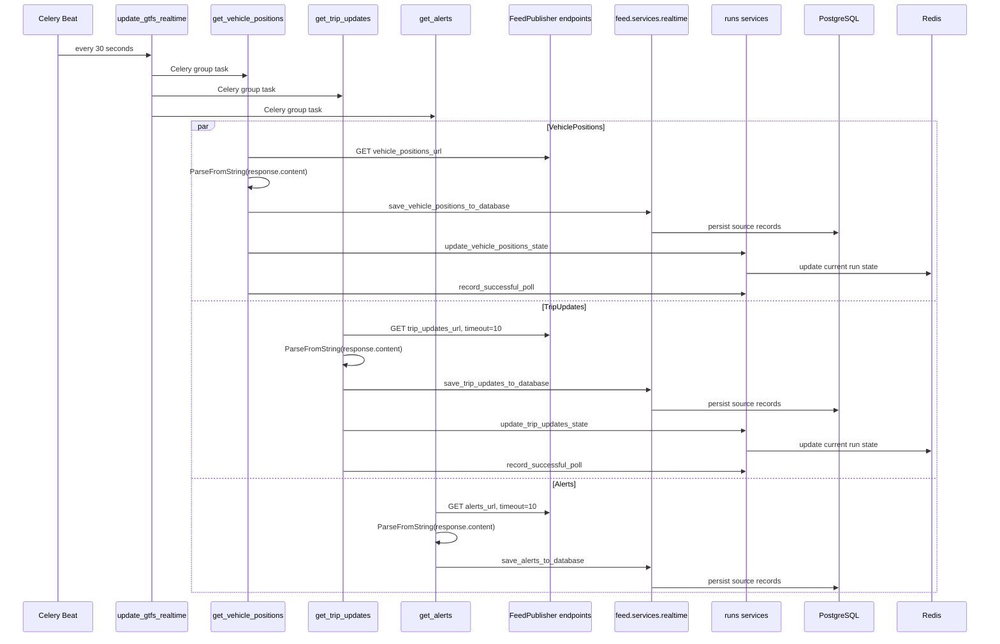
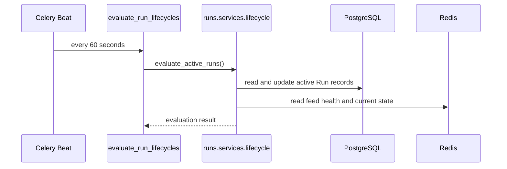
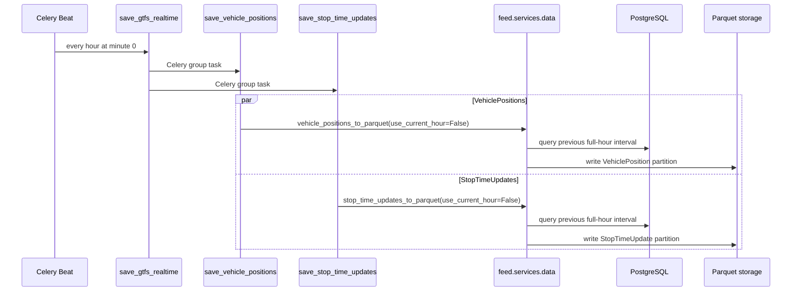

# Engine

The `engine` Django app coordinates scheduled acquisition, persistence, current
run-state updates, lifecycle evaluation, and historical exports for Infobús®.
It is an orchestration layer: it starts work and connects services owned by
other apps, while owning only a small information-service catalog of its own.

The app sits between two interfaces:

- On the input side, Celery Beat invokes `engine.tasks`, and active
  `feed.FeedPublisher` rows provide the GTFS Schedule and Realtime endpoint
  URLs used by those tasks.
- On the output side, `engine` delegates schedule and realtime persistence to
  `feed`, delegates current run state and lifecycle policy to `runs`, launches
  Parquet exports through `feed.services.data`, and exposes `InfoService`
  indirectly through the project-level API app.

The boundary is not uniform. Schedule HTTP acquisition is delegated to
`feed.services.schedule`, while VehiclePositions, TripUpdates, and Alerts are
fetched and decoded directly in `engine.tasks`. The app does not own the GTFS
models it populates, the run-state structures it updates, a public HTTP URLconf,
or a working WebSocket protocol.

## Overview

The connected runtime path has six stages:

1. **Schedule:** Celery Beat starts `get_schedule()` once per hour; the task
   selects active publishers and delegates HTTP acquisition and persistence to
   `feed.services.schedule`.
2. **Realtime fan-out:** every 30 seconds, `update_gtfs_realtime()` dispatches
   VehiclePositions, TripUpdates, and Alerts as a Celery group.
3. **Fetch and decode:** each realtime child task requests its publisher URL and
   decodes the response as a GTFS Realtime `FeedMessage`.
4. **Persist and project:** `feed.services.realtime` stores source records;
   VehiclePositions and TripUpdates additionally update current run state and
   record successful source polls through `runs`.
5. **Evaluate lifecycle:** every 60 seconds,
   `evaluate_run_lifecycles()` delegates active-run classification to
   `runs.services.lifecycle.evaluate_active_runs()`.
6. **Export history:** at the start of each hour, `save_gtfs_realtime()`
   launches VehiclePosition and StopTimeUpdate Parquet exports in parallel.



`engine` is therefore a coordinator rather than a domain boundary for all the
data that passes through it. PostgreSQL persistence, Redis state, lifecycle
policy, and Parquet serialization remain implemented in the apps and services
named in the diagram.

## Responsibilities and limits

### Responsibilities

- Declare the nine Celery tasks that coordinate GTFS acquisition, lifecycle
  evaluation, and historical export.
- Select active transit systems and feed publishers before realtime polling.
- Fetch and decode GTFS Realtime VehiclePositions, TripUpdates, and Alerts.
- Delegate Schedule and Realtime database persistence to `feed` services.
- Send decoded VehiclePositions and TripUpdates into `runs.services.state` and
  record successful source polls for lifecycle processing.
- Dispatch periodic lifecycle evaluation into `runs.services.lifecycle`.
- Dispatch hourly VehiclePosition and StopTimeUpdate Parquet exports.
- Define the `InfoProvider` and `InfoService` catalog models and register them in
  Django Admin.

### Inputs

- Celery Beat messages for the four directly scheduled orchestration tasks.
- Active `TransitSystem` and `FeedPublisher` rows from `feed.models`.
- `schedule_url`, `vehicle_positions_url`, `trip_updates_url`, and `alerts_url`
  stored on each publisher.
- HTTP responses containing GTFS Schedule ZIP data or GTFS Realtime protobuf
  payloads.
- The optional `use_current_hour` argument accepted by the two export tasks.

There are no app-specific environment variables for external feed URLs. Those
URLs are database content owned by `FeedPublisher`.

### Outputs

- Calls into `feed.services.schedule` and `feed.services.realtime` that create
  or update GTFS database records.
- Calls into `runs.services.state` that update current operational state and
  return observed run IDs.
- Calls into `runs.services.lifecycle` that record successful polls and
  evaluate active runs.
- Celery group result IDs returned by the two fan-out orchestration tasks.
- Parquet exports produced by `feed.services.data`.
- Durable `InfoProvider` and `InfoService` rows owned by this app.
- A mutable `InfoService` REST resource exposed by the separate `api` app at
  `/api/info-services/`.

### Limits

- `engine` does not define `TransitSystem`, `FeedPublisher`, GTFS Schedule,
  GTFS Realtime, or `Run` models.
- It does not own the Schedule HTTP implementation; that request is made inside
  `feed.services.schedule`.
- It does not implement run lifecycle policy or Redis run-state schemas.
- It does not implement Parquet serialization or select the Parquet storage
  layout.
- It has no working app-specific HTTP route, view, management command, signal,
  or WebSocket consumer.
- API permissions and serialization behavior for `InfoService` are owned by the
  `api` app, not by `engine`.

## Domain model and persistence

The app owns two small catalog models. They are separate from the operational
GTFS acquisition path: none of the nine Celery tasks imports or queries either
model.

### `InfoProvider`

`InfoProvider` represents a provider of information services. Its fields are:

| Field | Django type | Behavior |
|---|---|---|
| `id` | implicit `BigAutoField` | Primary key selected by `EngineConfig.default_auto_field`. |
| `name` | `CharField(max_length=100)` | Provider display name. |
| `description` | `TextField()` | Required free-form description. |

`__str__()` returns `name`. The only connected consumer is Django Admin;
repository code contains no task, API, view, or test that otherwise consumes
`InfoProvider`.

### `InfoService`

`InfoService` represents an information service associated with one provider.
Its fields are:

| Field | Django type | Behavior |
|---|---|---|
| `id` | implicit `BigAutoField` | Primary key selected by `EngineConfig.default_auto_field`. |
| `name` | `CharField(max_length=100)` | Service display name. |
| `description` | `TextField()` | Required free-form description. |
| `type` | `CharField(max_length=10, choices=TYPE_CHOICES)` | Categorizes the service using the literal choices below. |
| `provider` | `ForeignKey(InfoProvider, on_delete=CASCADE)` | Deletes services when their provider is deleted. |
| `created_at` | `DateTimeField(auto_now_add=True)` | Records creation time. |
| `updated_at` | `DateTimeField(auto_now=True)` | Records the most recent save time. |

The literal `TYPE_CHOICES` values and labels are:

```python
TYPE_CHOICES = [
    ("website", "Sitio web"),
    ("screens", "Sistema de pantallas"),
    ("analysis", "Análisis de datos"),
    ("app", "Aplicación móvil"),
    ("chatbot", "Chatbot"),
    ("social", "Redes sociales"),
    ("other", "Otro"),
]
```

`__str__()` returns `name`.

Unlike `InfoProvider`, `InfoService` has a connected output outside Admin.
`api.InfoServiceSerializer` exposes all model fields, and
`api.InfoServiceViewSet` supplies a `ModelViewSet` filtered by `type` and
`name`. The API router publishes it at `/api/info-services/`, and the static
OpenAPI document references the resource at `backend/api/infobus.yml:751` and
defines its schema at `backend/api/infobus.yml:1639`. This is mutable CRUD
exposure rather than a read-only endpoint. The ViewSet does not declare app-specific
`permission_classes`; access control remains the API app's responsibility.

### Migrations

`backend/engine/migrations/0001_initial.py` exists in the current working tree
and creates both models and the `InfoService.provider` foreign key. It is not a
versioned migration: the repository-wide `migrations/` rule at `.gitignore:87`
ignores the entire directory, and `git ls-files backend/engine` returns no
engine migration.

Consequently, `HEAD` contains no migration for either engine-owned table. A
clean clone cannot reconstruct these models from a committed engine migration.
An already deployed database may contain the tables, but that cannot be
inferred from repository state.

## Current implementation status

**Overall status: partially implemented.** The scheduled Schedule, Realtime,
run lifecycle, and Parquet orchestration paths are connected. The app's own
catalog has a real Admin and API integration, but migrations and tests are not
versioned or implemented, and its nominal HTTP/WebSocket scaffolding is dead or
broken.

### Implemented

- Nine Celery tasks cover Schedule acquisition, three GTFS Realtime entity
  feeds, lifecycle evaluation, and two historical exports.
- Celery Beat directly schedules Schedule polling, Realtime fan-out, lifecycle
  evaluation, and Realtime export fan-out.
- VehiclePositions, TripUpdates, and Alerts are fetched and decoded as GTFS
  Realtime protobuf messages.
- Realtime source data is delegated to the corresponding `feed` persistence
  functions.
- VehiclePositions and TripUpdates are sent to `runs` for current-state updates
  and successful-poll tracking.
- Active run lifecycle evaluation delegates to `evaluate_active_runs()`.
- VehiclePosition and StopTimeUpdate exports delegate to the corresponding
  Parquet services.
- `InfoProvider` and `InfoService` are registered in Django Admin.
- `InfoService` is exposed through the separate API app as a DRF
  `ModelViewSet`.

### Partial

- The acquisition boundary is split: Schedule HTTP belongs to `feed`, while
  Realtime HTTP and protobuf decoding belong to `engine`.
- HTTP timeout behavior is inconsistent. TripUpdates and Alerts use ten-second
  timeouts, while VehiclePositions has no timeout.
- None of the reviewed HTTP calls uses `raise_for_status()`.
- Export window selection has a broad input contract: it accepts both booleans
  and selected truthy strings. The task and service signatures document that
  breadth with `use_current_hour: bool | str` rather than narrowing the
  parameter to booleans; return values are annotated as `str`.
- Task logging reports missing configuration and request failures, but there
  are no app-specific metrics, traces, structured logs, or error-reporting
  integration.
- `InfoProvider` is connected only to Admin and the `InfoService` foreign key;
  it has no operational consumer.

### Broken

- `HEAD` contains no versioned initial migration for the app, so a clean clone
  has no committed migration that creates `InfoProvider` or `InfoService`.
- `templates/status.html` opens `/ws/status/`, but no consumer or route for that
  endpoint exists in the current backend.
- `engine/urls.py` is empty and is not included by the root URLconf, so the app
  has no HTTP entrypoint that could serve the status template.

### Scaffolding

- `views.py` contains only the default Django placeholder comment.
- `urls.py` is a zero-byte file with no `urlpatterns`.
- `tests.py` contains only the default Django import and placeholder comment.
- `templates/status.html` is a complete-looking browser client attached to an
  unimplemented server endpoint.
- `EngineConfig` declares only `default_auto_field` and `name`.

### Not found

- No app-specific management commands.
- No signals module or `EngineConfig.ready()` hook.
- No app-specific HTTP views or included URLconf.
- No app-specific WebSocket consumer or `routing.py`.
- No tests exercising models, tasks, scheduling, HTTP behavior, persistence,
  run integration, exports, Admin, or API integration.
- No named module logger, `print()` call, `sentry_sdk`, or `structlog` use in
  `tasks.py`, `models.py`, `views.py`, or `apps.py`.
- No application import of `pika`, `amqp`, or `kombu`, and no AMQP URI in
  application code.

### Not verifiable from repository code alone

- Whether a deployed database already contains the ignored engine migration or
  equivalent tables.
- Whether deployed Celery Beat and worker processes are running the configured
  schedules successfully.
- Availability, authentication requirements, content types, and correctness of
  publisher-provided external feed endpoints.
- Effective API access control after project-wide DRF authentication and
  deployment configuration are applied.
- Operational retention, monitoring, and downstream use of generated Parquet
  files.

## Runtime flows

### Schedule acquisition



`engine.tasks.get_schedule()` does not make the Schedule HTTP request itself.
The `requests.head()` and `requests.get()` calls, ETag comparison, ZIP parsing,
and model persistence live in `feed.services.schedule`. This distinction matters
for ownership of Schedule error handling and network limitations.

### GTFS Realtime polling



Each child task iterates active transit systems and their active publishers.
The Celery group parallelizes the three feed categories; publisher iteration
inside each child task remains synchronous.

VehiclePositions uses `requests.get()` without a timeout. TripUpdates and Alerts
use `timeout=10`. None calls `raise_for_status()`, so an HTTP error status is not
explicitly converted into a `requests.RequestException` before protobuf parsing.

### Run lifecycle evaluation



`engine` owns only the scheduled wrapper. Classification rules, thresholds,
state transitions, persistence, Redis keys, and downstream events belong to the
`runs` app.

### Historical Parquet export



By default, both services export the previous complete hour. The selected
interval begins one hour before the current hour and ends at the start of the
current hour. With `use_current_hour=True`, it begins at the start of the
current hour and ends one hour later. Both database filters use half-open
intervals `[window_start, window_end)`.

When `use_current_hour` arrives as a string, `1`, `true`, `yes`, `y`, and `on`
are treated as true after trimming and lowercasing. The task wrappers
`engine.tasks.save_vehicle_positions` and
`engine.tasks.save_stop_time_updates` and the delegated services
`feed.services.data.vehicle_positions_to_parquet` and
`feed.services.data.stop_time_updates_to_parquet` all annotate the parameter as
`use_current_hour: bool | str = False` and the return type as `str`.

## Configuration

### Celery Beat schedule

Scheduling is external to the app. `engine` declares tasks, but the schedule is
configured in `backend/infobus/celery.py:31`, not under `backend/engine/`:

```python
app.conf.beat_schedule = {
    "update-gtfs-schedule": {
        "task": "engine.tasks.get_schedule",
        "schedule": crontab(minute=30),
    },
    "update-gtfs-realtime": {
        "task": "engine.tasks.update_gtfs_realtime",
        "schedule": timedelta(seconds=30),
    },
    "evaluate-run-lifecycles": {
        "task": "engine.tasks.evaluate_run_lifecycles",
        "schedule": timedelta(seconds=60),
    },
    "save-gtfs-realtime": {
        "task": "engine.tasks.save_gtfs_realtime",
        "schedule": crontab(minute=0),
    },
}
```

The effective task cadence is:

| Task | Beat configuration |
|---|---|
| `get_schedule` | Direct: hourly at minute 30. |
| `get_vehicle_positions` | Indirect: child of `update_gtfs_realtime` every 30 seconds. |
| `get_trip_updates` | Indirect: child of `update_gtfs_realtime` every 30 seconds. |
| `get_alerts` | Indirect: child of `update_gtfs_realtime` every 30 seconds. |
| `update_gtfs_realtime` | Direct: every 30 seconds. |
| `evaluate_run_lifecycles` | Direct: every 60 seconds. |
| `save_vehicle_positions` | Indirect: child of `save_gtfs_realtime` hourly at minute 0. |
| `save_stop_time_updates` | Indirect: child of `save_gtfs_realtime` hourly at minute 0. |
| `save_gtfs_realtime` | Direct: hourly at minute 0. |

### Celery broker

Celery uses Redis through `CELERY_BROKER_URL` at
`backend/infobus/settings.py:161`:

```python
CELERY_BROKER_URL = f"redis://{REDIS_HOST}:{REDIS_PORT}/{REDIS_CELERY_DB}"
```

RabbitMQ is nevertheless provisioned at `compose.dev.yml:89` and
`compose.prod.yml:114`. The worker and scheduler wait for its health through
`depends_on: broker` at `compose.dev.yml:40`, `compose.dev.yml:62`,
`compose.prod.yml:77`, and `compose.prod.yml:104`, and
`celery[librabbitmq]` is declared at `backend/pyproject.toml:27`.

No application producer or consumer was found: application code contains no
`pika`, `amqp`, or `kombu` import and no AMQP URI. RabbitMQ is currently a
Compose health dependency without observable message traffic from the
application.

### External feed endpoints

External endpoint configuration is stored in the database rather than in
environment variables:

| Feed | Source field |
|---|---|
| GTFS Schedule | `FeedPublisher.schedule_url` — `backend/feed/models.py:90` |
| GTFS Realtime TripUpdates | `FeedPublisher.trip_updates_url` — `backend/feed/models.py:95` |
| GTFS Realtime VehiclePositions | `FeedPublisher.vehicle_positions_url` — `backend/feed/models.py:100` |
| GTFS Realtime Alerts | `FeedPublisher.alerts_url` — `backend/feed/models.py:105` |

The task module does not read environment variables directly.

### Django app configuration

`EngineConfig` sets `default_auto_field` to `BigAutoField` and the application
name to `engine`. It has no `ready()` hook and therefore performs no startup
registration beyond standard Django app loading.

## Persistence and runtime structures

### Engine-owned database structures

The intended app-owned relational structure is:

```text
InfoProvider
├── id: BigAutoField
├── name: varchar(100)
└── description: text

InfoService
├── id: BigAutoField
├── name: varchar(100)
├── description: text
├── type: varchar(10)
├── provider_id: ForeignKey -> InfoProvider.id (CASCADE)
├── created_at: datetime
└── updated_at: datetime
```

This is the structure expressed by `models.py` and the ignored local
`0001_initial.py`. It is not reproducible from a versioned engine migration in
`HEAD`.

### Delegated database structures

Schedule and Realtime tasks write through `feed` services. They do not create
or manipulate engine-owned acquisition models. Lifecycle evaluation and current
run observation operate through `runs` services and the `runs.Run` model.

### Redis structures

`engine` defines no Redis key, hash, set, sorted set, JSON document, stream, or
consumer group of its own. Redis appears at this boundary in two delegated
roles:

- Celery uses a Redis database as its broker.
- `runs` services use Redis for current run state, feed health, indexes, locks,
  and event production.

Those key schemas and consistency rules belong to `runs`; duplicating them in
`engine` would incorrectly imply ownership.

### File outputs

The app defines no storage path itself. The two export wrappers call
`feed.services.data`, which owns query construction, window normalization,
Parquet serialization, and output paths.

## Entrypoints and integration status

### Celery

The nine functions decorated with `@shared_task` are the app's only working
direct runtime entrypoints. Four are addressed by Celery Beat by their dotted
task names, while five are children dispatched by the two group tasks.

### Django Admin

Both `InfoProvider` and `InfoService` are registered with the default Admin
site. No custom `ModelAdmin` class, filters, search fields, or forms are defined
by this app.

### REST API

The app does not define its own DRF module. The separate `api` app imports
`InfoService`, serializes every field, exposes a mutable `ModelViewSet`, and
registers `info-services` beneath the root `/api/` mount. `InfoProvider` has no
corresponding API resource.

### HTTP URLs and views

`engine/urls.py` is empty, and the root URLconf at
`backend/infobus/urls.py:28` includes `website.urls`, `api.urls`, and
`screens.urls`, but not `engine.urls`. The `screens` app is discontinued but
remains present in the current code; its removal is pending in a separate PR.
`engine/views.py` defines no view. There is therefore no engine-owned HTTP
endpoint.

### WebSocket

`templates/status.html` attempts to connect to `/ws/status/`. No consumer,
`routing.py`, view, or URLconf for that endpoint exists in the current backend.
The project's connected WebSocket path is instead `ws/updates/`, implemented by
`UpdatesConsumer` at `backend/updates/consumers.py:31`, routed at
`backend/updates/routing.py:5`, and mounted by `backend/infobus/asgi.py:15`.

The status page is therefore orphaned and cannot be reached through an engine
HTTP route or complete its intended WebSocket exchange.

### Other entrypoints

The app has no management commands, signals, startup hook, app-specific
consumer, or standalone process entrypoint.

## External dependencies

### Celery

`shared_task` registers the nine task functions. `group` provides parallel
fan-out for Realtime polling and historical exports. Beat configuration and the
broker URL are project-level concerns outside this app.

### `requests`

Realtime child tasks use synchronous `requests.get()` calls. Schedule fetching
also uses `requests`, but from `feed.services.schedule` rather than from
`engine.tasks`.

### GTFS Realtime protobuf bindings

`google.transit.gtfs_realtime_pb2.FeedMessage` supplies protobuf construction
and decoding. The declared package is `gtfs-realtime-bindings>=1.0.0` at
`backend/pyproject.toml:18`.

### `feed`

`engine.tasks` depends on:

- `feed.models.TransitSystem` and `feed.models.FeedPublisher` for polling scope
  and endpoint configuration;
- `feed.services.schedule.save_schedule_to_database` for Schedule acquisition
  and persistence;
- `feed.services.realtime.save_vehicle_positions_to_database`,
  `save_trip_updates_to_database`, and `save_alerts_to_database` for Realtime
  persistence;
- `feed.services.data.vehicle_positions_to_parquet` and
  `stop_time_updates_to_parquet` for historical exports.

### `runs`

`engine.tasks` depends on:

- `runs.services.state.update_vehicle_positions_state`;
- `runs.services.state.update_trip_updates_state`;
- `runs.services.lifecycle.record_successful_poll`;
- `runs.services.lifecycle.evaluate_active_runs`.

The first three integrate successful Realtime observations into current state
and lifecycle health. The last performs periodic classification.

### Django and Django REST framework

The app's model module imports only `django.db.models`. Django Admin is the
direct UI for both models. DRF integration lives in `api`, where
`InfoServiceSerializer` and `InfoServiceViewSet` consume `InfoService`.

### PostgreSQL and Redis

PostgreSQL stores engine catalog rows and delegated `feed`/`runs` data. Redis is
the Celery broker and is used indirectly through `runs` current-state and
lifecycle services. `engine` does not instantiate its own database or Redis
client.

### Browser-only status page dependencies

The orphaned status template references Bootstrap CSS and JavaScript,
Bootstrap Icons, and Font Awesome from external CDNs. These dependencies are
only relevant if a future HTTP view and WebSocket server make the template
reachable.

## Source layout

The current physical tree, including the ignored local migration and this
documentation file, is:

```text
engine/
├── __init__.py
├── admin.py
├── apps.py
├── migrations/
│   ├── __init__.py
│   └── 0001_initial.py
├── models.py
├── README.md
├── tasks.py
├── templates/
│   └── status.html
├── tests.py
├── urls.py
└── views.py
```

The `migrations/` directory appears in the working tree but is excluded by the
global Git ignore rule. It must not be interpreted as versioned source.

## File-by-file reference

### `tasks.py`

This module contains every working engine runtime entrypoint and all of the
app's own operational logging.

#### Imports and logging — `backend/engine/tasks.py:1`

- `shared_task` and `group` come from Celery at line 1.
- Standard-library `logging` is imported at line 2.
- `requests` is imported at line 3.
- `google.transit.gtfs_realtime_pb2` is imported as `gtfs_rt` at line 4.
- `TransitSystem` and `FeedPublisher` are imported from `feed.models` at line 5.
- Schedule persistence is imported at line 6.
- Realtime persistence functions are imported at lines 7–11.
- Parquet export functions are imported at lines 12–15.
- Run state functions are imported at lines 16–19.
- Lifecycle functions are imported at line 20.

`logging.basicConfig()` at lines 22–26 configures level `INFO`, UTF-8 encoding,
and the format `%(levelname)s: %(message)s`.

#### `get_schedule()` — `backend/engine/tasks.py:30`

Queries active `FeedPublisher` rows, initializes its result mapping, warns and
returns early when none exist, and otherwise calls
`save_schedule_to_database(feed_publisher, result)` at line 41 for every active
publisher.

This task delegates both network access and persistence. It is scheduled
directly every hour at minute 30.

#### `get_vehicle_positions()` — `backend/engine/tasks.py:47`

Queries active `TransitSystem` rows and then active publishers belonging to
each system. Missing systems or publishers produce warnings.

For every publisher, the task:

1. creates `gtfs_rt.FeedMessage()` at line 67;
2. calls `requests.get(feed_publisher.vehicle_positions_url)` without a timeout
   at lines 69–71;
3. decodes `response.content` with `ParseFromString()` at line 72;
4. logs `requests.RequestException` at line 74 and continues with the next
   publisher;
5. calls `save_vehicle_positions_to_database()` at line 79;
6. calls `update_vehicle_positions_state()` at line 80;
7. calls `record_successful_poll()` at line 84.

It has no standalone Beat entry. `update_gtfs_realtime()` dispatches it.

#### `get_trip_updates()` — `backend/engine/tasks.py:94`

Uses the same transit-system and publisher selection pattern. It creates a
`FeedMessage` at line 113, calls `requests.get(..., timeout=10)` at lines
115–117, decodes the body at line 118, and logs request exceptions at line 120.

Successful messages go to `save_trip_updates_to_database()` at line 125,
`update_trip_updates_state()` at line 126, and `record_successful_poll()` at
line 130. It has no standalone Beat entry.

#### `get_alerts()` — `backend/engine/tasks.py:140`

Selects active transit systems and publishers, creates a `FeedMessage` at line
159, calls `requests.get(..., timeout=10)` at line 161, and decodes the body at
line 162. Request failures are logged at line 164. Successful messages are
passed to `save_alerts_to_database()` at line 169.

Alerts do not call the reviewed run-state or lifecycle services. This task has
no standalone Beat entry.

#### `update_gtfs_realtime()` — `backend/engine/tasks.py:175`

The `@shared_task` decorator is at line 174 and the function signature is at
line 175. It builds this group at line 180:

```python
group(get_vehicle_positions.s(), get_trip_updates.s(), get_alerts.s())
```

It dispatches the group with `apply_async()` and returns the group result ID at
line 181. Beat schedules this task every 30 seconds.

#### `evaluate_run_lifecycles()` — `backend/engine/tasks.py:185`

This thin scheduled adapter returns `evaluate_active_runs()` at line 187. Beat
schedules it every 60 seconds. All evaluation behavior belongs to
`runs.services.lifecycle`.

#### `save_vehicle_positions(use_current_hour=False)` — `backend/engine/tasks.py:191`

Calls `vehicle_positions_to_parquet(use_current_hour=use_current_hour)` at line
192 and returns a human-readable completion string. Its signature is
`save_vehicle_positions(use_current_hour: bool | str = False) -> str`. It has no
standalone Beat entry.

#### `save_stop_time_updates(use_current_hour=False)` — `backend/engine/tasks.py:197`

Calls `stop_time_updates_to_parquet(use_current_hour=use_current_hour)` at line
198 and returns a human-readable completion string. Its signature is
`save_stop_time_updates(use_current_hour: bool | str = False) -> str`. It has no
standalone Beat entry.

#### `save_gtfs_realtime()` — `backend/engine/tasks.py:203`

Builds a group containing `save_vehicle_positions.s()` and
`save_stop_time_updates.s()` at lines 208–211, dispatches it, and returns the
group result ID at line 212. Beat schedules it hourly at minute 0.

### `models.py`

The module imports only `django.db.models` at
`backend/engine/models.py:1`. It does not import `feed`, `runs`, Celery, or the
protobuf bindings.

#### `InfoProvider` — `backend/engine/models.py:6`

- `name` is a required `CharField(max_length=100)` at line 9.
- `description` is a required `TextField` at line 10.
- `__str__()` at lines 12–13 returns `self.name`.

#### `InfoService` — `backend/engine/models.py:16`

- `TYPE_CHOICES` is declared at lines 19–27.
- `name` is a required `CharField(max_length=100)` at line 28.
- `description` is a required `TextField` at line 29.
- `type` is a `CharField(max_length=10, choices=TYPE_CHOICES)` at line 30.
- `provider` is a cascading `ForeignKey` to `InfoProvider` at line 31.
- `created_at` uses `auto_now_add=True` at line 32.
- `updated_at` uses `auto_now=True` at line 33.
- `__str__()` at lines 35–36 returns `self.name`.

### `admin.py`

Imports `InfoProvider` and `InfoService` at `backend/engine/admin.py:2` and
registers both with the default Admin site at lines 6–7. The module defines no
custom `ModelAdmin` symbols.

### `apps.py`

#### `EngineConfig` — `backend/engine/apps.py:4`

Sets `default_auto_field = "django.db.models.BigAutoField"` at line 5 and
`name = "engine"` at line 6. It defines no `ready()` method.

### `migrations/0001_initial.py`

#### `Migration` — `backend/engine/migrations/0001_initial.py:7`

Marks itself as initial at line 9, declares no dependencies at lines 11–12,
and creates `InfoProvider` and `InfoService` at lines 15–34. The latter includes
the cascading provider foreign key at line 32.

The file is physical, ignored, and absent from `HEAD`.

### `templates/status.html`

This orphaned status page loads Django static support at
`backend/engine/templates/status.html:1` and renders placeholders for the last
update and provider count at lines 29 and 33.

Its client-side symbols are:

- `wsProtocol` at line 45 selects `ws://` or `wss://`.
- `wsUrl` at line 46 targets `/ws/status/`.
- `statusSocket` at line 47 constructs the WebSocket.
- `onopen`, `onclose`, and `onerror` handlers at lines 50, 54, and 59 log
  browser-console diagnostics.
- `onmessage` at line 65 parses JSON and updates the two page fields at lines
  67–70.

No backend symbol serves the template or implements its socket endpoint.

### `tests.py`

`backend/engine/tests.py:1` imports `django.test.TestCase`; line 3 contains only
`# Create your tests here.` No test class or function is defined.

### `views.py`

`backend/engine/views.py:1` contains a commented-out `render` import, and line 3
contains only `# Create your views here.` No view symbol is defined.

### `urls.py`

This is a zero-byte file. It has no import, `urlpatterns`, URL pattern, or line
to cite. No project URLconf includes it; the active root patterns begin at
`backend/infobus/urls.py:28`.

### `__init__.py`

An empty package marker with no runtime symbol or line to cite.

### `migrations/__init__.py`

An empty package marker with no runtime symbol or line to cite. Like its parent
directory, it is ignored by Git.

### `README.md`

This document describes the current app boundary and has no runtime behavior.

## Development and operations

### Migrations

Do not treat the physical `migrations/0001_initial.py` as committed project
history. Before relying on migrations from a clean clone, the project must make
an explicit repository-level decision to stop ignoring app migrations and
commit a valid initial migration. Generating another ignored file without
changing that policy would not repair clone reproducibility.

The deployed database state should be inspected before introducing a committed
initial migration, because existing environments may already contain the two
tables even though `HEAD` cannot create them.

### Run focused tests

The standard app test command is:

```bash
docker compose -f compose.dev.yml exec orchestrator \
	uv run python manage.py test engine
```

At present this discovers no implemented engine tests; `tests.py` is
boilerplate. Meaningful coverage should include task orchestration, publisher
selection, HTTP failures and statuses, protobuf decoding, service delegation,
Celery groups, export windows, model behavior, and API/Admin integration.

### Inspect registered tasks and workers

```bash
docker compose -f compose.dev.yml exec engine \
	uv run celery -A infobus inspect registered

docker compose -f compose.dev.yml exec engine \
	uv run celery -A infobus inspect active
```

The registered list should contain all nine `engine.tasks.*` names. The active
list is transient and does not prove that Beat is dispatching on schedule.

### Inspect worker and scheduler logs

```bash
docker compose -f compose.dev.yml logs -f engine scheduler
```

Use the scheduler log to confirm the four direct Beat entries and the worker
log to observe their five child tasks.

### Operation and observability

The app's own observability is limited to standard Python logging in
`tasks.py`:

- `logging.basicConfig()` configures `INFO` output at lines 22–26.
- `logging.warning()` reports missing active publishers or transit systems at
  lines 35, 50, 60, 97, 107, 143, and 153.
- `logging.error()` reports caught `requests.RequestException` instances at
  lines 74, 120, and 164.

The reviewed app code contains no named module `logger`, `print()` call,
`sentry_sdk`, or `structlog`. It also defines no app-owned metric, trace,
health endpoint, audit event, request correlation ID, retry counter, or
dashboard. Celery return strings and group IDs are task results, not a complete
observability system.

`logging.basicConfig()` configures the root logging system at module import
time rather than obtaining a named logger. Project-level logging configuration
and container log collection therefore remain important to effective output.

### Manual integration checks

A live integration check requires configured active `TransitSystem` and
`FeedPublisher` rows with reachable URLs. The repository does not provide a
working engine status page. Operational verification should use Celery task
state, logs, resulting `feed` records, `runs` state, and Parquet outputs rather
than `/ws/status/`.

The mutable `InfoService` API is mounted at:

```text
http://localhost:<backend-port>/api/info-services/
```

Authentication and authorization behavior should be checked against the API
app and deployment configuration; `engine` does not define those policies.

## Known limitations and open decisions

### Known limitations

- No engine migration is versioned in `HEAD`; the physical initial migration
  is ignored.
- There are no implemented tests.
- VehiclePositions HTTP requests have no timeout.
- Schedule HTTP requests in `feed.services.schedule` also have no timeout.
- Realtime and Schedule HTTP paths do not call `raise_for_status()`.
- The Schedule versus Realtime ownership boundary is inconsistent.
- Realtime network calls and publisher loops are synchronous inside each child
  task.
- No task decorator declares an app-specific retry, backoff, rate limit, or
  time limit.
- `InfoProvider` has no consumer outside Admin and its relationship to runtime
  feed publishers is not modeled.
- `InfoService` is exposed by a mutable API ViewSet; permission policy belongs
  to the API layer and is not declared by this app.
- `urls.py` and `views.py` provide no HTTP interface.
- `status.html` targets an unimplemented `/ws/status/` endpoint and is not
  served by any current view.
- There are no app-specific consumers, management commands, signals, or
  startup hooks.
- App-owned logging is unstructured and limited to selected warnings and
  request errors; no metrics, tracing, or external error reporting was found.
- The Beat schedule is outside the app, so changing task code alone does not
  change cadence.
- Redis run structures and Parquet file layouts are delegated; `engine` cannot
  validate them independently.

### Open decisions

1. **Migration policy:** decide how app migrations will be versioned and how an
   initial committed migration will be reconciled with existing databases.
2. **Acquisition boundary:** decide whether Schedule and Realtime HTTP fetching
   and decoding should share one owning layer.
3. **HTTP resilience:** define consistent timeouts, status validation, retry and
   backoff behavior, authentication, and payload validation for every feed.
4. **Status interface:** implement and route the status HTTP/WebSocket pair, or
   remove the orphaned template and empty URL/view scaffolding.
5. **Catalog purpose:** define the relationship, if any, among `InfoProvider`,
   `InfoService`, `FeedPublisher`, and operational services, and decide whether
   the mutable API is intended.
6. **RabbitMQ:** either configure an observable application producer/consumer
   that uses the provisioned broker or remove RabbitMQ as a Compose health
   dependency and undeclared operational requirement.
7. **`screens` catalog value:** the long-term status of the
   `("screens", "Sistema de pantallas")` value in `InfoService.TYPE_CHOICES` is
   **uncertain**. Decide whether it should remain, be renamed, or be retired
   when the discontinued `screens` app is removed; the shared name does not by
   itself establish that the catalog value and Django app have identical
   lifecycles (`backend/engine/models.py:19`).
