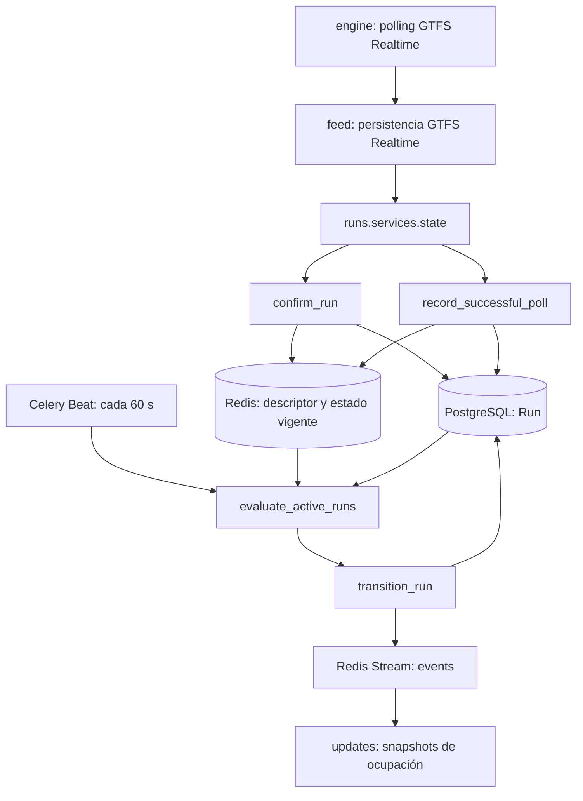

# Runs

La aplicación Django `runs` mantiene la identidad, el estado operacional y el
ciclo de vida de una ejecución concreta de un viaje GTFS dentro de Infobús®.
Una ejecución se confirma al observar un `TripDescriptor` en un feed GTFS
Realtime de posiciones de vehículos o actualizaciones de viaje.

`runs` no descarga feeds, no es dueño de los modelos GTFS Schedule ni conserva
el histórico completo de GTFS Realtime. Tampoco expone una API HTTP o un
WebSocket propio. `engine` coordina la ingesta, `feed` persiste los datos GTFS y
`updates` convierte los eventos de `runs` en snapshots publicados a clientes.

## Comportamiento confirmado

El flujo de ejecución conectado actualmente es:



### Confirmación de una ejecución

`engine.tasks.get_vehicle_positions` y `engine.tasks.get_trip_updates` se
ejecutan para los sistemas y publicadores activos. Cada tarea:

1. descarga y decodifica un `FeedMessage` GTFS Realtime;
2. entrega el mensaje a `feed.services.realtime` para su persistencia;
3. llama a `update_vehicle_positions_state()` o
   `update_trip_updates_state()`;
4. registra el polling exitoso mediante `record_successful_poll()`.

Las funciones de estado omiten entidades que no contienen `trip`. Para las
demás, `confirm_run()` extrae los campos presentes de `TripDescriptor` y busca
un `Run` del mismo `FeedPublisher`. El filtro incorpora `trip_id`, `start_date`
y `start_time` únicamente cuando cada campo viene en el descriptor.

Si encuentra el registro, actualiza los valores no nulos que hayan cambiado de
`route_id`, `direction_id` y `schedule_relationship`. Si no lo encuentra, crea
un `Run` con esos metadatos y el estado predeterminado `In Progress`. En ambos
casos intenta conservar el descriptor disponible en el hash Redis
`trip:<run_id>:trip`.

### Modelo y relaciones

`Run` es el único modelo de la aplicación. Su clave primaria es un UUID y cada
registro pertenece a un `feed.FeedPublisher`; por esa relación también queda
asociado a un `feed.TransitSystem`.

El modelo agrupa:

- referencias GTFS como texto: `route_id`, `trip_id`, `direction_id` y
  `shape_id`;
- datos de inicio: `start_date`, `start_time` y `request_timestamp`;
- relación con el horario: `schedule_relationship`;
- campos operacionales opcionales: `vehicle` y `operator`;
- ciclo de vida: `run_lifecycle_state`, `last_seen_at`, `missing_since`,
  `ended_at`, `completion_reason` y `last_event_at`.

Los identificadores de ruta, viaje y shape no son claves foráneas a modelos
GTFS Schedule. La evidencia de horario se resuelve en tiempo de ejecución
contra el `Feed` actual del publicador y sus filas `StopTime`.

`Run` está registrado en Django Admin. La aplicación no tiene ViewSets,
APIView, rutas HTTP, consumers, signals ni modelos adicionales conectados.

### Estado vigente en Redis

Después de confirmar el `Run`, los servicios conservan en Redis el estado más
reciente que venga en cada entidad:

- posiciones de vehículos: posición, secuencia y parada actuales, estado del
  vehículo, timestamp, congestión y ocupación;
- actualizaciones de viaje: predicciones `stop_time_updates` y delay;
- índices de paradas restantes y ejecuciones que se aproximan a cada parada.

Salvo el descriptor escrito por `confirm_run()`, estas claves incluyen el
código del sistema de transporte, por ejemplo
`<system>:trip:<run_id>:occupancy_status`. Los valores escalares que cambian se
actualizan con `WATCH`/`MULTI` y producen un evento tipado en el Redis Stream
`events`. La posición, el timestamp, las predicciones y el delay se actualizan
sin producir un evento propio.

`sync_remaining_stops()` obtiene el índice inicialmente de las predicciones
Realtime. Si todavía no existe ese índice, `ensure_remaining_stops()` puede
construirlo con los `StopTime` del feed Schedule actual. El avance de
`current_stop_sequence` elimina las paradas ya recorridas.

### Heartbeat de fuentes y ejecuciones

El heartbeat representa un polling exitoso, no una petición HTTP separada.
`record_successful_poll()` guarda la hora de éxito por publicador y por fuente
(`vehicle_positions` o `trip_updates`), incluso cuando el feed no observó
ninguna ejecución.

Para los IDs observados que no son terminales ni están marcados `CANCELED` o
`DELETED`, el servicio:

- añade el ID al set canónico `<system>:runs:active`;
- actualiza su score en `<system>:runs:last_seen`;
- persiste `last_seen_at` y limpia `missing_since` en PostgreSQL;
- devuelve un `No Signal` observado nuevamente a `In Progress`.

Si el descriptor observado tiene `schedule_relationship` `CANCELED` o
`DELETED`, el mismo heartbeat lo transiciona a `Cancelled`.

La salud de un publicador exige que todas las fuentes que tenga configuradas
entre posiciones de vehículos y actualizaciones de viaje hayan tenido un éxito
reciente. Si ninguna de esas fuentes está configurada, o alguna está vencida,
el publicador no se considera saludable y sus ausencias no envejecen las
ejecuciones.

### Evaluación del ciclo de vida

`evaluate_active_runs()` recorre exclusivamente los IDs de los sets canónicos
de Redis. Para cada ejecución combina:

- el último heartbeat del `Run`;
- la salud de las fuentes de su publicador;
- la secuencia y el estado actuales en Redis;
- la última parada y la hora final del GTFS Schedule actual;
- la secuencia y los tiempos terminales de las predicciones Realtime, cuando
  están disponibles.

Las predicciones Realtime sustituyen la hora final esperada del horario cuando
aportan una. Se considera que la ejecución está cerca del terminal al alcanzar
la penúltima secuencia, y en el terminal cuando alcanza la última con estado de
vehículo `STOPPED_AT`.

Los estados integrados son:

- `In Progress`: estado inicial y estado activo con señal;
- `No Signal`: la ejecución desapareció de fuentes saludables más allá de la
  gracia configurada;
- `Cancelled`: GTFS Realtime indicó `CANCELED` o `DELETED`;
- `Completed`: la señal cesó después de detenerse en el terminal, o cerca del
  terminal después de la hora final más su gracia;
- `Interrupted`: la señal cesó lejos del terminal después de la hora final más
  su gracia, o superó el timeout sin una hora final conocida.

Con los valores predeterminados, la fuente permanece saludable por 75 segundos,
`No Signal` se evalúa a los 120 segundos, el silencio en terminal a los 120
segundos, la gracia después del final esperado es 900 segundos y el timeout sin
final conocido es 1800 segundos. El estado Redis de una ejecución terminal se
retiene durante 86400 segundos para las claves encontradas durante la
transición.

`transition_run()` serializa la transición con un lock Redis y un bloqueo de
fila dentro de una transacción de PostgreSQL. Una transición válida actualiza
los timestamps y la razón; después del commit sincroniza Redis y publica el
evento correspondiente. Una ejecución terminal no puede volver a transicionar
por este servicio.

Al terminar una ejecución, el servicio la elimina de los índices activos y de
paradas restantes, aplica TTL al estado Redis localizado y publica uno de
`RunCompleted`, `RunInterrupted` o `RunCancelled`. Las transiciones entre señal
y ausencia publican `RunSignalLost` y `RunSignalRestored`.

### Relación con `updates`

`runs.events.types` define el contrato de los eventos. `updates` lee el stream
`events`, valida esos mensajes y reconstruye snapshots para los topics
registrados.

Actualmente las proyecciones registradas son únicamente las de ocupación por
ejecución y por parada. `OccupancyStatusChanged` y los cinco eventos de ciclo
de vida las invalidan. Los eventos terminales incluyen las paradas afectadas
antes de limpiar el índice, de modo que `updates` pueda reconstruir sus
snapshots. Otros eventos de estado son reconocidos por el parser de `updates`,
pero no tienen una proyección WebSocket registrada.

### Tareas y comando de administración

`runs` no declara tareas Celery propias. La integración está en `engine`:

- `engine.tasks.update_gtfs_realtime`, programada cada 30 segundos, crea un
  grupo con las tareas de posiciones, actualizaciones de viaje y alertas;
- las dos primeras llaman a los servicios de estado y heartbeat de `runs`;
- `engine.tasks.evaluate_run_lifecycles`, programada cada 60 segundos, llama a
  `evaluate_active_runs()`.

El comando `reconcile_active_runs` identifica registros antiguos en `In
Progress` o `No Signal` que no aparecen en ningún set canónico. Es dry-run por
defecto y acepta:

- `--apply` para persistir la interrupción;
- `--minimum-age-minutes` para cambiar la edad mínima, 60 por defecto;
- `--allow-empty-canonical` para permitir explícitamente una reconciliación sin
  IDs canónicos.

Al aplicar, el comando marca esos registros como `Interrupted`, limpia sus
índices de paradas y elimina el set legado `trip:in_progress`. Esta ruta usa una
actualización masiva: no llama a `transition_run()` ni publica eventos de ciclo
de vida.

### Dependencias efectivas

- `feed`: `TransitSystem`, `FeedPublisher`, `Feed` y `StopTime`, además de los
  mensajes GTFS Realtime que entrega `engine`;
- `engine`: polling, tareas Celery y programación periódica;
- PostgreSQL: persistencia durable del modelo `Run`;
- Redis: estado vigente, heartbeats, locks, índices, RedisJSON y el stream
  `events`, usando `REDIS_CELERY_DB`;
- `updates`: consumidor de eventos y proyecciones de ocupación;
- Pydantic: esquemas inmutables de eventos;
- `gtfs.utils`: conversión de fecha y hora del `TripDescriptor`.

## Desarrollo y pruebas

Las pruebas actuales de `runs` cubren la política pura de decisión para pérdida
de señal, finalización e interrupción. Desde `backend/` pueden ejecutarse con:

```bash
uv run python manage.py test runs
```

No hay pruebas de integración en esta aplicación para PostgreSQL, Redis,
Celery, el comando de reconciliación ni el consumo posterior en `updates`.

## Límites / decisiones abiertas

- `Requested`, `Validated`, `Initialized`, `Confirmed` y `Tracking` están
  declarados en `RunLifecycleStates`, pero no tienen productores ni
  transiciones conectadas en el código actual.
- `Short Turned` pertenece al conjunto de estados terminales, pero no existe un
  productor de esa transición ni un tipo de evento asociado en
  `_lifecycle_event()`. No es un estado operativo confirmado.
- `confirm_run()` usa `.first()` y el modelo no declara una restricción de
  unicidad para la identidad GTFS de una ejecución. No está confirmada la
  desambiguación cuando el descriptor omite parte de `trip_id`, `start_date` o
  `start_time`.
- El descriptor usa `trip:<run_id>:trip`, sin código de sistema, mientras el
  resto del estado usa `<system>:trip:<run_id>:...`. La limpieza terminal busca
  únicamente claves con namespace de sistema, por lo que no está confirmada la
  expiración de ese descriptor.
- `vehicle`, `operator` y `shape_id` existen en el modelo, pero el flujo
  Realtime revisado no los asigna.
- `multi_carriage_details` y `trip_properties` aparecen como puntos previstos
  en el servicio de estado, pero no se persisten. No se publica un evento propio
  para `delay` ni `stop_time_updates`.
- El comando de reconciliación no emite eventos; no está confirmado que los
  clientes de `updates` reciban una reconstrucción inmediata por esos cambios.
- No se confirmó un mecanismo general de reparación para una operación que
  quede aplicada en PostgreSQL pero falle posteriormente en Redis, o viceversa.
- La aplicación no ofrece una API pública de ejecuciones. `views.py` conserva
  únicamente el scaffolding generado por Django y no hay rutas de `runs`.
