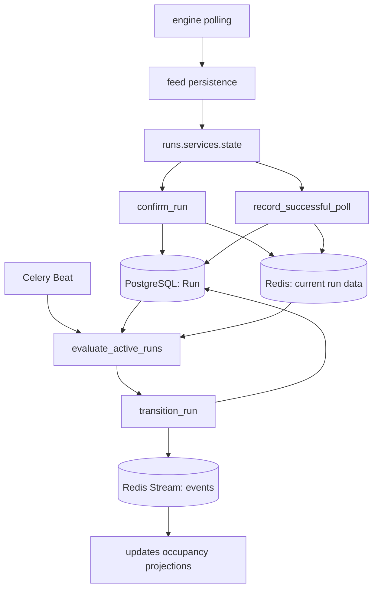
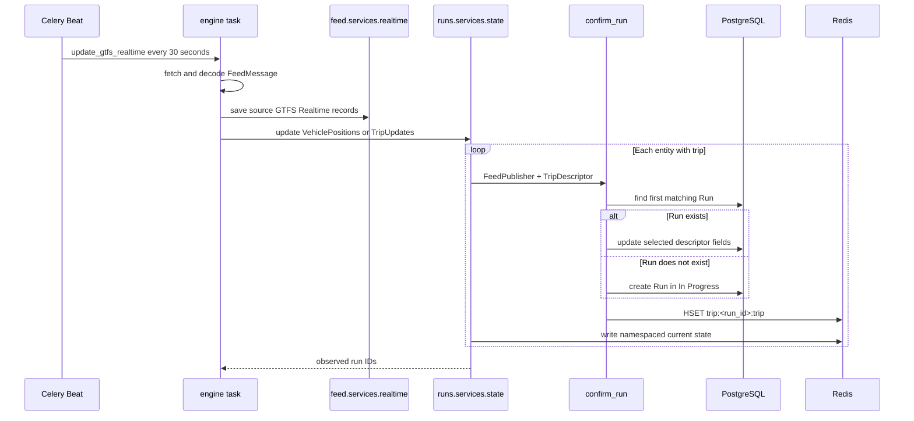
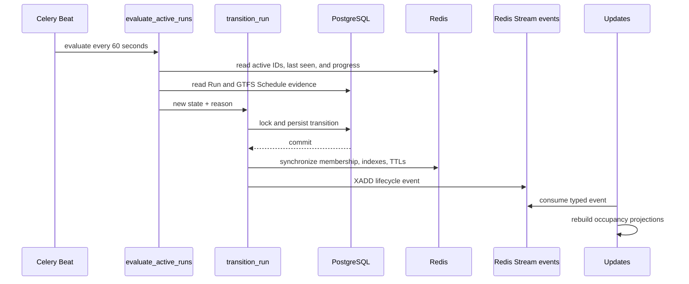

# Runs

The `runs` Django app maintains the identity, current operational state, and
lifecycle of concrete GTFS trip executions in Infobús®. A run is confirmed when
a GTFS Realtime VehiclePosition or TripUpdate contains a `TripDescriptor`.

The app sits between two interfaces:

- On the input side, `engine` fetches GTFS Realtime messages, `feed` persists
  the source records, and `runs` receives the decoded messages to confirm runs
  and update their current state.
- On the output side, `runs` persists durable lifecycle data in PostgreSQL,
  maintains current state and indexes in Redis, and writes typed events to the
  Redis Stream named `events` for `updates` to consume.

The app does not download feeds, own GTFS Schedule models, keep the complete
GTFS Realtime history, or expose its own HTTP or WebSocket interface.

## Overview

The connected runtime path has seven stages:

1. **Fetch:** `engine` requests VehiclePositions and TripUpdates for active
   transit systems and feed publishers.
2. **Persist source data:** `feed.services.realtime` stores the GTFS Realtime
   records represented by the incoming message.
3. **Confirm:** `confirm_run()` resolves or creates a durable `Run` from each
   entity that contains a trip descriptor.
4. **Update current state:** the state service writes the latest run attributes
   and remaining-stop indexes to Redis.
5. **Record heartbeat:** `record_successful_poll()` marks the source healthy and
   refreshes the runs observed in that poll.
6. **Evaluate lifecycle:** `evaluate_active_runs()` classifies silent active
   runs using feed health, schedule evidence, realtime predictions, and current
   progress.
7. **Publish changes:** state changes and lifecycle transitions append typed
   events to `events`; `updates` uses registered projections to rebuild current
   occupancy snapshots.



PostgreSQL and Redis serve different purposes. PostgreSQL stores the durable
run record and lifecycle timestamps. Redis stores the latest operational state,
feed health, active membership, remaining-stop indexes, locks, and the event
stream. Builders in `updates` read current state rather than reconstructing it
from the full event history.

## What is a `Run`?

A `Run` is one observed execution of a GTFS trip. It belongs to one
`feed.FeedPublisher`, and therefore to that publisher's `feed.TransitSystem`.
Its UUID is the internal identity used by Redis keys and domain events.

The model groups four kinds of data:

- **GTFS references:** `route_id`, `trip_id`, `direction_id`, and `shape_id`.
- **Start identity:** `start_date`, `start_time`, and the automatically recorded
  `request_timestamp`.
- **Operational fields:** optional `vehicle` and `operator` strings.
- **Lifecycle fields:** `schedule_relationship`, `run_lifecycle_state`,
  `last_seen_at`, `missing_since`, `ended_at`, `completion_reason`, and
  `last_event_at`.

The route, trip, and shape identifiers are strings, not foreign keys to GTFS
Schedule rows. When lifecycle evaluation needs schedule evidence, it queries
the publisher's current `Feed` and its `StopTime` rows using `trip_id`.

### Confirmation identity

`confirm_run()` always filters by `FeedPublisher`. It adds `trip_id`,
`start_date`, and `start_time` to the lookup only when those fields are present
in the incoming descriptor, then selects the first match.

For an existing run, it updates non-null changes to `route_id`, `direction_id`,
and `schedule_relationship`. Otherwise it creates a `Run`; the model default
sets its lifecycle state to `In Progress`. The available trip metadata is also
written to the unprefixed Redis hash `trip:<run_id>:trip`.

### Lifecycle vocabulary

`RunLifecycleStates` declares eleven values:

- `Requested`
- `Validated`
- `Initialized`
- `Confirmed`
- `Tracking`
- `Cancelled`
- `In Progress`
- `No Signal`
- `Completed`
- `Interrupted`
- `Short Turned`

Only a subset is connected to the current lifecycle policy. The implementation
status of each group is described below.

## Current implementation status

**Overall status: partial.** The GTFS Realtime-to-state, heartbeat, lifecycle,
and event path is implemented, while migrations are intentionally local-only,
several declared states have no producer, and some model and realtime fields
remain unused.

### Implemented

- VehiclePosition and TripUpdate entities with trip descriptors confirm runs.
- `Run` identity and lifecycle metadata are persisted through the Django model.
- Current vehicle and trip-update state is written to Redis.
- Successful source polls refresh feed health and canonical active-run indexes.
- The operational states `In Progress`, `No Signal`, `Cancelled`, `Completed`,
  and `Interrupted` have connected transition paths.
- Scalar state changes and lifecycle transitions produce typed events.
- `updates` consumes those events; occupancy-by-run and occupancy-by-stop are
  the currently registered projections invalidated by lifecycle events.
- Remaining-stop and approaching-run indexes are maintained for stop-level
  occupancy snapshots.
- `Run` is registered in Django Admin.

### Partial

- `Requested`, `Validated`, `Initialized`, `Confirmed`, and `Tracking` are
  declared but have no connected producers or transitions.
- `Short Turned` is classified as terminal, but has no transition producer and
  no lifecycle event type mapping.
- The model contains `vehicle`, `operator`, and `shape_id`, but the reviewed
  realtime confirmation path does not assign them.
- `multi_carriage_details` and `trip_properties` are placeholders in the state
  service and are not persisted there.
- Only the pure lifecycle decision policy has focused tests; PostgreSQL, Redis,
  Celery, reconciliation, and downstream event consumption are not covered by
  integration tests in this app.

### Scaffolding and not found

- `views.py` contains only the default Django scaffolding import and comment.
- The app has no `urls.py`, ViewSet, APIView, Celery task module, consumer, or
  signals module.
- There is no public runs API or runs-specific WebSocket protocol.

### Not verifiable from repository code alone

- Effective lifecycle thresholds in a deployed environment may differ from
  their settings defaults through environment overrides.
- No general repair guarantee could be verified for an operation that succeeds
  in PostgreSQL but subsequently fails in Redis, or vice versa.

## Runtime flows

### Run observation and confirmation



Entities without a `trip` field are skipped. VehiclePositions can update
position, stop sequence, stop ID, vehicle status, timestamp, congestion, and
occupancy. TripUpdates replace the current RedisJSON stop predictions, refresh
remaining-stop indexes, and optionally update delay.

The event-aware scalar path uses Redis `WATCH`/`MULTI`. It compares the previous
value with the incoming value and appends a typed event only when the first
value arrives or the value changes. Position, timestamp, stop predictions, and
delay are written without dedicated events.

### Heartbeat and source health

After a source message has been fetched, decoded, persisted, and projected,
`record_successful_poll()` records a successful poll for either
`vehicle_positions` or `trip_updates`. The source heartbeat is updated even
when the message contains no observed runs.

For observed runs that are neither terminal nor marked `CANCELED` or `DELETED`,
the heartbeat path:

1. adds the UUID to `<transit_system>:runs:active`;
2. scores it by observation time in `<transit_system>:runs:last_seen`;
3. persists `last_seen_at` and clears `missing_since` in PostgreSQL;
4. restores a run in `No Signal` to `In Progress`.

An observed non-terminal run with schedule relationship `CANCELED` or `DELETED`
is transitioned to `Cancelled`.

A publisher is healthy only when every configured run-bearing source has a
recent success. The sources considered are VehiclePositions and TripUpdates;
if neither URL is configured, or if any configured source is stale, lifecycle
evaluation does not age absent runs for that publisher.

### Lifecycle evaluation

Celery Beat invokes `engine.tasks.evaluate_run_lifecycles` every 60 seconds.
`evaluate_active_runs()` reads only the canonical active sets and combines:

- the run's latest observation time;
- publisher source health;
- current stop sequence and vehicle status from Redis;
- the last stop and end time from the current GTFS Schedule feed;
- terminal sequence and timestamps from current realtime stop predictions.

Realtime prediction time overrides the schedule-derived expected end when it is
available. A run is near terminal at the penultimate sequence or later. It is
at terminal when it reaches the final sequence with vehicle status
`STOPPED_AT`.

The connected decisions are:

- **No Signal:** the run is absent from healthy sources beyond the signal grace
  period.
- **Completed:** updates stop after the vehicle stopped at terminal, or stop
  near terminal after the expected end plus its grace period.
- **Interrupted:** updates stop away from terminal after the expected end plus
  its grace period, or exceed the unknown-end timeout when no expected end can
  be resolved.
- **In Progress:** a `No Signal` run reappears in a successful poll.
- **Cancelled:** GTFS Realtime reports `CANCELED` or `DELETED`.

`transition_run()` uses a Redis lock and a PostgreSQL row lock. It persists the
new state and timestamps in a database transaction, then synchronizes Redis and
publishes the event after commit. The service rejects transitions away from a
terminal state.

### Lifecycle event propagation



Terminal cleanup removes the run from active and last-seen indexes, captures and
clears remaining-stop indexes, and applies the configured TTL to namespaced run
state keys found before the transition. Lifecycle events include the affected
stop IDs so `updates` can rebuild stop occupancy after cleanup.

## Redis structures

`<transit_system>` means the value of `TransitSystem.code`. Most current-state
and index keys use this prefix. The unprefixed exceptions are documented
separately because they are real code-level namespace differences.

All `runs` Redis clients use the database selected by `REDIS_CELERY_DB`.

### Namespaced current state

| Key | Type | Purpose |
| --- | --- | --- |
| `<transit_system>:trip:<run_id>:position` | hash | Latest latitude, longitude, bearing, speed, and odometer fields present. |
| `<transit_system>:trip:<run_id>:current_stop_sequence` | string | Current GTFS stop sequence. |
| `<transit_system>:trip:<run_id>:stop_id` | string | Current stop ID. |
| `<transit_system>:trip:<run_id>:current_status` | string | Numeric GTFS Realtime vehicle stop status. |
| `<transit_system>:trip:<run_id>:timestamp` | string | Source VehiclePosition timestamp. |
| `<transit_system>:trip:<run_id>:congestion_level` | string | Numeric GTFS Realtime congestion level. |
| `<transit_system>:trip:<run_id>:occupancy_status` | string | Numeric GTFS Realtime occupancy status. |
| `<transit_system>:trip:<run_id>:occupancy_percentage` | string | Occupancy percentage when supplied. |
| `<transit_system>:trip:<run_id>:stop_time_updates` | RedisJSON | Current list of stop predictions. |
| `<transit_system>:trip:<run_id>:delay` | string | Trip-level delay when supplied. |

### Namespaced lifecycle and stop indexes

| Key | Type | Purpose |
| --- | --- | --- |
| `<transit_system>:runs:active` | set | Canonical active run UUIDs. |
| `<transit_system>:runs:last_seen` | sorted set | Run UUIDs scored by observation timestamp. |
| `<transit_system>:publisher:<publisher_id>:<source>:last_success` | string | Last successful poll timestamp for one configured source. |
| `<transit_system>:run:<run_id>:lifecycle_state` | string | Current lifecycle state mirrored after a transition. |
| `<transit_system>:run:<run_id>:remaining_stops` | sorted set | Stop IDs scored by stop sequence. |
| `<transit_system>:run:<run_id>:remaining_stops_initialized` | string | Distinguishes an initialized empty index from an absent index. |
| `<transit_system>:stop:<stop_id>:approaching_runs` | set | Reverse index of runs still approaching a stop. |

TripUpdates call `sync_remaining_stops()` on every processed run and replace the
current index. If the index has never been initialized, `ensure_remaining_stops()`
can build it from `StopTime` rows in the current GTFS Schedule feed.
`advance_remaining_stops()` removes sequences before the current one.

### Global and unprefixed structures

| Key | Type | Purpose |
| --- | --- | --- |
| `trip:<run_id>:trip` | hash | Trip descriptor written by `confirm_run()` without a transit-system prefix. |
| `run:<run_id>:lifecycle_lock` | lock key | Serializes lifecycle transitions for one UUID. |
| `events` | stream | Shared typed domain-event stream consumed by `updates`. |
| `trip:in_progress` | legacy set | Members are removed during terminal cleanup, and reconciliation deletes the set entirely; current code does not add members. |

The descriptor namespace is inconsistent with the namespaced state keys.
Terminal cleanup scans `<transit_system>:trip:<run_id>:*` and
`<transit_system>:run:<run_id>:*`, so expiration of the unprefixed descriptor is
not confirmed by the current code.

## External dependencies

### `engine`

`engine.tasks.get_vehicle_positions` and `engine.tasks.get_trip_updates` fetch
and decode source messages, call `feed` persistence, invoke the `runs` state
services, and record successful polls. `engine.tasks.update_gtfs_realtime` is
scheduled every 30 seconds. `engine.tasks.evaluate_run_lifecycles` delegates to
`evaluate_active_runs()` every 60 seconds.

`runs` does not declare Celery tasks of its own.

### `feed`

`Run` has a foreign key to `FeedPublisher`, which links it to a
`TransitSystem`. Lifecycle and stop-index services query the publisher's current
`Feed` and its `StopTime` rows. `FeedPublisher.vehicle_positions_url`,
`trip_updates_url`, and `timezone` participate in source health and timing
evidence.

### PostgreSQL/PostGIS

The Django default database uses the PostGIS backend. It stores `Run` identity,
lifecycle state, observation timestamps, end timestamps, and completion reason.
Each environment derives this schema locally from the current Django models
rather than from a versioned migration graph.

### Redis

Redis stores current state, source heartbeats, active indexes, stop indexes,
lifecycle locks, RedisJSON predictions, and domain events. The app uses the
Redis database configured by `REDIS_CELERY_DB`, which is also used in the
configured Celery broker URL.

### `updates`

`runs.events.types` is the wire contract imported by `updates.events`.
`updates` recognizes the scalar state events and five connected lifecycle
events. Its registered trip and stop occupancy projections are triggered by
`OccupancyStatusChanged`, `RunSignalLost`, `RunSignalRestored`, `RunCompleted`,
`RunInterrupted`, and `RunCancelled`. Recognized events without a registered
projection are consumed without producing a WebSocket snapshot.

### Pydantic and GTFS utilities

Pydantic defines immutable, extra-forbidding event models and serializes them
for Redis. `gtfs.utils.gtfs_date` and `gtfs.utils.gtfs_time` convert descriptor
start values before lookup and persistence.

## Source layout

The versioned `backend/runs/` source tree, excluding locally generated
migrations, is:

```text
runs/
├── README.md
├── __init__.py
├── admin.py
├── apps.py
├── models.py
├── tests.py
├── views.py
├── domain/
│   └── lifecycle/
│       ├── __init__.py
│       └── states.py
├── events/
│   ├── detector.py
│   └── types.py
├── services/
│   ├── lifecycle.py
│   ├── realtime.py
│   ├── state.py
│   └── stop_index.py
└── management/
    ├── __init__.py
    └── commands/
        ├── __init__.py
        └── reconcile_active_runs.py
```

The `migrations/` directory is intentionally excluded from versioned source by
the `migrations/` rule at `.gitignore:87`. Files generated there remain local;
no `runs` migration is versioned in the repository.

## File-by-file reference

Every symbol in this section is cited at its current source location.

### `models.py`

#### `Run` — `backend/runs/models.py:9`

The only Django model in the app. It defines the UUID identity, publisher
relationship, GTFS reference strings, optional operational fields, schedule
relationship, and lifecycle tracking fields. Its lifecycle default is
`RunLifecycleStates.IN_PROGRESS.value` at `backend/runs/models.py:44`.

#### `Run.__str__()` — `backend/runs/models.py:57`

Formats the route ID, trip ID, and start date for admin and shell display.

The module-level string beginning at `backend/runs/models.py:61` is descriptive
text, not executable mapping logic. Parts of it describe legacy or unimplemented
Redis structures; the services are the source of truth for current keys.

### `domain/lifecycle/states.py`

#### `RunLifecycleStates` — `backend/runs/domain/lifecycle/states.py:4`

Defines all eleven lifecycle strings. Current policy code uses only the subset
documented in [Current implementation status](#current-implementation-status).

#### `choices()` — `backend/runs/domain/lifecycle/states.py:22`

Builds Django field choices from every declared lifecycle state.

### `domain/lifecycle/__init__.py`

Re-exports `RunLifecycleStates` and `choices` at
`backend/runs/domain/lifecycle/__init__.py:1` and declares them in `__all__` at
`backend/runs/domain/lifecycle/__init__.py:3`.

### `services/realtime.py`

#### `confirm_run(feed_publisher, trip)` — `backend/runs/services/realtime.py:11`

Converts fields present in a protobuf trip descriptor, resolves the textual
schedule relationship, finds the first matching `Run`, updates selected fields
or creates the run, and writes `trip:<run_id>:trip`.

### `services/state.py`

#### `_update_state_and_publish_event(...)` — `backend/runs/services/state.py:49`

Uses Redis optimistic locking to compare and set one scalar state value and to
append the detector's event to `events` atomically.

#### `update_vehicle_positions_state(...)` — `backend/runs/services/state.py:82`

Confirms runs from VehiclePosition entities, writes the current vehicle state,
advances remaining stops, and returns the observed UUIDs.

#### `update_trip_updates_state(...)` — `backend/runs/services/state.py:203`

Confirms runs from TripUpdate entities, replaces RedisJSON stop predictions,
synchronizes remaining stops, writes delay when present, and returns the
observed UUIDs.

### `services/lifecycle.py`

#### Types and state sets

- `RealtimeSource` — `backend/runs/services/lifecycle.py:27` — restricts source
  names to `vehicle_positions` and `trip_updates`.
- `ACTIVE_STATES` — `backend/runs/services/lifecycle.py:29` — contains
  `In Progress` and `No Signal`.
- `TERMINAL_STATES` — `backend/runs/services/lifecycle.py:33` — contains
  `Cancelled`, `Completed`, `Interrupted`, and `Short Turned`.
- `LifecycleEvidence` — `backend/runs/services/lifecycle.py:49` — immutable
  input to the pure decision policy.
- `LifecycleDecision` — `backend/runs/services/lifecycle.py:60` — immutable
  target state and reason returned by the policy.
- `_TimingEvidence` — `backend/runs/services/lifecycle.py:286` — internal
  terminal sequence, expected end, and terminal proximity result.

#### Redis key helpers

- `active_runs_key(transit_system)` — `backend/runs/services/lifecycle.py:67`.
- `last_seen_key(transit_system)` — `backend/runs/services/lifecycle.py:72`.
- `feed_success_key(feed_publisher, source)` —
  `backend/runs/services/lifecycle.py:77`.

#### Lifecycle policy and orchestration

- `decide_run_lifecycle(...)` — `backend/runs/services/lifecycle.py:85` — pure
  classification using feed health, silence, terminal proximity, and expected
  end.
- `record_successful_poll(...)` — `backend/runs/services/lifecycle.py:136` —
  stores source health, refreshes active runs, restores signal, and applies
  realtime cancellation.
- `publisher_realtime_healthy(...)` —
  `backend/runs/services/lifecycle.py:196` — requires every configured
  run-bearing source to be fresh.
- `evaluate_active_runs(...)` — `backend/runs/services/lifecycle.py:217` — reads
  canonical active sets, builds evidence, and applies policy decisions.
- `_timing_evidence(run)` — `backend/runs/services/lifecycle.py:293` — merges
  schedule and realtime timing with current Redis progress.
- `_scheduled_terminal_evidence(run)` —
  `backend/runs/services/lifecycle.py:332` — queries the current Schedule feed.
- `_realtime_terminal_evidence(run)` —
  `backend/runs/services/lifecycle.py:370` — reads RedisJSON predictions.
- `transition_run(...)` — `backend/runs/services/lifecycle.py:399` — locks and
  persists one non-terminal transition, then schedules Redis work after commit.
- `_apply_redis_transition(...)` — `backend/runs/services/lifecycle.py:461` —
  synchronizes lifecycle state, active membership, stop indexes, TTLs, and the
  event stream.
- `_lifecycle_event(...)` — `backend/runs/services/lifecycle.py:509` — maps the
  five connected lifecycle states to typed events.

### `services/stop_index.py`

#### Key helpers

- `_remaining_stops_key(...)` — `backend/runs/services/stop_index.py:18`.
- `_approaching_runs_key(...)` — `backend/runs/services/stop_index.py:22`.
- `_initialized_key(...)` — `backend/runs/services/stop_index.py:26`.

#### Index operations

- `sync_remaining_stops(...)` — `backend/runs/services/stop_index.py:30` —
  replaces both directions of the current stop index.
- `ensure_remaining_stops(...)` — `backend/runs/services/stop_index.py:55` —
  falls back to the current Schedule feed when the index is uninitialized.
- `remaining_stop_ids(...)` — `backend/runs/services/stop_index.py:81` — returns
  stops at or after the current sequence.
- `approaching_run_ids(...)` — `backend/runs/services/stop_index.py:93` — reads
  the reverse stop index.
- `run_is_approaching_stop(...)` — `backend/runs/services/stop_index.py:97` —
  validates one run/stop pair against current progress.
- `advance_remaining_stops(...)` — `backend/runs/services/stop_index.py:112` —
  removes passed stops from both index directions.
- `clear_remaining_stops(...)` — `backend/runs/services/stop_index.py:130` —
  removes all remaining-stop structures for one run.

### `events/types.py`

#### GTFS Realtime enums

- `VehicleStopStatus` — `backend/runs/events/types.py:9`.
- `CongestionLevel` — `backend/runs/events/types.py:15`.
- `OccupancyStatus` — `backend/runs/events/types.py:23`.

#### Event base and scalar events

- `Event` — `backend/runs/events/types.py:35` — immutable Pydantic base carrying
  transit system, event UUID, event type, and run UUID.
- `Event.redis_fields()` — `backend/runs/events/types.py:43` — serializes fields
  for Redis.
- `CurrentStopSequenceChanged` — `backend/runs/events/types.py:47`.
- `StopIDChanged` — `backend/runs/events/types.py:53`.
- `CurrentStatusChanged` — `backend/runs/events/types.py:59`.
- `CongestionLevelChanged` — `backend/runs/events/types.py:65`.
- `OccupancyStatusChanged` — `backend/runs/events/types.py:71`.
- `OccupancyPercentageChanged` — `backend/runs/events/types.py:77`.

#### Lifecycle events

- `RunLifecycleEvent` — `backend/runs/events/types.py:83` — adds reason,
  occurrence time, last-seen time, and affected stop IDs.
- `RunSignalLost` — `backend/runs/events/types.py:92`.
- `RunSignalRestored` — `backend/runs/events/types.py:96`.
- `RunCompleted` — `backend/runs/events/types.py:100`.
- `RunInterrupted` — `backend/runs/events/types.py:104`.
- `RunCancelled` — `backend/runs/events/types.py:108`.

No `RunShortTurned` event type exists in the current file.

### `events/detector.py`

#### `EventDetector` — `backend/runs/events/detector.py:11`

Provides six static change detectors. Each returns serialized event fields when
the previous value is absent or different, otherwise `None`:

- `EventDetector.current_stop_sequence(...)` —
  `backend/runs/events/detector.py:13`.
- `EventDetector.stop_id(...)` — `backend/runs/events/detector.py:27`.
- `EventDetector.current_status(...)` — `backend/runs/events/detector.py:41`.
- `EventDetector.congestion_level(...)` —
  `backend/runs/events/detector.py:52`.
- `EventDetector.occupancy_status(...)` —
  `backend/runs/events/detector.py:63`.
- `EventDetector.occupancy_percentage(...)` —
  `backend/runs/events/detector.py:74`.

### `management/commands/reconcile_active_runs.py`

#### `Command` — `backend/runs/management/commands/reconcile_active_runs.py:13`

Defines the `reconcile_active_runs` management command.

- `Command.add_arguments(...)` —
  `backend/runs/management/commands/reconcile_active_runs.py:19` — registers
  `--apply`, `--minimum-age-minutes` with default `60`, and
  `--allow-empty-canonical`.
- `Command.handle(...)` —
  `backend/runs/management/commands/reconcile_active_runs.py:25` — reports or
  interrupts old active-state rows absent from canonical sets, clears their
  stop indexes, and deletes `trip:in_progress` when applying.

The command uses a bulk database update rather than `transition_run()` and does
not publish lifecycle events.

### `tests.py`

#### `RunLifecyclePolicyTests` — `backend/runs/tests.py:15`

The `SimpleTestCase` suite covers these pure decisions:

- feed outage does not age a run — `backend/runs/tests.py:19`;
- healthy-source silence produces `No Signal` — `backend/runs/tests.py:31`;
- terminal silence produces `Completed` — `backend/runs/tests.py:44`;
- silence near terminal after expected end produces `Completed` —
  `backend/runs/tests.py:57`;
- silence away from terminal after expected end produces `Interrupted` —
  `backend/runs/tests.py:71`;
- long silence without an expected end produces `Interrupted` —
  `backend/runs/tests.py:85`.

### Django app support files

- `RunsConfig` — `backend/runs/apps.py:4` — registers the `runs` app name.
- `admin.py` registers `Run` — `backend/runs/admin.py:6`.
- `views.py` is scaffolding only — `backend/runs/views.py:1`.
- `backend/runs/__init__.py`, `backend/runs/management/__init__.py`, and
  `backend/runs/management/commands/__init__.py` are empty package markers and
  define no symbols.

### Model-backed lifecycle schema

The lifecycle tracking schema is defined by the current `Run` model, not by a
versioned migration. It declares the optional indexed `last_seen_at`
`DateTimeField` at `backend/runs/models.py:51`, optional `missing_since` at
`backend/runs/models.py:52`, optional indexed `ended_at` at
`backend/runs/models.py:53`, and optional 255-character `completion_reason` at
`backend/runs/models.py:54`.

## Development and operations

### Migrations

**Status: partial.** The app does not version migrations. The repository-wide
`migrations/` rule at `.gitignore:87` covers this directory, so generated files
remain local and no `runs` migration is committed. During DEBUG startup, the
entrypoint generates migrations automatically only for `feed` and `engine` at
`backend/docker-entrypoint.sh:320`; `runs` therefore requires the manual step
below.

After the development services are running, generate the local migration from
the current models and apply it through the `orchestrator` Compose service:

```bash
docker compose -f compose.dev.yml exec orchestrator uv run python manage.py makemigrations runs
docker compose -f compose.dev.yml exec orchestrator uv run python manage.py migrate
```

Repeat this local generation when the model schema changes. The team keeps
migrations unversioned while the app is not in production.

### Lifecycle settings

These values are configurable through environment-backed Django settings. The
current defaults are:

| Setting | Default seconds | Effect |
| --- | ---: | --- |
| `RUN_FEED_HEALTH_MAX_AGE_SECONDS` | 75 | Maximum age of every configured source heartbeat. |
| `RUN_NO_SIGNAL_AFTER_SECONDS` | 120 | Silence before an active run becomes `No Signal`. |
| `RUN_TERMINAL_SILENCE_GRACE_SECONDS` | 120 | Silence after stopping at terminal before completion. |
| `RUN_EXPECTED_END_GRACE_SECONDS` | 900 | Grace after expected end before terminal classification. |
| `RUN_UNKNOWN_TIMEOUT_SECONDS` | 1800 | Silence before interrupting a run with no expected end. |
| `RUN_TERMINAL_STATE_TTL_SECONDS` | 86400 | TTL applied to namespaced terminal state keys found during cleanup. |

Effective deployed values are not verifiable from repository code when the
environment overrides these defaults.

### Scheduled work

`runs` has no task module. Celery integration is owned by `engine`:

- `engine.tasks.update_gtfs_realtime` runs every 30 seconds and dispatches
  VehiclePositions, TripUpdates, and Alerts tasks.
- the VehiclePositions and TripUpdates tasks call `runs` state and heartbeat
  services;
- `engine.tasks.evaluate_run_lifecycles` runs every 60 seconds.

### Reconcile legacy active runs

The command is dry-run by default:

```bash
uv run python manage.py reconcile_active_runs --minimum-age-minutes 60
```

Apply the bulk interruption only after canonical heartbeat tracking has
completed successful polling cycles:

```bash
uv run python manage.py reconcile_active_runs \
	--minimum-age-minutes 60 \
	--apply
```

The command refuses an empty canonical set unless
`--allow-empty-canonical` is passed explicitly. With `--apply`, it marks
candidates `Interrupted`, clears their remaining-stop indexes, and deletes the
entire legacy set `trip:in_progress`. It does not emit lifecycle events.

### Run focused tests

After local migrations have been generated and applied, run the current app
test module from `backend/` with:

```bash
uv run python manage.py test runs
```

The current tests exercise only the pure lifecycle decision policy. They do not
verify PostgreSQL/Redis synchronization, Celery scheduling, the management
command, or downstream `updates` processing.

### Admin and public interfaces

`Run` is available through Django Admin. There is no runs-specific HTTP route,
REST endpoint, WebSocket endpoint, or public protocol to exercise.

## Known limitations

- **Partial migration workflow:** no `runs` migration is versioned, and startup
  generation includes only `feed` and `engine` at
  `backend/docker-entrypoint.sh:320`; each development environment must generate
  and apply the `runs` migration manually.
- **Partial lifecycle vocabulary:** `Requested`, `Validated`, `Initialized`,
  `Confirmed`, and `Tracking` have no connected producers or transitions.
- **Incomplete terminal state:** `Short Turned` is terminal in policy constants
  but has no producer and no event mapping.
- **Ambiguous sparse identity:** `confirm_run()` uses `.first()` and the model
  declares no uniqueness constraint for the GTFS run identity. Descriptors that
  omit `trip_id`, `start_date`, or `start_time` may not be unambiguously
  resolved.
- **Redis namespace mismatch:** `trip:<run_id>:trip` is unprefixed while current
  state and index keys use `<transit_system>`. Terminal cleanup does not confirm
  expiration of that descriptor.
- **Unused model fields:** the current confirmation path does not populate
  `vehicle`, `operator`, or `shape_id`.
- **State placeholders:** `multi_carriage_details` and `trip_properties` are not
  persisted by the state service. `delay` and `stop_time_updates` do not produce
  dedicated events.
- **Reconciliation bypasses events:** the management command bulk-updates rows
  and does not trigger immediate `updates` reconstruction.
- **Cross-store recovery is uncertain:** no general repair mechanism was
  verified for partial PostgreSQL/Redis failure.
- **No public runs interface:** `views.py` remains scaffolding and the app has no
  URLs, REST views, consumers, or signals.
- **Limited tests:** lifecycle policy branches are tested, but integration with
  persistence, Redis, Celery, reconciliation, and `updates` is not.
