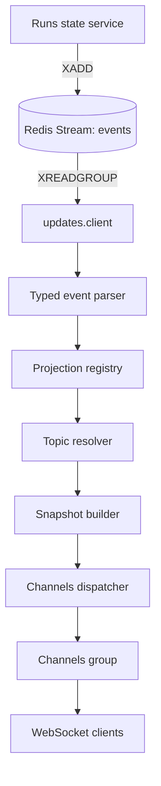
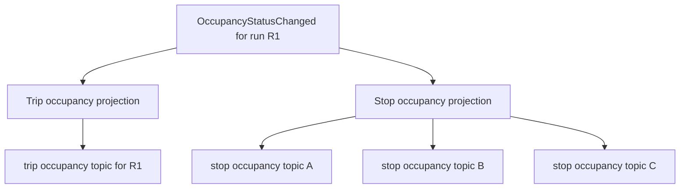
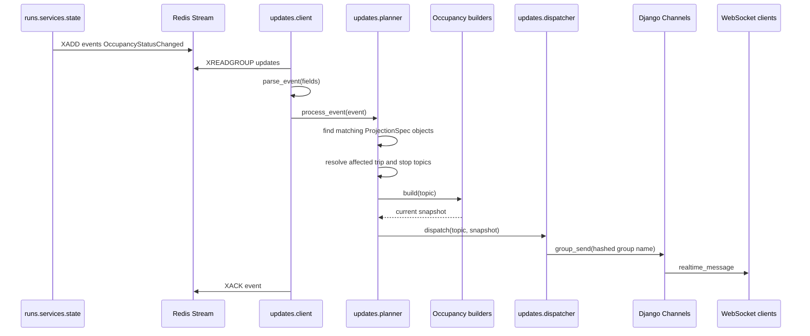
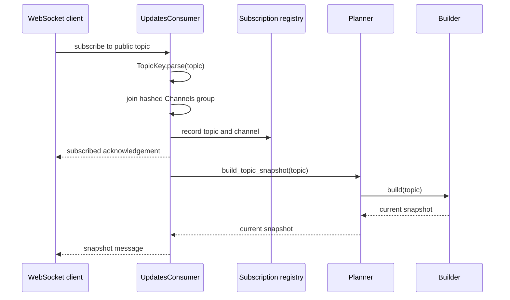

# Updates

The `updates` Django app is Infobus's real-time delivery layer. It translates
domain events produced by the rest of the backend into topic-oriented snapshots
and sends those snapshots to WebSocket clients through Django Channels.

The app sits between two different interfaces:

- On the input side, it consumes typed events from the Redis Stream named
  `events`.
- On the output side, it exposes a WebSocket pub-sub protocol at
  `/ws/updates/`.

The app does not collect GTFS Realtime feeds and does not own run state. The
`engine`, `feed`, and `runs` apps perform those jobs. `updates` observes their
events, determines which public topics are affected, builds the current state
for each topic, and publishes it.

## Overview

The event-driven path has five stages:

1. **Consume:** `client.py` reads events reliably from a Redis consumer group.
2. **Validate:** `events.py` parses each stream entry into a typed Pydantic event.
3. **Plan:** `registry.py` and `planner.py` select projections and resolve the
   topics affected by the event.
4. **Build:** a builder reads the current state from Redis and the database and
   creates a complete topic snapshot.
5. **Dispatch:** `dispatcher.py` sends the snapshot to the corresponding Django
   Channels group.



Clients can also request a snapshot without waiting for a new event. When a
client subscribes, `UpdatesConsumer` resolves the topic's registered builder and
sends its current snapshot immediately. Later events send updated snapshots to
the same topic.

This snapshot-oriented design means clients do not need to reconstruct state by
replaying every event. An event is only a trigger that says a projection may
need to be rebuilt; the builder remains the source of the outgoing message.

## What is a _projection_?

In this app, a **projection** is a definition of a client-facing read model. It describes how backend state should be viewed for a particular family of topics, which events can make that view stale, how to determine the concrete topics affected by one event, and how to rebuild the current snapshot for one topic.

The word comes from the idea of projecting a larger domain model onto a smaller, purpose-specific view. The backend knows about feeds, runs, trips, routes, stop sequences, realtime state, and Redis indexes. A screen interested in one stop does not need that entire model. It needs a projection such as:

```json
{
  "stop_id": "123",
  "runs": [
    {
      "run_id": "019fc09f-2af5-75b0-baab-c9ec701db592",
      "route_id": "1",
      "arrival_time": 1785645000,
      "occupancy_status": 2
    }
  ]
}
```

That payload is a read model tailored to the question: "What is the occupancy status of the vehicles approaching this stop?"

### Parts of a projection

Every registered projection is represented by a `ProjectionSpec` and has four
behavioral parts:

| Part           | Question answered                                    | Stop occupancy example                                      |
| -------------- | ---------------------------------------------------- | ----------------------------------------------------------- |
| Topic pattern  | Which subscription shape does this projection serve? | `*.stop.occupancy_status.by_stop.*`                         |
| Triggers       | Which events may make its snapshots stale?           | `OccupancyStatusChanged`                                    |
| Topic resolver | Which concrete topics are affected by this event?    | All remaining stops of the changed run                      |
| Builder        | What is the complete current snapshot for one topic? | All approaching runs and their occupancy state for one stop |

The corresponding registration is conceptually:

```python
ProjectionSpec(
    name="stop_occupancy_status",
    description="The occupancy status of trips coming to a stop, by stop ID.",
    topic_pattern=TopicPattern(
        entity="stop",
        info="occupancy_status",
        primary_selector="by_stop",
    ),
    triggers=(OccupancyStatusChanged,),
    resolve_topics=resolve_stop_occupancy_topics,
    build=build_stop_occupancy_status,
)
```

### Projection versus event, topic, and snapshot

These terms describe different things:

- An **event** is a fact that something changed. For example,`OccupancyStatusChanged` says that one run's occupancy changed from one value to another.
- A **topic** is the public address to which clients subscribe. For example, `mbta.stop.occupancy_status.by_stop.123` identifies occupancy information for stop `123`.
- A **snapshot** is one concrete message produced at a point in time for one concrete topic.
- A **projection** is the reusable rule that connects events and topics to the builder that creates those snapshots.

A projection is therefore not the event payload and not the outgoing message. It is the definition used to derive outgoing messages from current state.

### Why builders read current state

Events are used as invalidation signals rather than as the sole source of the WebSocket payload. For example, an occupancy event contains one run ID and one new occupancy value, but the stop-level snapshot may contain several approaching runs. The stop builder must query the current run-to-stop indexes, current occupancy keys, stop-time predictions, and `Run` records to rebuild the complete view.

This has several useful properties:

- A newly connected client can receive the same snapshot immediately, without waiting for another event.
- Retrying an event rebuilds current state instead of applying the same mutation twice.
- Clients can replace their local topic state with each message instead of replaying a sequence of deltas.
- The event schema can remain focused on domain changes while each projection produces a payload suited to its audience.

The projections in this app are currently computed on demand. Their output is not stored as a separate database table or Redis document before dispatch. The underlying run state and indexes are stored; builders assemble snapshots when a subscription starts or a triggering event arrives.

### One event can invalidate multiple projections

Suppose run `R1` approaches stops `A`, `B`, and `C`, and its occupancy changes. One `OccupancyStatusChanged` event triggers two registered projections:

1. The **trip occupancy projection** resolves `mbta.trip.occupancy_status.by_run.R1` and builds a snapshot for that run.
2. The **stop occupancy projection** resolves `mbta.stop.occupancy_status.by_stop.A`, `.B`, and `.C`, then rebuilds one aggregate snapshot per stop.



This fan-out belongs in topic resolvers. Builders receive one already-resolved topic and answer only what its current snapshot should contain.

### Projection lookup has two directions

The registry supports two complementary lookups:

- **Event to projections:** `projections_for_event(event)` finds every read model invalidated by an incoming event. This drives event-triggered delivery.
- **Topic to projection:** `projection_for_topic(topic)` finds the builder for a client subscription. This drives the initial snapshot.

Using the same `ProjectionSpec` for both paths guarantees that initial and later messages are built by the same code and have the same shape.

## Current implementation status

The fully implemented event-driven information type is `occupancy_status`:

- `trip.occupancy_status.by_run.<run_id>` produces the occupancy snapshot for a
  single run.
- `stop.occupancy_status.by_stop.<stop_id>` produces all approaching runs with
  known occupancy state for a stop.

Both topics are scoped by transit system, so complete examples are:

```text
mbta.trip.occupancy_status.by_run.019fc09f-2af5-75b0-baab-c9ec701db592
mbta.stop.occupancy_status.by_stop.123
```

The event parser also recognizes stop sequence, stop ID, vehicle status,
congestion, occupancy percentage, and run lifecycle events. Event types without
registered projections are validated and acknowledged without publishing a
WebSocket message.

## Runtime flows

### Event-driven update

An occupancy update follows this sequence:



One `OccupancyStatusChanged` event can affect multiple topics. The direct trip
projection always resolves one topic. The stop projection resolves one topic for
each remaining stop of the run.

### WebSocket subscription



Disconnecting removes all subscriptions associated with that WebSocket channel.

## WebSocket protocol

### Endpoint

```text
/ws/updates/
```

Use `ws://` for plain HTTP development and `wss://` when the site is served over
HTTPS.

### Subscribe (example)

```json
{
  "action": "subscribe",
  "topic": "mbta.stop.occupancy_status.by_stop.123"
}
```

The server acknowledges the subscription:

```json
{
  "type": "subscribed",
  "topic": "mbta.stop.occupancy_status.by_stop.123"
}
```

If a builder is registered for the topic, the server then sends an initial
snapshot:

```json
{
  "topic": "mbta.stop.occupancy_status.by_stop.123",
  "message": {
    "topic": "mbta.stop.occupancy_status.by_stop.123",
    "stop_id": "123",
    "runs": []
  }
}
```

### Unsubscribe

```json
{
  "action": "unsubscribe",
  "topic": "mbta.stop.occupancy_status.by_stop.123"
}
```

The response is:

```json
{
  "type": "unsubscribed",
  "topic": "mbta.stop.occupancy_status.by_stop.123"
}
```

### Errors

Malformed topics, missing properties, invalid JSON values, and unsupported
actions produce an error message:

```json
{
  "type": "error",
  "message": "A topic must have 5 or 7 segments."
}
```

> **[Verificado — Fase 2, HEAD 0fd8ad136d194daf088b65d36d1a806876309da3]**
> Estado: `no encontrado`. `/ws/updates/` no aplica autenticación ni
> autorización: ASGI monta `URLRouter` sin middleware de autenticación
> (`backend/infobus/asgi.py:19-23`) y `connect()` acepta la conexión
> inmediatamente (`backend/updates/consumers.py:36-40`).

## Topic model

Public topics have either five or seven dot-separated segments:

```text
<transit_system>.<entity>.<info>.<primary_selector>.<primary_value>
[.<qualifier_selector>.<qualifier_value>]
```

For example:

```text
mbta.stop.occupancy_status.by_stop.123
```

| Segment            | Example            | Meaning                                                     |
| ------------------ | ------------------ | ----------------------------------------------------------- |
| Transit system     | `mbta`             | Prevents identifiers from different systems from colliding. |
| Entity             | `stop`             | The type of subject represented by the topic.               |
| Information        | `occupancy_status` | The projected information sent to clients.                  |
| Primary selector   | `by_stop`          | How the primary value selects data.                         |
| Primary value      | `123`              | The selected stop ID.                                       |
| Qualifier selector | `by_direction`     | Optional additional selection dimension.                    |
| Qualifier value    | `1`                | Optional qualifier value.                                   |

The public topic is not used directly as a Channels group name. `TopicKey`
hashes the public topic with SHA-256 and prefixes the digest with `updates.`. This
produces deterministic group names that satisfy Channels' length and character
restrictions while keeping the complete public topic in messages and Redis
subscription metadata.

## Redis structures

### Streams

| Key                  | Type   | Purpose                                                  |
| -------------------- | ------ | -------------------------------------------------------- |
| `events`             | stream | Domain events produced by the `runs` app.                |
| `events:dead-letter` | stream | Events that cannot be parsed as a supported typed event. |

The stream consumer uses the consumer group `updates`. A consumer is named from
its container hostname and operating-system process ID.

Events are acknowledged only after processing succeeds. Invalid events are
copied to `events:dead-letter` and then acknowledged. Processing failures remain
pending and can be reclaimed after 60 seconds with `XAUTOCLAIM`.

### Subscription metadata

| Key                     | Type | Value                                                  |
| ----------------------- | ---- | ------------------------------------------------------ |
| `active_subscriptions`  | set  | Public topics with at least one connected channel.     |
| `subscriptions:<topic>` | set  | Channels channel names subscribed to one public topic. |

Subscription addition uses a Redis transaction. Removal uses a Lua script so
removing the channel and deleting empty topic metadata happen atomically.

### State read by occupancy builders

| Key                                                         | Type       | Purpose                                                        |
| ----------------------------------------------------------- | ---------- | -------------------------------------------------------------- |
| `<transit_system>:trip:<run_id>:occupancy_status`           | string     | Current occupancy enum value.                                  |
| `<transit_system>:trip:<run_id>:stop_time_updates`          | RedisJSON  | Stop predictions used to find arrival time.                    |
| `<transit_system>:run:<run_id>:remaining_stops`             | sorted set | Stop IDs scored by stop sequence.                              |
| `<transit_system>:run:<run_id>:remaining_stops_initialized` | string     | Distinguishes an initialized empty index from an absent index. |
| `<transit_system>:stop:<stop_id>:approaching_runs`          | set        | Reverse index of runs that still approach a stop.              |

The remaining-stop indexes are owned by `runs.services.stop_index`, not by this
app. They are documented here because stop topic resolution and snapshot
building depend on them.

## Source layout

```text
updates/
├── client.py
├── consumers.py
├── dispatcher.py
├── events.py
├── exceptions.py
├── planner.py
├── registry.py
├── routing.py
├── subscriptions.py
├── topics.py
├── builders/
│   ├── stop/
│   │   └── occupancy_status.py
│   └── trip/
│       └── occupancy_status.py
└── projections/
		├── stop/
		│   └── occupancy_status.py
		└── trip/
				└── occupancy_status.py
```

Other builder and projection files exist as placeholders or legacy code. Their
status is described below.

## File-by-file reference

### `client.py`

This module is the long-running Redis Streams worker. The Docker
`streams-consumer` service launches it with:

```text
python -m updates.client
```

#### Constants

- `STREAM_NAME = "events"` selects the input stream.
- `GROUP_NAME = "updates"` identifies the Redis consumer group.
- `DEAD_LETTER_STREAM = "events:dead-letter"` receives invalid event payloads.
- `CLAIM_IDLE_MS = 60_000` sets the minimum idle time before pending work is
  reclaimed.

#### `_ensure_consumer_group(redis)`

Creates the `updates` consumer group at `$` and creates the stream if needed.
`BUSYGROUP` is ignored because it means the group already exists. Other Redis
errors are raised.

Creating the group at `$` means a brand-new deployment begins with events added
after group creation; it does not replay older stream history.

#### `_process_entries(redis, entries, consumer_name)`

Processes a batch of stream entries:

1. Calls `parse_event()` to validate and type the string fields.
2. Sends invalid entries to the dead-letter stream and acknowledges them.
3. Calls `process_event()` for valid entries.
4. Acknowledges entries only when projection processing succeeds.

Imports of `events` and `planner` are local to this function so Django setup is
complete before modules that access models and settings are imported.

#### `_claim_stale_entries(redis, consumer_name)`

Uses `XAUTOCLAIM` to transfer entries that have remained pending for at least 60
seconds to the current consumer, then sends those entries through
`_process_entries()`.

#### `consume_events()`

Creates a decoded Redis client, registers the consumer group, periodically
claims stale work, and blocks for up to five seconds in `XREADGROUP` while
waiting for batches of up to 100 new entries.

The loop is intentionally permanent and is expected to run in its own container
or managed process.

### `events.py`

Defines the set of domain events this app can parse.

#### `UpdateEvent`

A discriminated union of Pydantic models imported from `runs.events.types`. The
`event_type` field selects the concrete model. Currently recognized event types
are:

- `CurrentStopSequenceChanged`
- `StopIDChanged`
- `CurrentStatusChanged`
- `CongestionLevelChanged`
- `OccupancyStatusChanged`
- `OccupancyPercentageChanged`
- `RunSignalLost`
- `RunSignalRestored`
- `RunCompleted`
- `RunInterrupted`
- `RunCancelled`

#### `_event_adapter`

A Pydantic `TypeAdapter` compiled once for the `UpdateEvent` union.

#### `parse_event(fields)`

Validates Redis Stream string fields and returns the correct concrete event
model. Pydantic converts UUIDs and integer enum values from their Redis string
representations.

Recognizing an event does not imply that a projection exists for it. Projection
support is controlled independently by `registry.py`.

### `topics.py`

Contains the public topic value objects.

#### `TopicKey`

An immutable dataclass representing one concrete topic. Its properties mirror
the five or seven topic segments.

- `TopicKey.parse(raw)` validates segment count and rejects empty segments.
- `render()` converts the object back to its public dot-separated form.
- `__str__()` delegates to `render()`.
- `group_name()` converts the public topic into a deterministic Channels-safe
  group name using SHA-256.

#### `TopicPattern`

An immutable dataclass representing the structural parts of a topic without its
values or transit system. `matches(topic)` compares entity, information type,
primary selector, and qualifier selector. The registry uses it to locate the
builder for an initial subscription snapshot.

### `registry.py`

Declares which projections exist and connects event types, topic resolution, and
snapshot builders.

#### `ProjectionSpec`

An immutable configuration object with:

- `name`: a diagnostic name.
- `description`: a human-readable description of the projection.
- `topic_pattern`: the topic shape handled by the projection.
- `triggers`: event classes that invalidate the projection.
- `resolve_topics`: function that maps an event to concrete topics.
- `build`: function that builds one topic's current snapshot.

#### `PROJECTIONS`

The tuple of every projection enabled by the app. It is the declarative registry used for both event-driven updates and initial subscription snapshots.

Each entry defines one client-facing read model by connecting a topic pattern with its triggering event types, topic resolver, and snapshot builder. Adding a `ProjectionSpec` to this tuple makes it discoverable by `projections_for_event()` and `projection_for_topic()`; merely creating resolver or builder modules does not activate them.

Multiple entries may share the same trigger when one domain change affects different views, and different entries may target the same entity at different selectors or levels of aggregation. Registry order matters only for topic-to-projection lookup, which returns the first matching specification, so topic patterns should not overlap ambiguously.

#### `projections_for_event(event)`

Returns every specification whose `triggers` tuple accepts the event. More than
one projection can react to the same event, which is how one run occupancy event
updates both the direct trip topic and all relevant stop topics.

#### `projection_for_topic(topic)`

Returns the first specification whose `TopicPattern` matches the concrete topic,
or `None`. This lookup powers initial snapshots during WebSocket subscription.

### `planner.py`

Coordinates projections without containing domain-specific routing or message
construction.

#### `process_event(event)`

For every matching projection:

1. Resolves concrete topics.
2. Deduplicates those topics with a set.
3. Builds a snapshot for each topic.
4. Dispatches every non-`None` snapshot.

Builders may return `None` when the selected state or database object is not
available. In that case nothing is sent.

#### `build_topic_snapshot(topic)`

Finds the projection registered for a topic and calls its builder. It returns
`None` if no projection supports that topic. `UpdatesConsumer` uses this method
immediately after subscription.

### `dispatcher.py`

Contains the final transport step.

#### `dispatch(topic, payload)`

Gets the configured Django Channels layer and synchronously calls
`group_send()` for the hashed topic group. The Channels event has:

```python
{
		"type": "realtime_message",
		"topic": topic.render(),
		"message": payload,
}
```

The `type` selects `UpdatesConsumer.realtime_message()`.

### `consumers.py`

Contains synchronous Django Channels WebSocket consumers.

#### `UpdatesConsumer`

This is the consumer exposed by `routing.py` and used by the topic pub-sub
protocol.

- `__init__()` creates an in-memory set of this connection's `TopicKey`
  subscriptions.
- `connect()` accepts the socket, initializes its subscription set, and sends a JSON `connected` acknowledgement.
- `disconnect()` leaves every Channels group and removes Redis subscription
  metadata for this channel.
- `receive(text_data)` parses the JSON command and topic, dispatches subscribe
  or unsubscribe, and returns protocol errors without closing the connection.
- `subscribe(topic)` joins the hashed Channels group, records the subscription,
  acknowledges it, and sends an initial snapshot when a builder exists.
- `unsubscribe(topic)` leaves the group, removes metadata, and acknowledges the
  action.
- `realtime_message(event)` serializes dispatcher messages to the WebSocket.

### `subscriptions.py`

Maintains Redis metadata about WebSocket subscriptions.

#### `ACTIVE_SUBSCRIPTIONS_KEY`

The Redis key `active_subscriptions`, a set of public topic strings that have at
least one subscriber.

#### `_subscribers_key(topic)`

Returns the per-topic Redis key `subscriptions:<topic>`.

#### `add_subscription(redis, topic, channel_name)`

Atomically adds the channel to the per-topic set and the topic to
`active_subscriptions` using a Redis transaction pipeline.

#### `remove_subscription(redis, topic, channel_name)`

Runs a Lua script that removes the channel and, when the topic has no remaining
channels, deletes the empty set and removes the topic from
`active_subscriptions`.

This per-channel design prevents one disconnect from incorrectly marking a topic
inactive while other clients remain subscribed.

### `routing.py`

Defines the app's ASGI WebSocket route:

```text
ws/updates/ -> UpdatesConsumer
```

`infobus.asgi` imports `websocket_urlpatterns` and mounts it under the ASGI
`websocket` protocol router.

### `projections/trip/occupancy_status.py`

#### `resolve_trip_occupancy_topics(event)`

Maps an `OccupancyStatusChanged` event to exactly one direct topic:

```text
<transit_system>.trip.occupancy_status.by_run.<run_id>
```

> **[Verificado — Fase 2, HEAD 0fd8ad136d194daf088b65d36d1a806876309da3]**
> Estado: `parcial`. El resolver también acepta `RunLifecycleEvent`, no solo
> `OccupancyStatusChanged`
> (`backend/updates/projections/trip/occupancy_status.py:6-8`).

No database or Redis query is required because the event already identifies the
transit system and run.

### `projections/stop/occupancy_status.py`

#### `resolve_stop_occupancy_topics(event)`

Calls `runs.services.stop_index.remaining_stop_ids()` and creates one topic for
every stop that the run has not passed:

```text
<transit_system>.stop.occupancy_status.by_stop.<stop_id>
```

> **[Verificado — Fase 2, HEAD 0fd8ad136d194daf088b65d36d1a806876309da3]**
> Estado: `parcial`. `remaining_stop_ids()` solo se llama para eventos de
> ocupación; los eventos de ciclo de vida leen `affected_stop_ids_json`
> directamente (`backend/updates/projections/stop/occupancy_status.py:9-15`).
> Este comportamiento corresponde a la limitación ya indicada más abajo sobre
> los IDs de parada afectados por eventos terminales; es una aclaración del
> cuerpo principal, no un hallazgo nuevo.

Topic resolution answers **where** an update belongs. It does not build the
outgoing message.

### `builders/trip/occupancy_status.py`

#### `build_trip_occupancy_status(topic)`

Builds the current occupancy snapshot for one run:

1. Reads the occupancy value from Redis.
2. Queries the `Run` row while enforcing the topic's transit-system scope.
3. Returns the public topic, run ID, GTFS trip ID, route ID, and integer
   occupancy status.

> **[Verificado — Fase 2, HEAD 0fd8ad136d194daf088b65d36d1a806876309da3]**
> Estado: `parcial`. El payload real también incluye `lifecycle_state`, campo no
> reflejado en la enumeración anterior
> (`backend/updates/builders/trip/occupancy_status.py:28-36`).

It returns `None` when the Redis state or matching run is absent.

### `builders/stop/occupancy_status.py`

Builds the aggregate snapshot shown by a stop-level client.

#### `_arrival_time(transit_system, run_id, stop_id)`

Reads the run's RedisJSON stop-time updates and returns the arrival timestamp for
the requested stop. It still accepts a JSON string document for compatibility
with data written before stop-time updates were stored as proper RedisJSON
arrays.

#### `build_stop_occupancy_status(topic)`

1. Reads candidate run IDs from the stop-to-runs reverse index.
2. Discards candidates that are no longer approaching the stop.
3. Fetches the matching `Run` rows in one database query.
4. Reads each run's current occupancy from Redis.
5. Adds trip, route, and arrival information.
6. Sorts runs by known arrival time and then run ID.

> **[Verificado — Fase 2, HEAD 0fd8ad136d194daf088b65d36d1a806876309da3]**
> Estado: `parcial`. Antes de comprobar si cada run todavía se aproxima a la
> parada, el builder también descarta los runs fuera del conjunto activo; ese
> filtro no aparece en la enumeración anterior
> (`backend/updates/builders/stop/occupancy_status.py:40-45`).

The resulting snapshot has this shape:

```json
{
  "topic": "mbta.stop.occupancy_status.by_stop.123",
  "stop_id": "123",
  "runs": [
    {
      "run_id": "019fc09f-2af5-75b0-baab-c9ec701db592",
      "trip_id": "trip-123",
      "route_id": "route-1",
      "arrival_time": 1785645000,
      "occupancy_status": 2
    }
  ]
}
```

> **[Verificado — Fase 2, HEAD 0fd8ad136d194daf088b65d36d1a806876309da3]**
> Estado: `parcial`. Cada entrada del payload real también incluye
> `lifecycle_state`, campo no reflejado en el ejemplo anterior
> (`backend/updates/builders/stop/occupancy_status.py:62-70`).

An empty `runs` list is a valid snapshot.

### `tests.py`

The current focused tests cover:

- Parsing and rendering transit-system-scoped topics.
- Rejecting old unscoped topics.
- Stable, length-safe Channels group names.
- Parsing first-observation events without `previous_state`.
- Sending a JSON connection acknowledgement.
- Rejecting binary WebSocket frames without closing the connection.
- Resolving direct trip occupancy topics.
- Resolving all remaining stop occupancy topics.
- Planner coordination from resolution through dispatch.

The tests mock projection dependencies and do not replace the live integration
checks for Redis Streams, RedisJSON, Channels, or the database.

> **[Verificado — Fase 2, HEAD 0fd8ad136d194daf088b65d36d1a806876309da3]**
> Estado: `parcial`. El archivo contiene once tests. Además de los casos
> enumerados, cubre el rechazo de un tópico que no es string
> (`backend/updates/tests.py:46-51`), el parsing de un evento de ciclo de vida
> (`backend/updates/tests.py:106-118`) y la resolución de las paradas afectadas
> por un evento terminal (`backend/updates/tests.py:153-167`).

### `exceptions.py`

Defines `InvalidTopicException`, a `ValueError` subclass raised when a public
topic has the wrong number of segments or contains empty segments.

### `apps.py`

Defines `UpdatesConfig`, the Django application configuration registered in
`INSTALLED_APPS` as `updates.apps.UpdatesConfig`.

### `__init__.py`

An empty package marker. It makes `updates` an importable Python package and has
no runtime behavior.

### `models.py`

Defines three database models that are separate from the real-time projection
pipeline:

- `Weather`: weather observations and measurements.
- `CommonAlert`: a placeholder for Common Alerting Protocol data.
- `Social`: social-media content and engagement counts.

These models are historical or future content sources. The occupancy pipeline
does not read them.

### `admin.py`

Registers `Weather`, `Social`, and `CommonAlert` in Django admin.

### `migrations/0001_initial.py`

Creates the database tables for the models in `models.py`.

### `migrations/__init__.py`

An empty package marker for Django's migration discovery.

> **[Verificado — Fase 2, HEAD 0fd8ad136d194daf088b65d36d1a806876309da3]**
> Estado: `no encontrado`. En el árbol actual no existe
> `backend/updates/migrations/` y `git ls-files -- backend/updates/migrations`
> devuelve vacío: no hay migraciones de `updates` versionadas. La regla que
> excluye esos directorios está en `.gitignore:87`.

### `views.py`

Currently contains no HTTP views. The manual WebSocket test page is implemented
by the `website` app at `/updates/`, not by this module.

### `builders/message_builder.py`

Legacy generic message-switching code for stop and trip stop-time builders. It
is not used by the projection registry. The referenced stop-time functions are
currently placeholders, and their signatures do not match the argument passed
by `message_builder()`.

### Placeholder projection files

The following files are empty and are not registered:

- `projections/agency/alerts.py`
- `projections/route/alerts.py`
- `projections/route/vehicle_positions.py`
- `projections/stop/stop_times_updates.py`
- `projections/trip/stop_times_updates.py`

### Placeholder builder files

The following builder files are empty and are not registered:

- `builders/agency/alerts.py`
- `builders/route/alerts.py`
- `builders/route/vehicle_positions.py`
- `builders/stop/alerts.py`
- `builders/stop/vehicle_positions.py`
- `builders/trip/alerts.py`
- `builders/trip/congestion_level.py`
- `builders/trip/vehicle_stop_status.py`

The stop and trip `stop_time_updates.py` files each contain only a placeholder
function.

## External dependencies

### Event production

`runs.services.state` atomically updates scalar run state and publishes domain
events to the `events` stream. Event schemas are defined in
`runs.events.types`; `updates.events` imports those schemas rather than defining
a second wire contract.

### Remaining-stop index

`runs.services.stop_index` maintains the run-to-stop and stop-to-run indexes used
by stop projections:

- `sync_remaining_stops()` refreshes both directions from realtime stop-time
  updates.
- `ensure_remaining_stops()` falls back to current GTFS Schedule `StopTime`
  rows when no realtime index has been initialized.
- `remaining_stop_ids()` returns stops at or after the current sequence.
- `approaching_run_ids()` reads the reverse stop index.
- `run_is_approaching_stop()` validates reverse-index candidates.
- `advance_remaining_stops()` removes stops with lower sequences.
- `clear_remaining_stops()` removes the index when a run is decommissioned.

### Django Channels

The channel layer is configured in `infobus.settings`. The dispatcher and
WebSocket consumer both derive the same hashed group name from `TopicKey`, so
they do not need to share an in-memory registry.

### Redis

The app requires Redis Streams and RedisJSON. Development uses Redis 8, which
provides the JSON commands used by the stop occupancy builder and run state
service.

> **[Verificado — Fase 2, HEAD 0fd8ad136d194daf088b65d36d1a806876309da3]**
> Estado de producción: `roto` en los tres puntos siguientes. Primero,
> `streams-consumer` está declarado en desarrollo (`compose.dev.yml:70-87`),
> pero no tiene un servicio equivalente en el mapa de servicios de producción
> (`compose.prod.yml:22-289`). Segundo, producción usa `redis:7-alpine` sin
> módulos declarados (`compose.prod.yml:167-170`), mientras el builder de parada
> y el estado de runs ejecutan comandos RedisJSON
> (`backend/updates/builders/stop/occupancy_status.py:20-24`,
> `backend/runs/services/state.py:254-258`). Tercero, el servidor exige
> contraseña (`compose.prod.yml:170-179`), pero settings, Channels, el consumer
> WebSocket y el cliente del stream omiten credenciales
> (`backend/infobus/settings.py:133-137`,
> `backend/infobus/settings.py:159-162`,
> `backend/infobus/settings.py:178-186`,
> `backend/updates/consumers.py:17-19`, `backend/updates/client.py:75-82`).

## Adding a new projection

Use the following sequence when adding another information type.

1. **Define or reuse a typed event.** Add it to `runs.events.types`, ensure the
   producer publishes it, and include it in `updates.events.UpdateEvent`.
2. **Create a resolver.** Add
   `projections/<entity>/<info>.py` with a function that maps the event to one or
   more `TopicKey` objects.
3. **Create a builder.** Add `builders/<entity>/<info>.py` with a function that
   builds a complete current snapshot for one topic.
4. **Register the projection.** Add a `ProjectionSpec` to `PROJECTIONS` with the
   topic pattern, event triggers, resolver, and builder.
5. **Add tests.** Cover topic resolution, snapshot shape, planner dispatch, and
   first-subscription behavior.
6. **Validate live delivery.** Subscribe a WebSocket client, publish a controlled
   event, and verify both the initial snapshot and event-triggered snapshot.

Resolvers should answer **which topics are affected**. Builders should answer
**what the current message is**. Dispatchers should only deliver data. Keeping
those responsibilities separate prevents GTFS and Redis query logic from
spreading into WebSocket transport code.

## Development and operations

### Run focused tests

From the repository root:

```bash
docker compose -f compose.dev.yml exec orchestrator \
	/home/app/.venv/bin/python manage.py test updates
```

### Check the consumer group

```bash
docker compose -f compose.dev.yml exec memory \
	redis-cli XINFO GROUPS events

docker compose -f compose.dev.yml exec memory \
	redis-cli XPENDING events updates
```

### Inspect dead-letter events

```bash
docker compose -f compose.dev.yml exec memory \
	redis-cli XREVRANGE events:dead-letter + - COUNT 20
```

### Restart the stream consumer

```bash
docker compose -f compose.dev.yml restart streams-consumer
```

### Manual browser test

The `website` app provides a page at:

```text
http://localhost:<backend-port>/updates/
```

It lists current MBTA stops, subscribes to a selected stop occupancy topic, and
shows raw WebSocket messages.

## Known limitations

- Only occupancy status has registered event-driven projections. Those
  projections are invalidated by occupancy and run lifecycle events.
- Valid typed events with no matching projection are acknowledged without an
  outgoing message.
- The consumer starts a newly created group at `$`; historical events are not
  replayed on first deployment.
- Projection processing is at-least-once. Builders and dispatch are snapshot
  based, but WebSocket clients may still receive duplicate equivalent snapshots
  after retry.
- There is no stream trimming policy in this app yet.
- Dead-letter entries have no automated replay workflow.
- `ScreenConsumer` and `StatusConsumer` are not routed by this app.
- Several builder/projection modules are placeholders.
- Terminal lifecycle events carry affected stop IDs so occupancy snapshots are
  rebuilt after remaining-stop indexes are cleaned up.

> **[Verificado — Fase 2, HEAD 0fd8ad136d194daf088b65d36d1a806876309da3]**
> Estado: `no encontrado`. Ni `ScreenConsumer` ni `StatusConsumer` existen en
> ningún archivo Python del repositorio. El routing importa únicamente
> `UpdatesConsumer` (`backend/updates/routing.py:3`) y registra ese único
> consumer (`backend/updates/routing.py:5-9`), cuya clase está en
> `backend/updates/consumers.py:31`. `engine/status.html` es un cliente separado
> y no relacionado: abre `/ws/status/`
> (`backend/engine/templates/status.html:44-47`), espera un payload distinto
> (`backend/engine/templates/status.html:65-70`) y ASGI solo monta el routing de
> `updates` (`backend/infobus/asgi.py:15-22`).

> **[Aclaración documental]** La ruta real de esa plantilla es
> `backend/engine/templates/status.html`; `engine/status.html` es una abreviación
> imprecisa.

> **[Verificado — Fase 2, HEAD 0fd8ad136d194daf088b65d36d1a806876309da3]**
> Estado: `no encontrado`; decisión abierta. El contrato de tópico, evento y
> mensaje no declara una versión: `Event` no incluye un campo de versión
> (`backend/runs/events/types.py:35-44`) y `TopicKey` no contiene un segmento de
> versión (`backend/updates/topics.py:8-16`). Esta nota no define ni resuelve el
> esquema de versionado.
