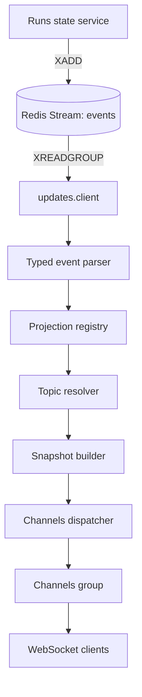
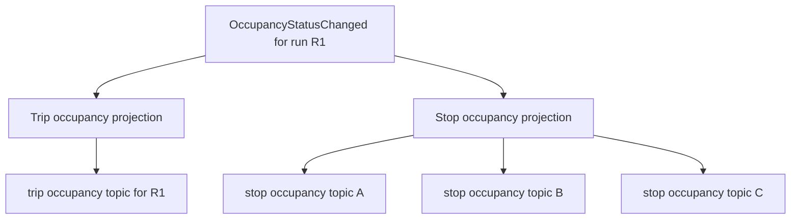
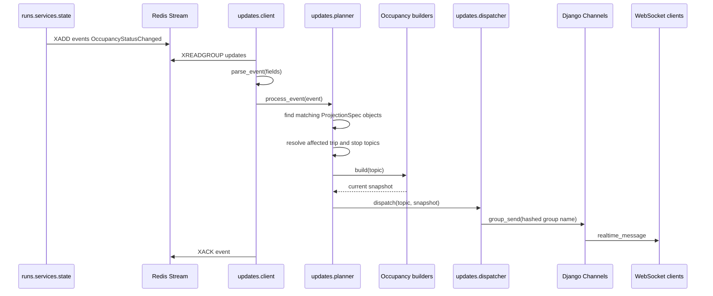
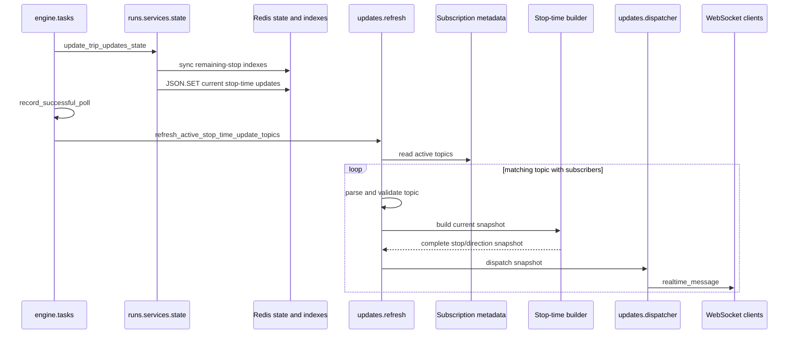
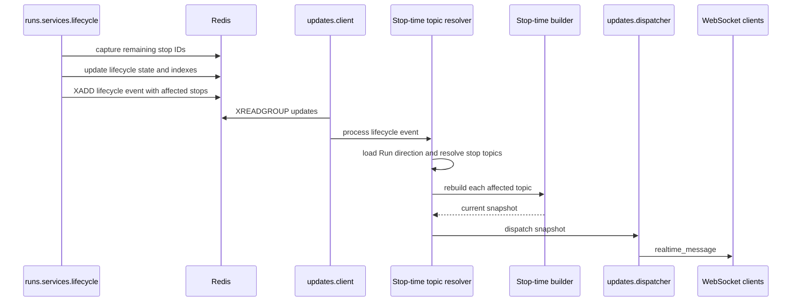
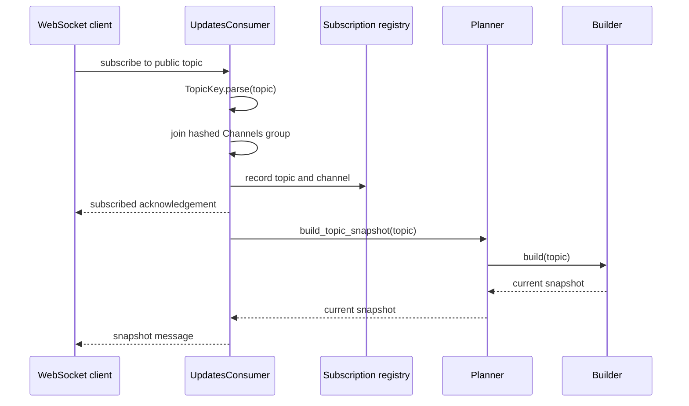

# Updates

The `updates` Django app is Infobus's real-time delivery layer. It translates
domain events produced by the rest of the backend into topic-oriented snapshots
and sends those snapshots to WebSocket clients through Django Channels.

The app sits between two different interfaces:

- On the input side, it consumes typed events from the Redis Stream named
  `events`.
- On the output side, it exposes a WebSocket pub-sub protocol at
  `/ws/updates/`.

The app does not collect GTFS Realtime feeds and does not own run state. The
`engine`, `feed`, and `runs` apps perform those jobs. `updates` observes their
events, determines which public topics are affected, builds the current state
for each topic, and publishes it.

## Overview

The event-driven path has five stages:

1. **Consume:** `client.py` reads events reliably from a Redis consumer group.
2. **Validate:** `events.py` parses each stream entry into a typed Pydantic event.
3. **Plan:** `registry.py` and `planner.py` select projections and resolve the
   topics affected by the event.
4. **Build:** a builder reads the current state from Redis and the database and
   creates a complete topic snapshot.
5. **Dispatch:** `dispatcher.py` sends the snapshot to the corresponding Django
   Channels group.



Clients can also request a snapshot without waiting for a new event. When a
client subscribes, `UpdatesConsumer` resolves the topic's registered builder and
sends its current snapshot immediately. Later events send updated snapshots to
the same topic.

This snapshot-oriented design means clients do not need to reconstruct state by
replaying every event. An event is only a trigger that says a projection may
need to be rebuilt; the builder remains the source of the outgoing message.

## What is a _projection_?

In this app, a **projection** is a definition of a client-facing read model. It describes how backend state should be viewed for a particular family of topics, which events can make that view stale, how to determine the concrete topics affected by one event, and how to rebuild the current snapshot for one topic.

The word comes from the idea of projecting a larger domain model onto a smaller, purpose-specific view. The backend knows about feeds, runs, trips, routes, stop sequences, realtime state, and Redis indexes. A screen interested in one stop does not need that entire model. It needs a projection such as:

```json
{
  "stop_id": "123",
  "runs": [
    {
      "run_id": "019fc09f-2af5-75b0-baab-c9ec701db592",
      "route_id": "1",
      "arrival_time": 1785645000,
      "occupancy_status": 2
    }
  ]
}
```

That payload is a read model tailored to the question: "What is the occupancy status of the vehicles approaching this stop?"

### Parts of a projection

Every registered projection is represented by a `ProjectionSpec` and has four
behavioral parts:

| Part           | Question answered                                    | Stop occupancy example                                      |
| -------------- | ---------------------------------------------------- | ----------------------------------------------------------- |
| Topic pattern  | Which subscription shape does this projection serve? | `*.stop.occupancy_status.by_stop.*`                         |
| Triggers       | Which events may make its snapshots stale?           | `OccupancyStatusChanged`                                    |
| Topic resolver | Which concrete topics are affected by this event?    | All remaining stops of the changed run                      |
| Builder        | What is the complete current snapshot for one topic? | All approaching runs and their occupancy state for one stop |

Some projections also attach a topic validator for semantic constraints
that cannot be expressed by `TopicPattern`. Pattern matching selects a projection
from its fixed entity, information, and selector segments; the validator then
checks concrete selector values before a WebSocket subscription is registered.
The stop-time projection uses this hook to require a canonical GTFS direction ID
of `0` or `1`. (`backend/updates/registry.py:28-44`,
`backend/updates/planner.py:25-31`,
`backend/updates/projections/stop/stop_time_updates.py:11-29`)

The corresponding registration is conceptually:

```python
ProjectionSpec(
    name="stop_occupancy_status",
    description="The occupancy status of trips coming to a stop, by stop ID.",
    topic_pattern=TopicPattern(
        entity="stop",
        info="occupancy_status",
        primary_selector="by_stop",
    ),
    triggers=(OccupancyStatusChanged,),
    resolve_topics=resolve_stop_occupancy_topics,
    build=build_stop_occupancy_status,
)
```

### Projection versus event, topic, and snapshot

These terms describe different things:

- An **event** is a fact that something changed. For example,`OccupancyStatusChanged` says that one run's occupancy changed from one value to another.
- A **topic** is the public address to which clients subscribe. For example, `mbta.stop.occupancy_status.by_stop.123` identifies occupancy information for stop `123`.
- A **snapshot** is one concrete message produced at a point in time for one concrete topic.
- A **projection** is the reusable rule that connects events and topics to the builder that creates those snapshots.

A projection is therefore not the event payload and not the outgoing message. It is the definition used to derive outgoing messages from current state.

### Why builders read current state

Events are used as invalidation signals rather than as the sole source of the WebSocket payload. For example, an occupancy event contains one run ID and one new occupancy value, but the stop-level snapshot may contain several approaching runs. The stop builder must query the current run-to-stop indexes, current occupancy keys, stop-time predictions, and `Run` records to rebuild the complete view.

This has several useful properties:

- A newly connected client can receive the same snapshot immediately, without waiting for another event.
- Retrying an event rebuilds current state instead of applying the same mutation twice.
- Clients can replace their local topic state with each message instead of replaying a sequence of deltas.
- The event schema can remain focused on domain changes while each projection produces a payload suited to its audience.

The projections in this app are currently computed on demand. Their output is not stored as a separate database table or Redis document before dispatch. The underlying run state and indexes are stored; builders assemble snapshots when a subscription starts or a triggering event arrives.

### One event can invalidate multiple projections

Suppose run `R1` approaches stops `A`, `B`, and `C`, and its occupancy changes. One `OccupancyStatusChanged` event triggers two registered projections:

1. The **trip occupancy projection** resolves `mbta.trip.occupancy_status.by_run.R1` and builds a snapshot for that run.
2. The **stop occupancy projection** resolves `mbta.stop.occupancy_status.by_stop.A`, `.B`, and `.C`, then rebuilds one aggregate snapshot per stop.



This fan-out belongs in topic resolvers. Builders receive one already-resolved topic and answer only what its current snapshot should contain.

### Projection lookup has two directions

The registry supports two complementary lookups:

- **Event to projections:** `projections_for_event(event)` finds every read model invalidated by an incoming event. This drives event-triggered delivery.
- **Topic to projection:** `projection_for_topic(topic)` finds the builder for a client subscription. This drives the initial snapshot.

Using the same `ProjectionSpec` for both paths guarantees that initial and later messages are built by the same code and have the same shape.

## Current implementation status

The fully implemented event-driven information type is `occupancy_status`:

- `trip.occupancy_status.by_run.<run_id>` produces the occupancy snapshot for a
  single run.
- `stop.occupancy_status.by_stop.<stop_id>` produces all approaching runs with
  known occupancy state for a stop.

Both topics are scoped by transit system, so complete examples are:

```text
mbta.trip.occupancy_status.by_run.019fc09f-2af5-75b0-baab-c9ec701db592
mbta.stop.occupancy_status.by_stop.123
```

The registered stop-time projection is:

```text
<transit_system>.stop.stop_time_updates.by_stop.<stop_id>.by_direction.<direction_id>
```

For example:

```text
mbta.stop.stop_time_updates.by_stop.123.by_direction.1
```

It produces the current GTFS Realtime stop-time predictions for active runs
approaching one stop in one canonical GTFS direction. It is refreshed directly
after successful TripUpdates polls and is also invalidated by run lifecycle
events. (`backend/updates/registry.py:86-108`,
`backend/engine/tasks.py:145-164`)

The event parser also recognizes stop sequence, stop ID, vehicle status,
congestion, occupancy percentage, and run lifecycle events. Event types without
registered projections are validated and acknowledged without publishing a
WebSocket message.

## Runtime flows

### Event-driven update

An occupancy update follows this sequence:



One `OccupancyStatusChanged` event can affect multiple topics. The direct trip
projection always resolves one topic. The stop projection resolves one topic for
each remaining stop of the run.

### Trip-update poll refresh

Stop-time prediction changes do not publish one domain event per changed RedisJSON
document. After a TripUpdates poll has persisted the feed, updated current run
state, and recorded the successful poll, `engine.tasks` calls
`refresh_active_stop_time_update_topics()` once for each successfully processed
transit system. (`backend/engine/tasks.py:121-166`,
`backend/runs/services/state.py:246-303`)



The refresh considers only active subscriptions for the transit system and only
topics registered to `stop_stop_time_updates`. It checks subscriber presence
before collecting the topic and again immediately before building, validates the
concrete topic, and isolates failures so one broken topic does not prevent later
topics from being refreshed. (`backend/updates/refresh.py:24-68`)

### Stop-time lifecycle invalidation

Run lifecycle transitions use the normal Redis Stream path. Before terminal
cleanup removes a run from the active set and stop indexes, the lifecycle service
captures its indexed stop IDs. The cleanup and lifecycle event publication occur
in the same Redis transaction, and the event carries those stops in
`affected_stop_ids_json`. (`backend/runs/services/lifecycle.py:499-549`,
`backend/runs/services/lifecycle.py:552-579`)



The projection reacts to signal loss, signal restoration, completion,
interruption, and cancellation. Its resolver loads the scoped `Run` direction,
parses the captured stop list, removes duplicate stop IDs while preserving their
order, and creates one qualified topic per affected stop. It resolves no topics
when the run direction is unavailable or noncanonical, or when the captured stop
list is not a JSON array. (`backend/updates/registry.py:98-107`,
`backend/updates/projections/stop/stop_time_updates.py:32-68`)

### WebSocket subscription



Disconnecting removes all subscriptions associated with that WebSocket channel.

## WebSocket protocol

### Endpoint

```text
/ws/updates/
```

Use `ws://` for plain HTTP development and `wss://` when the site is served over
HTTPS.

### Subscribe (example)

```json
{
  "action": "subscribe",
  "topic": "mbta.stop.occupancy_status.by_stop.123"
}
```

The server acknowledges the subscription:

```json
{
  "type": "subscribed",
  "topic": "mbta.stop.occupancy_status.by_stop.123"
}
```

If a builder is registered for the topic, the server then sends an initial
snapshot:

```json
{
  "topic": "mbta.stop.occupancy_status.by_stop.123",
  "message": {
    "topic": "mbta.stop.occupancy_status.by_stop.123",
    "stop_id": "123",
    "runs": []
  }
}
```

### Qualified stop-time subscription

A stop-time subscription must include both the stop and canonical direction:

```json
{
  "action": "subscribe",
  "topic": "mbta.stop.stop_time_updates.by_stop.123.by_direction.1"
}
```

The initial snapshot and later dispatched snapshots use the same outer WebSocket
envelope and the same builder-produced message shape.
(`backend/updates/consumers.py:84-102`,
`backend/updates/consumers.py:113-115`,
`backend/updates/dispatcher.py:8-17`)

```json
{
  "topic": "mbta.stop.stop_time_updates.by_stop.123.by_direction.1",
  "message": {
    "topic": "mbta.stop.stop_time_updates.by_stop.123.by_direction.1",
    "stop_id": "123",
    "direction_id": 1,
    "stop_time_updates": [
      {
        "run_id": "019fc09f-2af5-75b0-baab-c9ec701db592",
        "trip_id": "trip-123",
        "route_id": "route-1",
        "direction_id": 1,
        "stop_id": "123",
        "stop_sequence": 8,
        "arrival": {
          "delay": 30,
          "time": 1785645000,
          "uncertainty": null
        },
        "departure": {
          "delay": null,
          "time": 1785645030,
          "uncertainty": null
        },
        "schedule_relationship": "SCHEDULED"
      }
    ]
  }
}
```

`trip_id`, `route_id`, `stop_sequence`, and `schedule_relationship` may be
`null`. Arrival and departure remain objects whose `delay`, `time`, and
`uncertainty` fields may independently be `null`. An empty
`stop_time_updates` list is a valid current snapshot.
(`backend/updates/schemas.py:16-50`,
`backend/updates/builders/stop/stop_time_updates.py:185-221`)

### Unsubscribe

```json
{
  "action": "unsubscribe",
  "topic": "mbta.stop.occupancy_status.by_stop.123"
}
```

The response is:

```json
{
  "type": "unsubscribed",
  "topic": "mbta.stop.occupancy_status.by_stop.123"
}
```

### Errors

Malformed topics, missing properties, invalid JSON values, and unsupported
actions produce an error message:

```json
{
  "type": "error",
  "message": "A topic must have 5 or 7 segments."
}
```

> **[Verificado — Fase 2, HEAD 0fd8ad136d194daf088b65d36d1a806876309da3]**
> Estado: `no encontrado`. `/ws/updates/` no aplica autenticación ni
> autorización: ASGI monta `URLRouter` sin middleware de autenticación
> (`backend/infobus/asgi.py:19-23`) y `connect()` acepta la conexión
> inmediatamente (`backend/updates/consumers.py:36-40`).

## Topic model

Public topics have either five or seven dot-separated segments:

```text
<transit_system>.<entity>.<info>.<primary_selector>.<primary_value>
[.<qualifier_selector>.<qualifier_value>]
```

For example:

```text
mbta.stop.occupancy_status.by_stop.123
```

| Segment            | Example            | Meaning                                                     |
| ------------------ | ------------------ | ----------------------------------------------------------- |
| Transit system     | `mbta`             | Prevents identifiers from different systems from colliding. |
| Entity             | `stop`             | The type of subject represented by the topic.               |
| Information        | `occupancy_status` | The projected information sent to clients.                  |
| Primary selector   | `by_stop`          | How the primary value selects data.                         |
| Primary value      | `123`              | The selected stop ID.                                       |
| Qualifier selector | `by_direction`     | Optional additional selection dimension.                    |
| Qualifier value    | `1`                | Optional qualifier value.                                   |

The stop-time projection uses all seven segments:

| Segment | Value example | Stop-time meaning |
| --- | --- | --- |
| Transit system | `mbta` | Scopes Redis state and `Run` records to one transit system. (`backend/updates/builders/stop/stop_time_updates.py:136-162`) |
| Entity | `stop` | Selects the stop-level aggregate view. (`backend/updates/registry.py:92-97`) |
| Information | `stop_time_updates` | Selects current GTFS Realtime stop predictions. (`backend/updates/registry.py:92-97`) |
| Primary selector | `by_stop` | Interprets the primary value as a stop ID. (`backend/updates/registry.py:92-97`) |
| Primary value | `123` | Filters prediction entries to the requested stop. (`backend/updates/builders/stop/stop_time_updates.py:131-132`, `backend/updates/builders/stop/stop_time_updates.py:171-173`) |
| Qualifier selector | `by_direction` | Interprets the qualifier value as a GTFS direction ID. (`backend/updates/registry.py:92-97`) |
| Qualifier value | `1` | Accepts only the canonical strings `0` and `1`. (`backend/updates/projections/stop/stop_time_updates.py:11-22`) |

There is no route qualifier. One topic can therefore contain predictions from
multiple routes when those runs approach the same stop in the selected direction.
(`backend/updates/builders/stop/stop_time_updates.py:145-198`)

The public topic is not used directly as a Channels group name. `TopicKey`
hashes the public topic with SHA-256 and prefixes the digest with `updates.`. This
produces deterministic group names that satisfy Channels' length and character
restrictions while keeping the complete public topic in messages and Redis
subscription metadata.

## Redis structures

### Streams

| Key                  | Type   | Purpose                                                  |
| -------------------- | ------ | -------------------------------------------------------- |
| `events`             | stream | Domain events produced by the `runs` app.                |
| `events:dead-letter` | stream | Events that cannot be parsed as a supported typed event. |

The stream consumer uses the consumer group `updates`. A consumer is named from
its container hostname and operating-system process ID.

Events are acknowledged only after processing succeeds. Invalid events are
copied to `events:dead-letter` and then acknowledged. Processing failures remain
pending and can be reclaimed after 60 seconds with `XAUTOCLAIM`.

### Subscription metadata

| Key                     | Type | Value                                                  |
| ----------------------- | ---- | ------------------------------------------------------ |
| `active_subscriptions`  | set  | Public topics with at least one connected channel.     |
| `subscriptions:<topic>` | set  | Channels channel names subscribed to one public topic. |

Subscription addition uses a Redis transaction. Removal uses a Lua script so
removing the channel and deleting empty topic metadata happen atomically.

### State read by occupancy builders

| Key                                                         | Type       | Purpose                                                        |
| ----------------------------------------------------------- | ---------- | -------------------------------------------------------------- |
| `<transit_system>:trip:<run_id>:occupancy_status`           | string     | Current occupancy enum value.                                  |
| `<transit_system>:trip:<run_id>:stop_time_updates`          | RedisJSON  | Stop predictions used to find arrival time.                    |
| `<transit_system>:run:<run_id>:remaining_stops`             | sorted set | Stop IDs scored by stop sequence.                              |
| `<transit_system>:run:<run_id>:remaining_stops_initialized` | string     | Distinguishes an initialized empty index from an absent index. |
| `<transit_system>:stop:<stop_id>:approaching_runs`          | set        | Reverse index of runs that still approach a stop.              |

The remaining-stop indexes are owned by `runs.services.stop_index`, not by this
app. They are documented here because stop topic resolution and snapshot
building depend on them.

### State read by the stop-time builder

| Key | Type | Purpose |
| --- | --- | --- |
| `<transit_system>:runs:active` | set | Canonical membership of runs eligible for public snapshots. (`backend/runs/services/lifecycle.py:83-85`, `backend/updates/builders/stop/stop_time_updates.py:136-143`) |
| `<transit_system>:stop:<stop_id>:approaching_runs` | set | Candidate run IDs indexed for the requested stop. (`backend/runs/services/stop_index.py:24-26`, `backend/runs/services/stop_index.py:105-107`) |
| `<transit_system>:run:<run_id>:remaining_stops` | sorted set | Confirms that the stop remains at or ahead of current progress. (`backend/runs/services/stop_index.py:19-21`, `backend/runs/services/stop_index.py:110-123`) |
| `<transit_system>:trip:<run_id>:current_stop_sequence` | string | Current progress used to reject earlier or sequence-less visits. (`backend/updates/builders/stop/stop_time_updates.py:87-102`, `backend/updates/builders/stop/stop_time_updates.py:175-183`) |
| `<transit_system>:trip:<run_id>:stop_time_updates` | RedisJSON | Current arrival, departure, sequence, stop, and schedule-relationship values. (`backend/runs/services/state.py:263-293`) |

The builder also queries scoped `Run` rows for the UUID, GTFS trip ID, GTFS
route ID, transit system, and direction. It does not use the historical
`feed.StopTimeUpdate` rows to construct the public snapshot.
(`backend/updates/builders/stop/stop_time_updates.py:9-20`,
`backend/updates/builders/stop/stop_time_updates.py:145-198`)

## Source layout

```text
updates/
├── client.py
├── consumers.py
├── dispatcher.py
├── events.py
├── exceptions.py
├── planner.py
├── refresh.py
├── registry.py
├── routing.py
├── schemas.py
├── subscriptions.py
├── topics.py
├── builders/
│   ├── stop/
│   │   ├── stop_time_updates.py
│   │   └── occupancy_status.py
│   └── trip/
│       └── occupancy_status.py
└── projections/
		├── stop/
		│   ├── stop_time_updates.py
		│   └── occupancy_status.py
		└── trip/
				└── occupancy_status.py
```

Other builder and projection files exist as placeholders or legacy code. Their
status is described below.

## File-by-file reference

### `client.py`

This module is the long-running Redis Streams worker. The Docker
`streams-consumer` service launches it with:

```text
python -m updates.client
```

#### Constants

- `STREAM_NAME = "events"` selects the input stream.
- `GROUP_NAME = "updates"` identifies the Redis consumer group.
- `DEAD_LETTER_STREAM = "events:dead-letter"` receives invalid event payloads.
- `CLAIM_IDLE_MS = 60_000` sets the minimum idle time before pending work is
  reclaimed.

#### `_ensure_consumer_group(redis)`

Creates the `updates` consumer group at `$` and creates the stream if needed.
`BUSYGROUP` is ignored because it means the group already exists. Other Redis
errors are raised.

Creating the group at `$` means a brand-new deployment begins with events added
after group creation; it does not replay older stream history.

#### `_process_entries(redis, entries, consumer_name)`

Processes a batch of stream entries:

1. Calls `parse_event()` to validate and type the string fields.
2. Sends invalid entries to the dead-letter stream and acknowledges them.
3. Calls `process_event()` for valid entries.
4. Acknowledges entries only when projection processing succeeds.

Imports of `events` and `planner` are local to this function so Django setup is
complete before modules that access models and settings are imported.

#### `_claim_stale_entries(redis, consumer_name)`

Uses `XAUTOCLAIM` to transfer entries that have remained pending for at least 60
seconds to the current consumer, then sends those entries through
`_process_entries()`.

#### `consume_events()`

Creates a decoded Redis client, registers the consumer group, periodically
claims stale work, and blocks for up to five seconds in `XREADGROUP` while
waiting for batches of up to 100 new entries.

The loop is intentionally permanent and is expected to run in its own container
or managed process.

### `events.py`

Defines the set of domain events this app can parse.

#### `UpdateEvent`

A discriminated union of Pydantic models imported from `runs.events.types`. The
`event_type` field selects the concrete model. Currently recognized event types
are:

- `CurrentStopSequenceChanged`
- `StopIDChanged`
- `CurrentStatusChanged`
- `CongestionLevelChanged`
- `OccupancyStatusChanged`
- `OccupancyPercentageChanged`
- `RunSignalLost`
- `RunSignalRestored`
- `RunCompleted`
- `RunInterrupted`
- `RunCancelled`

#### `_event_adapter`

A Pydantic `TypeAdapter` compiled once for the `UpdateEvent` union.

#### `parse_event(fields)`

Validates Redis Stream string fields and returns the correct concrete event
model. Pydantic converts UUIDs and integer enum values from their Redis string
representations.

Recognizing an event does not imply that a projection exists for it. Projection
support is controlled independently by `registry.py`.

### `topics.py`

Contains the public topic value objects.

#### `TopicKey`

An immutable dataclass representing one concrete topic. Its properties mirror
the five or seven topic segments.

- `TopicKey.parse(raw)` validates segment count and rejects empty segments.
- `render()` converts the object back to its public dot-separated form.
- `__str__()` delegates to `render()`.
- `group_name()` converts the public topic into a deterministic Channels-safe
  group name using SHA-256.

#### `TopicPattern`

An immutable dataclass representing the structural parts of a topic without its
values or transit system. `matches(topic)` compares entity, information type,
primary selector, and qualifier selector. The registry uses it to locate the
builder for an initial subscription snapshot.

### `schemas.py`

Defines and validates the public stop-time snapshot contract. All three models
forbid undeclared fields. (`backend/updates/schemas.py:16-50`)

#### `DirectionID` and `StopTimeScheduleRelationship`

`DirectionID` is the integer literal union `0 | 1`.
`StopTimeScheduleRelationship` accepts `SCHEDULED`, `SKIPPED`, `NO_DATA`, and
`UNSCHEDULED`. (`backend/updates/schemas.py:7-13`)

#### `StopTimeEventSnapshot`

Represents one arrival or departure event. `delay`, Unix `time`, and
`uncertainty` are independently optional integers. (`backend/updates/schemas.py:16-23`)

#### `StopTimeUpdateSnapshot`

Represents one current visit of one run to the selected stop. It contains run,
trip, route, direction, stop, and sequence identifiers; complete arrival and
departure event objects; and the optional normalized schedule relationship.
(`backend/updates/schemas.py:26-39`)

#### `StopTimeUpdatesByStopSnapshot`

Represents the complete current list for one public stop/direction topic. It
contains the rendered topic, selected stop ID, selected direction ID, and the
validated list of visit snapshots. (`backend/updates/schemas.py:42-50`)

### `registry.py`

Declares which projections exist and connects event types, topic resolution, and
snapshot builders.

#### `ProjectionSpec`

An immutable configuration object with:

- `name`: a diagnostic name.
- `description`: a human-readable description of the projection.
- `topic_pattern`: the topic shape handled by the projection.
- `triggers`: event classes that invalidate the projection.
- `resolve_topics`: function that maps an event to concrete topics.
- `build`: function that builds one topic's current snapshot.
- `validate_topic`: optional semantic validation applied to a concrete
  subscription topic before it is registered. (`backend/updates/registry.py:31-44`,
  `backend/updates/planner.py:25-31`)

#### `PROJECTIONS`

The tuple of every projection enabled by the app. It is the declarative registry used for both event-driven updates and initial subscription snapshots.

Each entry defines one client-facing read model by connecting a topic pattern with its triggering event types, topic resolver, and snapshot builder. Adding a `ProjectionSpec` to this tuple makes it discoverable by `projections_for_event()` and `projection_for_topic()`; merely creating resolver or builder modules does not activate them.

Multiple entries may share the same trigger when one domain change affects different views, and different entries may target the same entity at different selectors or levels of aggregation. Registry order matters only for topic-to-projection lookup, which returns the first matching specification, so topic patterns should not overlap ambiguously.

#### `projections_for_event(event)`

Returns every specification whose `triggers` tuple accepts the event. More than
one projection can react to the same event, which is how one run occupancy event
updates both the direct trip topic and all relevant stop topics.

#### `projection_for_topic(topic)`

Returns the first specification whose `TopicPattern` matches the concrete topic,
or `None`. This lookup powers initial snapshots during WebSocket subscription.

### `planner.py`

Coordinates projections without containing domain-specific routing or message
construction.

#### `process_event(event)`

For every matching projection:

1. Resolves concrete topics.
2. Deduplicates those topics with a set.
3. Builds a snapshot for each topic.
4. Dispatches every non-`None` snapshot.

Builders may return `None` when the selected state or database object is not
available. In that case nothing is sent.

#### `build_topic_snapshot(topic)`

Finds the projection registered for a topic and calls its builder. It returns
`None` if no projection supports that topic. `UpdatesConsumer` uses this method
immediately after subscription.

#### `validate_topic(topic)`

Rejects topics that do not match a registered projection. When the matching
`ProjectionSpec` has a `validate_topic` hook, it also applies that
projection-specific validation before subscription state or Channels membership
is changed. (`backend/updates/planner.py:25-31`,
`backend/updates/consumers.py:84-98`)

### `refresh.py`

Provides the direct poll-driven invalidation path for active stop-time topics.
It owns a decoded Redis client for the same database used by subscription
metadata and identifies the target projection by the diagnostic name
`stop_stop_time_updates`. (`backend/updates/refresh.py:1-21`)

#### `refresh_active_stop_time_update_topics(transit_system)`

Reads the active public topic set and parses each entry. It discards malformed
topics, topics from other transit systems, topics handled by other projections,
and topics whose per-topic subscriber set is empty. The remaining topics are
deduplicated and processed in rendered-topic order.
(`backend/updates/refresh.py:24-47`)

Before each build, it repeats the registry and subscriber checks, applies the
projection-specific validator, builds the current snapshot, and dispatches
non-`None` payloads. Exceptions are logged per topic so later topics continue,
and the return value is the number of snapshots successfully dispatched.
(`backend/updates/refresh.py:46-68`)

### `dispatcher.py`

Contains the final transport step.

#### `dispatch(topic, payload)`

Gets the configured Django Channels layer and synchronously calls
`group_send()` for the hashed topic group. The Channels event has:

```python
{
		"type": "realtime_message",
		"topic": topic.render(),
		"message": payload,
}
```

The `type` selects `UpdatesConsumer.realtime_message()`.

### `consumers.py`

Contains synchronous Django Channels WebSocket consumers.

#### `UpdatesConsumer`

This is the consumer exposed by `routing.py` and used by the topic pub-sub
protocol.

- `__init__()` creates an in-memory set of this connection's `TopicKey`
  subscriptions.
- `connect()` accepts the socket, initializes its subscription set, and sends a JSON `connected` acknowledgement.
- `disconnect()` leaves every Channels group and removes Redis subscription
  metadata for this channel.
- `receive(text_data)` parses the JSON command and topic, dispatches subscribe
  or unsubscribe, and returns protocol errors without closing the connection.
- `subscribe(topic)` joins the hashed Channels group, records the subscription,
  acknowledges it, and sends an initial snapshot when a builder exists.
- `unsubscribe(topic)` leaves the group, removes metadata, and acknowledges the
  action.
- `realtime_message(event)` serializes dispatcher messages to the WebSocket.

`subscribe()` validates the concrete topic before joining its Channels group or
writing Redis subscription metadata. Consequently, a structurally valid but
unregistered topic, or a stop-time topic with a noncanonical direction, receives
a protocol error and creates no subscription. (`backend/updates/consumers.py:84-102`,
`backend/updates/planner.py:25-31`)

### `subscriptions.py`

Maintains Redis metadata about WebSocket subscriptions.

#### `ACTIVE_SUBSCRIPTIONS_KEY`

The Redis key `active_subscriptions`, a set of public topic strings that have at
least one subscriber.

#### `_subscribers_key(topic)`

Returns the per-topic Redis key `subscriptions:<topic>`.

#### `active_subscription_topics(redis)`

Reads `active_subscriptions` and returns decoded public topic strings. This is
the starting set for poll-driven stop-time refreshes.
(`backend/updates/subscriptions.py:12-17`,
`backend/updates/refresh.py:24-27`)

#### `has_subscribers(redis, topic)`

Checks the cardinality of `subscriptions:<topic>`. The poll refresh uses it both
while selecting work and immediately before building a snapshot.
(`backend/updates/subscriptions.py:20-22`,
`backend/updates/refresh.py:39-53`)

#### `add_subscription(redis, topic, channel_name)`

Atomically adds the channel to the per-topic set and the topic to
`active_subscriptions` using a Redis transaction pipeline.

#### `remove_subscription(redis, topic, channel_name)`

Runs a Lua script that removes the channel and, when the topic has no remaining
channels, deletes the empty set and removes the topic from
`active_subscriptions`.

This per-channel design prevents one disconnect from incorrectly marking a topic
inactive while other clients remain subscribed.

### `routing.py`

Defines the app's ASGI WebSocket route:

```text
ws/updates/ -> UpdatesConsumer
```

`infobus.asgi` imports `websocket_urlpatterns` and mounts it under the ASGI
`websocket` protocol router.

### `projections/trip/occupancy_status.py`

#### `resolve_trip_occupancy_topics(event)`

Maps an `OccupancyStatusChanged` or `RunLifecycleEvent` event to exactly one direct topic:

```text
<transit_system>.trip.occupancy_status.by_run.<run_id>
```

> (`backend/updates/projections/trip/occupancy_status.py:6-8`).

No database or Redis query is required because the event already identifies the
transit system and run.

### `projections/stop/occupancy_status.py`

#### `resolve_stop_occupancy_topics(event)`

Calls `runs.services.stop_index.remaining_stop_ids()` and creates one topic for
every stop that the run has not passed:

```text
<transit_system>.stop.occupancy_status.by_stop.<stop_id>
```

> Estado: `parcial`. `remaining_stop_ids()` solo se llama para eventos de
> ocupación; los eventos de ciclo de vida leen `affected_stop_ids_json`
> directamente (`backend/updates/projections/stop/occupancy_status.py:9-15`).
> Este comportamiento corresponde a la limitación ya indicada más abajo sobre
> los IDs de parada afectados por eventos terminales; es una aclaración del
> cuerpo principal, no un hallazgo nuevo.

Topic resolution answers **where** an update belongs. It does not build the
outgoing message.

### `projections/stop/stop_time_updates.py`

#### `VALID_DIRECTION_IDS`

Maps the only accepted public qualifier strings, `"0"` and `"1"`, to the
corresponding integer GTFS direction IDs. (`backend/updates/projections/stop/stop_time_updates.py:11`)

#### `direction_id_from_topic(topic)`

Returns the canonical integer direction for a topic. Any missing, alternative,
or noncanonical representation raises `InvalidTopicException`; values such as
`"01"` are not normalized. (`backend/updates/projections/stop/stop_time_updates.py:14-22`)

#### `validate_stop_time_updates_topic(topic)`

Rejects an empty stop ID and delegates direction validation to
`direction_id_from_topic()`. Structural selector matching has already happened
in the registry before this semantic validation runs.
(`backend/updates/projections/stop/stop_time_updates.py:25-29`,
`backend/updates/planner.py:25-31`)

#### `resolve_stop_time_updates_topics(event)`

Resolves lifecycle invalidations rather than ordinary prediction changes. It
queries the event's `Run` within the event's transit system and returns no topics
unless the persisted direction is `0` or `1`.
(`backend/updates/projections/stop/stop_time_updates.py:32-45`)

It then parses `affected_stop_ids_json`, requires a JSON list, stringifies
nonempty entries, and deduplicates them in original order. Each stop becomes:

```text
<transit_system>.stop.stop_time_updates.by_stop.<stop_id>.by_direction.<direction_id>
```

Malformed JSON or a non-list value resolves to no topics.
(`backend/updates/projections/stop/stop_time_updates.py:47-68`)

### `builders/trip/occupancy_status.py`

#### `build_trip_occupancy_status(topic)`

Builds the current occupancy snapshot for one run:

1. Reads the occupancy value from Redis.
2. Queries the `Run` row while enforcing the topic's transit-system scope.
3. Returns the public topic, run ID, GTFS trip ID, route ID, and integer
   occupancy status.

> Estado: `parcial`. El payload real también incluye `lifecycle_state`, campo no
> reflejado en la enumeración anterior
> (`backend/updates/builders/trip/occupancy_status.py:28-36`).

It returns `None` when the Redis state or matching run is absent.

### `builders/stop/occupancy_status.py`

Builds the aggregate snapshot shown by a stop-level client.

#### `_arrival_time(transit_system, run_id, stop_id)`

Reads the run's RedisJSON stop-time updates and returns the arrival timestamp for
the requested stop. It still accepts a JSON string document for compatibility
with data written before stop-time updates were stored as proper RedisJSON
arrays.

#### `build_stop_occupancy_status(topic)`

1. Reads candidate run IDs from the stop-to-runs reverse index.
2. Discards candidates that are no longer approaching the stop.
3. Fetches the matching `Run` rows in one database query.
4. Reads each run's current occupancy from Redis.
5. Adds trip, route, and arrival information.
6. Sorts runs by known arrival time and then run ID.

> Estado: `parcial`. Antes de comprobar si cada run todavía se aproxima a la
> parada, el builder también descarta los runs fuera del conjunto activo; ese
> filtro no aparece en la enumeración anterior
> (`backend/updates/builders/stop/occupancy_status.py:40-45`).

The resulting snapshot has this shape:

```json
{
  "topic": "mbta.stop.occupancy_status.by_stop.123",
  "stop_id": "123",
  "runs": [
    {
      "run_id": "019fc09f-2af5-75b0-baab-c9ec701db592",
      "trip_id": "trip-123",
      "route_id": "route-1",
      "arrival_time": 1785645000,
      "occupancy_status": 2
    }
  ]
}
```

> Estado: `parcial`. Cada entrada del payload real también incluye
> `lifecycle_state`, campo no reflejado en el ejemplo anterior
> (`backend/updates/builders/stop/occupancy_status.py:62-70`).

An empty `runs` list is a valid snapshot.

### `builders/stop/stop_time_updates.py`

Builds the complete current prediction list for one stop and direction. It uses
run lifecycle membership and stop indexes as its primary eligibility boundary,
then applies per-entry progress, schema, schedule-relationship, and freshness
filters. (`backend/updates/builders/stop/stop_time_updates.py:123-221`)

#### `SCHEDULE_RELATIONSHIPS`

Maps the four GTFS Realtime numeric StopTimeUpdate schedule relationships to
their stable names: `SCHEDULED`, `SKIPPED`, `NO_DATA`, and `UNSCHEDULED`.
(`backend/updates/builders/stop/stop_time_updates.py:31-36`)

#### `_decode_stop_time_updates(value)`

Accepts current RedisJSON arrays, bytes, and the legacy JSON-string
representation. Invalid JSON and non-list values produce an empty list; values
inside a valid list are retained only when they are dictionaries.
(`backend/updates/builders/stop/stop_time_updates.py:39-50`)

#### `_schedule_relationship_name(value)`

Normalizes known integer values, digit strings, and case-insensitive known names.
Unknown values are deliberately left unchanged so Pydantic rejects corruption
instead of silently converting it. Booleans are also left invalid rather than
being treated as integers. (`backend/updates/builders/stop/stop_time_updates.py:53-67`)

#### `_event_snapshot(value)`

Builds an arrival or departure snapshot from the `delay`, `time`, and
`uncertainty` fields of a dictionary. Missing or non-dictionary events become an
event object whose three fields are `None`.
(`backend/updates/builders/stop/stop_time_updates.py:70-76`,
`backend/updates/schemas.py:16-23`)

#### `_current_documents(transit_system, run_ids)`

Uses one non-transactional Redis pipeline to read all current stop-time
RedisJSON documents followed by all current stop-sequence strings. Invalid
sequence values are represented as `None`; an empty run list performs no Redis
commands. (`backend/updates/builders/stop/stop_time_updates.py:79-102`)

#### `_predicted_time(update)`

Uses `arrival.time` when present and otherwise uses `departure.time`. This same
effective timestamp drives freshness filtering and ordering.
(`backend/updates/builders/stop/stop_time_updates.py:105-109`,
`backend/updates/builders/stop/stop_time_updates.py:209-214`)

#### `_sort_key(update)`

Sorts known effective timestamps before unknown timestamps, then by timestamp,
run UUID, sequence presence, and sequence value. Repeated visits to the same
stop are preserved as separate entries.
(`backend/updates/builders/stop/stop_time_updates.py:112-120`,
`backend/updates/builders/stop/stop_time_updates.py:171-214`)

#### `build_stop_time_updates(topic)`

Builds one complete snapshot in this order:

1. Reads the stop and validated direction from the topic and computes the oldest
   allowed predicted time. (`backend/updates/builders/stop/stop_time_updates.py:131-135`)
2. Intersects the stop's approaching-run index with the canonical active-run set
   and verifies that each run still approaches the stop.
   (`backend/updates/builders/stop/stop_time_updates.py:136-144`)
3. Loads scoped `Run` rows and retains only the selected GTFS direction.
   (`backend/updates/builders/stop/stop_time_updates.py:145-158`)
4. Bulk-reads current prediction documents and current sequences.
   (`backend/updates/builders/stop/stop_time_updates.py:160-169`)
5. Retains entries for the selected stop whose sequence is parseable and has not
   fallen behind current progress. (`backend/updates/builders/stop/stop_time_updates.py:171-183`)
6. Constructs the strict public schema and discards individual entries that fail
   Pydantic validation. (`backend/updates/builders/stop/stop_time_updates.py:185-206`)
7. Excludes `SKIPPED` visits and predictions older than the configured tolerance.
   Timestamp-free visits remain eligible. (`backend/updates/builders/stop/stop_time_updates.py:207-212`)
8. Sorts the surviving entries and returns a JSON-compatible aggregate snapshot,
   including a valid empty list when no entry survives.
   (`backend/updates/builders/stop/stop_time_updates.py:214-221`)

The module-level name `stop_time_updates` remains an alias of the registered
builder so the legacy `builders.message_builder` import remains importable.
(`backend/updates/builders/stop/stop_time_updates.py:224-225`)

### `tests.py`

The current focused tests cover:

- Parsing and rendering transit-system-scoped topics.
- Rejecting old unscoped topics.
- Stable, length-safe Channels group names.
- Parsing first-observation events without `previous_state`.
- Sending a JSON connection acknowledgement.
- Rejecting binary WebSocket frames without closing the connection.
- Resolving direct trip occupancy topics.
- Resolving all remaining stop occupancy topics.
- Planner coordination from resolution through dispatch.
- Parsing and semantically validating qualified stop-time topics.
  (`backend/updates/tests.py:61-68`, `backend/updates/tests.py:211-224`)
- Building empty and populated stop-time snapshots, including repeated visits,
  direction and transit-system isolation, sequence progress, schedule
  relationships, temporal tolerance, and deterministic ordering.
  (`backend/updates/tests.py:226-374`, `backend/updates/tests.py:377-677`)
- Refreshing only active matching topics and isolating one topic failure from
  later refreshes. (`backend/updates/tests.py:680-751`)

The tests mock projection dependencies and do not replace the live integration
checks for Redis Streams, RedisJSON, Channels, or the database.

> Estado: `parcial`. El archivo contiene once tests. Además de los casos
> enumerados, cubre el rechazo de un tópico que no es string
> (`backend/updates/tests.py:46-51`), el parsing de un evento de ciclo de vida
> (`backend/updates/tests.py:106-118`) y la resolución de las paradas afectadas
> por un evento terminal (`backend/updates/tests.py:153-167`).

### `exceptions.py`

Defines `InvalidTopicException`, a `ValueError` subclass raised when a public
topic has the wrong number of segments or contains empty segments.

### `apps.py`

Defines `UpdatesConfig`, the Django application configuration registered in
`INSTALLED_APPS` as `updates.apps.UpdatesConfig`.

### `__init__.py`

An empty package marker. It makes `updates` an importable Python package and has
no runtime behavior.

### `models.py`

Defines three database models that are separate from the real-time projection
pipeline:

- `Weather`: weather observations and measurements.
- `CommonAlert`: a placeholder for Common Alerting Protocol data.
- `Social`: social-media content and engagement counts.

These models are historical or future content sources. The occupancy pipeline
does not read them.

### `admin.py`

Registers `Weather`, `Social`, and `CommonAlert` in Django admin.

### `migrations/0001_initial.py`

Creates the database tables for the models in `models.py`.

### `migrations/__init__.py`

An empty package marker for Django's migration discovery.

> Estado: `no encontrado`. En el árbol actual no existe
> `backend/updates/migrations/` y `git ls-files -- backend/updates/migrations`
> devuelve vacío: no hay migraciones de `updates` versionadas. La regla que
> excluye esos directorios está en `.gitignore:87`.

### `views.py`

Currently contains no HTTP views. The manual WebSocket test page is implemented
by the `website` app at `/updates/`, not by this module.

### `builders/message_builder.py`

Legacy generic message-switching code for stop and trip stop-time builders. It
is not used by the projection registry. The referenced stop-time functions are
currently placeholders, and their signatures do not match the argument passed
by `message_builder()`.

### Placeholder projection files

The following files are empty and are not registered:

- `projections/agency/alerts.py`
- `projections/route/alerts.py`
- `projections/route/vehicle_positions.py`
- `projections/stop/stop_times_updates.py`
- `projections/trip/stop_times_updates.py`

### Placeholder builder files

The following builder files are empty and are not registered:

- `builders/agency/alerts.py`
- `builders/route/alerts.py`
- `builders/route/vehicle_positions.py`
- `builders/stop/alerts.py`
- `builders/stop/vehicle_positions.py`
- `builders/trip/alerts.py`
- `builders/trip/congestion_level.py`
- `builders/trip/vehicle_stop_status.py`

The stop and trip `stop_time_updates.py` files each contain only a placeholder
function.

## External dependencies

### Event production

`runs.services.state` atomically updates scalar run state and publishes domain
events to the `events` stream. Event schemas are defined in
`runs.events.types`; `updates.events` imports those schemas rather than defining
a second wire contract.

### Trip-update poll integration

`engine.tasks` imports `refresh_active_stop_time_update_topics()` directly from
`updates.refresh`. This is an in-process Python interface from the polling
orchestrator into the delivery app; it does not pass through the `events` Redis
Stream. (`backend/engine/tasks.py:19-28`,
`backend/engine/tasks.py:157-164`)

The call occurs only after a publisher's TripUpdates response has been persisted,
its current run state has been updated, and the successful poll has been
recorded. Transit systems are deduplicated before refresh, so multiple processed
publishers in one system produce one refresh call at the end of the task.
(`backend/engine/tasks.py:121-166`)

### Remaining-stop index

`runs.services.stop_index` maintains the run-to-stop and stop-to-run indexes used
by stop projections:

- `sync_remaining_stops()` refreshes both directions from realtime stop-time
  updates.
- `ensure_remaining_stops()` falls back to current GTFS Schedule `StopTime`
  rows when no realtime index has been initialized.
- `remaining_stop_ids()` returns stops at or after the current sequence.
- `approaching_run_ids()` reads the reverse stop index.
- `run_is_approaching_stop()` validates reverse-index candidates.
- `advance_remaining_stops()` removes stops with lower sequences.
- `clear_remaining_stops()` removes the index when a run is decommissioned.

The stop `stop_time_updates` builder keeps those indexes and the canonical
active-run set authoritative. As a public-boundary safeguard, it also excludes
an update when its `arrival.time` (or `departure.time` when arrival is absent)
is older than `GTFS_RT_STOP_TIME_UPDATE_PAST_TOLERANCE_SECONDS`, which defaults
to 120 seconds. This covers polling/processing delay and vehicles dwelling at a
stop; it does not replace terminal lifecycle cleanup. Updates with neither
timestamp remain eligible from index/progress evidence and sort last.

### Django Channels

The channel layer is configured in `infobus.settings`. The dispatcher and
WebSocket consumer both derive the same hashed group name from `TopicKey`, so
they do not need to share an in-memory registry.

### Redis

The app requires Redis Streams and RedisJSON. Development uses Redis 8, which
provides the JSON commands used by the stop occupancy builder and run state
service.

> Estado de producción: `roto` en los tres puntos siguientes. Primero,
> `streams-consumer` está declarado en desarrollo (`compose.dev.yml:70-87`),
> pero no tiene un servicio equivalente en el mapa de servicios de producción
> (`compose.prod.yml:22-289`). Segundo, producción usa `redis:7-alpine` sin
> módulos declarados (`compose.prod.yml:167-170`), mientras el builder de parada
> y el estado de runs ejecutan comandos RedisJSON
> (`backend/updates/builders/stop/occupancy_status.py:20-24`,
> `backend/runs/services/state.py:254-258`). Tercero, el servidor exige
> contraseña (`compose.prod.yml:170-179`), pero settings, Channels, el consumer
> WebSocket y el cliente del stream omiten credenciales
> (`backend/infobus/settings.py:133-137`,
> `backend/infobus/settings.py:159-162`,
> `backend/infobus/settings.py:178-186`,
> `backend/updates/consumers.py:17-19`, `backend/updates/client.py:75-82`).

## Adding a new projection

Use the following sequence when adding another information type.

1. **Define or reuse a typed event.** Add it to `runs.events.types`, ensure the
   producer publishes it, and include it in `updates.events.UpdateEvent`.
2. **Create a resolver.** Add
   `projections/<entity>/<info>.py` with a function that maps the event to one or
   more `TopicKey` objects.
3. **Create a builder.** Add `builders/<entity>/<info>.py` with a function that
   builds a complete current snapshot for one topic.
4. **Register the projection.** Add a `ProjectionSpec` to `PROJECTIONS` with the
   topic pattern, event triggers, resolver, and builder.

When a topic has semantic constraints on selector values, set
`ProjectionSpec.validate_topic` so invalid subscriptions are rejected before
Channels and Redis subscription state are changed. Poll-driven projections also
need an explicit producer-side call analogous to the TripUpdates integration;
registration in `PROJECTIONS` only enables event lookup and subscription-time
building. (`backend/updates/registry.py:34-44`,
`backend/updates/planner.py:25-31`,
`backend/engine/tasks.py:157-164`)

5. **Add tests.** Cover topic resolution, snapshot shape, planner dispatch, and
   first-subscription behavior.
6. **Validate live delivery.** Subscribe a WebSocket client, publish a controlled
   event, and verify both the initial snapshot and event-triggered snapshot.

Resolvers should answer **which topics are affected**. Builders should answer
**what the current message is**. Dispatchers should only deliver data. Keeping
those responsibilities separate prevents GTFS and Redis query logic from
spreading into WebSocket transport code.

## Development and operations

### Run focused tests

From the repository root:

```bash
docker compose -f compose.dev.yml exec orchestrator \
	/home/app/.venv/bin/python manage.py test updates
```

### Check the consumer group

```bash
docker compose -f compose.dev.yml exec memory \
	redis-cli XINFO GROUPS events

docker compose -f compose.dev.yml exec memory \
	redis-cli XPENDING events updates
```

### Inspect dead-letter events

```bash
docker compose -f compose.dev.yml exec memory \
	redis-cli XREVRANGE events:dead-letter + - COUNT 20
```

### Restart the stream consumer

```bash
docker compose -f compose.dev.yml restart streams-consumer
```

### Manual browser test

The `website` app provides a page at:

```text
http://localhost:<backend-port>/updates/
```

It lists current MBTA stops, subscribes to a selected stop occupancy topic, and
shows raw WebSocket messages.

## Known limitations

- Only occupancy status has registered event-driven projections. Those
  projections are invalidated by occupancy and run lifecycle events.
- Valid typed events with no matching projection are acknowledged without an
  outgoing message.
- The consumer starts a newly created group at `$`; historical events are not
  replayed on first deployment.
- Projection processing is at-least-once. Builders and dispatch are snapshot
  based, but WebSocket clients may still receive duplicate equivalent snapshots
  after retry.
- There is no stream trimming policy in this app yet.
- Dead-letter entries have no automated replay workflow.
- Stop-time prediction changes do not publish their own typed event. Existing
  subscribed topics are refreshed after successful TripUpdates polls, while
  lifecycle events provide the event-stream invalidation path.
  (`backend/runs/services/state.py:246-303`,
  `backend/updates/registry.py:98-107`,
  `backend/engine/tasks.py:157-164`)
- Stop-time topics require a canonical direction of `0` or `1`. Runs without one
  of those persisted values are absent from both lifecycle resolution and built
  snapshots. (`backend/updates/projections/stop/stop_time_updates.py:36-45`,
  `backend/updates/builders/stop/stop_time_updates.py:152-158`)
- A current RedisJSON document is not sufficient by itself. A run must also be
  present in the canonical active set, the stop's approaching-run set, the
  remaining-stop sorted set, and a scoped `Run` row.
  (`backend/updates/builders/stop/stop_time_updates.py:136-158`)
- The snapshot exposes run, trip, route, direction, stop, and sequence
  identifiers, but not rider-facing stop names, route names, or destination
  headsigns. Those values exist in the Schedule `Stop`, `Route`, `Trip`, and
  `StopTime` models, but the builder queries only `Run` and its transit-system
  relation. (`backend/updates/schemas.py:26-50`,
  `backend/feed/models.py:194-255`,
  `backend/feed/models.py:314-338`,
  `backend/gtfs-django/gtfs/models.py:50-64`,
  `backend/gtfs-django/gtfs/models.py:118-135`,
  `backend/gtfs-django/gtfs/models.py:248-267`,
  `backend/gtfs-django/gtfs/models.py:285-303`,
  `backend/updates/builders/stop/stop_time_updates.py:145-198`)
- The remaining-stop indexes and current RedisJSON document are written by
  separate Redis operations. There is no transaction spanning both writes, so a
  concurrent snapshot build can observe the intermediate state.
  (`backend/runs/services/state.py:280-293`,
  `backend/runs/services/stop_index.py:34-57`)
- Poll refreshes isolate builder and dispatcher failures per topic. Initial
  subscription builds and Redis Stream event processing do not provide the same
  per-topic isolation inside the planner.
  (`backend/updates/refresh.py:46-62`,
  `backend/updates/consumers.py:84-102`,
  `backend/updates/planner.py:8-22`)
- `ScreenConsumer` and `StatusConsumer` are not routed by this app.
- Several builder/projection modules are placeholders.
- Terminal lifecycle events carry affected stop IDs so occupancy snapshots are
  rebuilt after remaining-stop indexes are cleaned up.

> **[Verificado — Fase 2, HEAD 0fd8ad136d194daf088b65d36d1a806876309da3]**
> Estado: `no encontrado`. Ni `ScreenConsumer` ni `StatusConsumer` existen en
> ningún archivo Python del repositorio. El routing importa únicamente
> `UpdatesConsumer` (`backend/updates/routing.py:3`) y registra ese único
> consumer (`backend/updates/routing.py:5-9`), cuya clase está en
> `backend/updates/consumers.py:31`. `engine/status.html` es un cliente separado
> y no relacionado: abre `/ws/status/`
> (`backend/engine/templates/status.html:44-47`), espera un payload distinto
> (`backend/engine/templates/status.html:65-70`) y ASGI solo monta el routing de
> `updates` (`backend/infobus/asgi.py:15-22`).


> Estado: `no encontrado`; decisión abierta. El contrato de tópico, evento y
> mensaje no declara una versión: `Event` no incluye un campo de versión
> (`backend/runs/events/types.py:35-44`) y `TopicKey` no contiene un segmento de
> versión (`backend/updates/topics.py:8-16`). Esta nota no define ni resuelve el
> esquema de versionado.

## Route vehicle positions by route

> Status: `implemented` (project state: `implementado`). The
> `route_vehicle_positions` projection is registered with a concrete resolver,
> builder, validator, poll refresh, and lifecycle triggers.
> (`backend/updates/registry.py:114-135`)

### Topic and segment contract

The projection uses this five-segment topic:

```text
<transit_system>.route.vehicle_positions.by_route.<route_id>
```

For example:

```text
mbta.route.vehicle_positions.by_route.1
```

| Segment | Value example | Route vehicle-position meaning |
| --- | --- | --- |
| Transit system | `mbta` | Scopes both PostgreSQL runs and Redis state to one transit system. (`backend/updates/builders/route/vehicle_positions.py:75-83`, `backend/updates/builders/route/vehicle_positions.py:91-98`) |
| Entity | `route` | Selects the route-level aggregate view. (`backend/updates/registry.py:120-124`) |
| Information | `vehicle_positions` | Selects current GTFS Realtime vehicle positions. (`backend/updates/registry.py:115-124`) |
| Primary selector | `by_route` | Interprets the primary value as a GTFS route ID. (`backend/updates/registry.py:120-124`) |
| Primary value | `1` | Filters `Run` rows to the requested `route_id`. (`backend/updates/builders/route/vehicle_positions.py:72-80`) |

There is no qualifier. The projection-specific validator requires only a
nonempty primary value; structural matching of `route`, `vehicle_positions`,
and `by_route` comes from the registry.
(`backend/updates/projections/route/vehicle_positions.py:8-11`,
`backend/updates/registry.py:120-124`)

> Verification note: this five-segment topic still has no qualifier, and the statement
> above remains accurate for it. A separate qualified projection now serves the
> seven-segment variant documented below; the two patterns are disjoint because
> `TopicPattern.matches()` compares `qualifier_selector` by exact equality, including
> `None`. (`backend/updates/topics.py:81-88`,
> `backend/updates/registry.py:141-163`)

### Run resolution and snapshot construction

The builder first queries PostgreSQL for `Run` rows whose `route_id` matches the
topic, whose publisher belongs to the selected transit system, and whose
lifecycle state is active. The active lifecycle states are `In Progress` and
`No Signal`. (`backend/updates/builders/route/vehicle_positions.py:72-83`,
`backend/runs/services/lifecycle.py:29-32`)

Those database candidates are then intersected with the canonical
`<transit_system>:runs:active` Redis set by one `SMISMEMBER` call. Both
boundaries are necessary: `confirm_run_record()` can create a `Run` whose model
default is already `In Progress` while the realtime state update is running,
but `get_vehicle_positions()` calls `record_successful_poll()` only after that
state update returns. The successful-poll recorder is what adds observed runs
to the canonical active set. The intersection therefore prevents a newly
created, database-active run from appearing in a public snapshot before a poll
has successfully registered it. (`backend/runs/services/realtime.py:54-89`,
`backend/runs/models.py:44-50`, `backend/runs/services/state.py:119-132`,
`backend/engine/tasks.py:101-110`,
`backend/runs/services/lifecycle.py:152-181`)

For the remaining candidates, one non-transactional Redis pipeline reads every
position hash and the ordered scalar state keys. The builder applies these
exclusions in order:

1. A run without membership in the canonical active set is excluded. This also
   excludes every candidate when that set is absent.
   (`backend/updates/builders/route/vehicle_positions.py:91-121`)
2. A run without a parseable `latitude` or `longitude` in its position hash is
   excluded. (`backend/updates/builders/route/vehicle_positions.py:33-41`,
   `backend/updates/builders/route/vehicle_positions.py:123-135`)
3. A run with a timestamp earlier than the freshness cutoff is excluded. A
   missing timestamp does **not** exclude the run.
   (`backend/updates/builders/route/vehicle_positions.py:107-109`,
   `backend/updates/builders/route/vehicle_positions.py:137-153`)

The cutoff is the current time minus
`GTFS_RT_VEHICLE_POSITION_STALE_TOLERANCE_SECONDS`. The setting defaults to 120
seconds. (`backend/infobus/settings.py:168-173`)

Surviving vehicles are sorted by their textual `run_id` in ascending order.
The builder always returns a complete snapshot: if the route has no candidate
runs or every candidate is excluded, `vehicles` is an empty list. Because that
snapshot is a dictionary rather than `None`, it is still sent on initial
subscription and by poll or lifecycle invalidation.
(`backend/updates/builders/route/vehicle_positions.py:67-69`,
`backend/updates/builders/route/vehicle_positions.py:84-89`,
`backend/updates/builders/route/vehicle_positions.py:208-213`,
`backend/updates/consumers.py:100-102`, `backend/updates/refresh.py:47-61`,
`backend/updates/planner.py:8-14`)

### Invalidation paths

Vehicle-position snapshots have two invalidation paths:

1. **VehiclePositions poll refresh.** Each successfully processed publisher
   poll saves the feed, updates current state, records the successful poll, and
   marks its transit system for refresh. After the polling pass, each marked
   system is refreshed once. The refresh selects active subscribed topics
   registered to `route_vehicle_positions`, validates and rebuilds each topic,
   and dispatches the snapshot while isolating per-topic failures.
   (`backend/engine/tasks.py:76-120`, `backend/updates/refresh.py:21-70`,
   `backend/updates/refresh.py:82-88`)
2. **Run lifecycle invalidation.** The registered triggers are signal loss,
   signal restoration, completion, interruption, and cancellation. The resolver
   loads the run's `route_id` within the event's transit system and resolves one
   route topic when that value is present; the normal event planner then rebuilds
   and dispatches it. (`backend/updates/registry.py:125-134`,
   `backend/updates/projections/route/vehicle_positions.py:14-37`,
   `backend/updates/planner.py:8-14`)

### Payload boundary

The public vehicle schema exposes run, trip, route, and direction identifiers;
coordinates; optional motion values; current stop state; congestion and
occupancy state; and the vehicle timestamp. It does **not** enrich the payload
with rider-facing route names or headsigns. Route-name and headsign enrichment
is `not found` (project state: `no encontrado`): the builder selects only four
fields from `Run` and performs no Schedule `Route` or `Trip` lookup.
(`backend/updates/schemas.py:53-83`,
`backend/updates/builders/route/vehicle_positions.py:75-83`)

### Limitations

- **Cross-publisher route aggregation — `implemented` (`implementado`).** A
  Schedule `route_id` is unique within one feed, not within an entire transit
  system. The builder deliberately filters by `route_id` and transit system,
  without a publisher predicate, so runs for homonymous routes from different
  publishers in the same system are aggregated into one topic.
  (`backend/feed/models.py:244-252`,
  `backend/updates/builders/route/vehicle_positions.py:75-83`)

- **Incremental position hashes — `partial` (`parcial`).** State ingestion
  removes absent fields from the mapping passed to `HSET`, but it never deletes
  their previous hash fields. If a later VehiclePosition omits a field, an older
  value can therefore persist. The builder receives only the resulting hash and
  cannot distinguish “not supplied now” from “supplied previously.”
  (`backend/runs/services/state.py:136-160`,
  `backend/updates/builders/route/vehicle_positions.py:94-105`,
  `backend/updates/builders/route/vehicle_positions.py:123-135`)
- **VehiclePositions feed coverage — `partial` (`parcial`).** The topic can show
  only runs for which the VehiclePositions feed has supplied usable coordinates.
  TripUpdates can confirm a run and register it as active, but that path writes
  stop-time state rather than a position hash, so a TripUpdates-only run fails
  the coordinate requirement and does not appear even while active.
  (`backend/runs/services/state.py:119-160`,
  `backend/runs/services/state.py:246-293`, `backend/engine/tasks.py:159-168`,
  `backend/runs/services/lifecycle.py:152-181`,
  `backend/updates/builders/route/vehicle_positions.py:120-135`)

## Route vehicle positions by route and direction

> Status: `implemented`. The
> `route_vehicle_positions_by_direction` projection is registered with a concrete
> resolver, builder, validator, poll refresh, and lifecycle triggers.
> (`backend/updates/registry.py:141-163`)

### Topic and segment contract

The projection uses this seven-segment topic:

```text
<transit_system>.route.vehicle_positions.by_route.<route_id>.by_direction.<direction_id>
```

For example:

```text
mbta.route.vehicle_positions.by_route.1.by_direction.0
```

| Segment | Value example | Route-and-direction vehicle-position meaning |
| --- | --- | --- |
| Transit system | `mbta` | Uses `TransitSystem.code` and scopes both PostgreSQL runs and Redis state to one transit system. (`backend/feed/models.py:34-43`, `backend/updates/builders/route/vehicle_positions.py:80-90`, `backend/updates/builders/route/vehicle_positions.py:101-108`) |
| Entity | `route` | Selects the route-level aggregate view. (`backend/updates/registry.py:147-152`) |
| Information | `vehicle_positions` | Selects current GTFS Realtime vehicle positions. (`backend/updates/registry.py:147-152`) |
| Primary selector | `by_route` | Interprets the primary value as a GTFS route ID. (`backend/updates/registry.py:147-152`) |
| Primary value | `1` | Filters `Run` rows to the requested `route_id`. (`backend/updates/builders/route/vehicle_positions.py:80-90`) |
| Qualifier selector | `by_direction` | Interprets the qualifier value as a canonical GTFS direction ID. (`backend/updates/registry.py:147-152`, `backend/updates/directions.py:6-17`) |
| Qualifier value | `0` | Adds the selected canonical direction to the `Run` query and the payload wrapper. (`backend/updates/builders/route/vehicle_positions.py:233-245`) |

### Direction qualifier

Only the exact canonical topic values `0` and `1` are accepted. The textual value
`01` is rejected rather than normalized because the shared mapping contains only
the keys `"0"` and `"1"`, and lookup rejects every other qualifier value.
(`backend/updates/directions.py:6-17`)

The projection validator rejects an empty `route_id` before it validates the
direction. WebSocket subscription handling invokes that validator before joining
the Channels group and before registering the subscription in Redis.
(`backend/updates/projections/route/vehicle_positions.py:41-45`,
`backend/updates/consumers.py:84-90`)

The canonical mapping and `direction_id_from_topic()` helper live in
`updates/directions.py`. Both the route vehicle-position projection and the stop
stop-time projection import the same helper instead of defining local direction
rules. (`backend/updates/directions.py:1-17`,
`backend/updates/projections/route/vehicle_positions.py:1-6`,
`backend/updates/projections/stop/stop_time_updates.py:1-8`)

### Run resolution and snapshot construction

The builder obtains the canonical direction from the topic. It then queries
PostgreSQL for active `Run` rows matching the topic's route and transit system and
adds `direction_id=<canonical direction>` to the query filters. The active states
are `In Progress` and `No Signal`.
(`backend/updates/builders/route/vehicle_positions.py:78-91`,
`backend/updates/builders/route/vehicle_positions.py:233-239`,
`backend/runs/services/lifecycle.py:29-32`)

Those PostgreSQL candidates are intersected with the canonical
`<transit_system>:runs:active` Redis set through `SMISMEMBER`. Exactly one
non-transactional Redis pipeline reads that membership result, every position
hash, and the ordered scalar state keys for the snapshot.
(`backend/updates/builders/route/vehicle_positions.py:94-116`)

The builder excludes a candidate that is absent from the canonical active set or
lacks a parseable latitude or longitude. It also excludes a candidate whose
timestamp is older than the configured freshness cutoff; a missing timestamp does
not exclude the candidate. (`backend/updates/builders/route/vehicle_positions.py:117-163`)

Surviving vehicle snapshots are sorted by textual `run_id`. The qualified wrapper
then includes the rendered seven-segment topic, route, canonical direction, and
complete vehicle list. (`backend/updates/builders/route/vehicle_positions.py:165-219`,
`backend/updates/builders/route/vehicle_positions.py:233-245`)

### Invalidation paths

Vehicle-position snapshots have two invalidation paths:

1. **VehiclePositions poll refresh.** After successful publisher polls record
   current vehicle state, each affected transit system is refreshed once. The
   vehicle refresh now selects the two projection names `route_vehicle_positions`
   and `route_vehicle_positions_by_direction`, then validates, builds, and
   dispatches each active subscribed topic independently.
   (`backend/engine/tasks.py:101-120`, `backend/updates/refresh.py:21-70`,
   `backend/updates/refresh.py:82-90`)
2. **Run lifecycle invalidation.** The five triggers are signal loss, signal
   restoration, completion, interruption, and cancellation. The qualified
   resolver loads the run's route and direction within the event's transit system,
   discards a row without a nonempty route or canonical direction, and otherwise
   resolves the corresponding seven-segment topic for the normal event planner.
   (`backend/updates/registry.py:153-162`,
   `backend/updates/projections/route/vehicle_positions.py:48-79`,
   `backend/updates/planner.py:8-14`)

### Payload contract

The builder-produced payload wrapper has exactly four keys: `topic`, `route_id`,
`direction_id`, and `vehicles`. The wrapper direction uses the `DirectionID` alias,
and extra wrapper fields are forbidden.
(`backend/updates/schemas.py:7`, `backend/updates/schemas.py:86-94`,
`backend/updates/builders/route/vehicle_positions.py:240-245`)

Each vehicle contains `run_id`, `trip_id`, `route_id`, `direction_id`, `latitude`,
`longitude`, `bearing`, `speed`, `odometer`, `current_stop_sequence`, `stop_id`,
`current_status`, `congestion_level`, `occupancy_status`, `occupancy_percentage`,
and `timestamp`. (`backend/updates/schemas.py:53-73`)

### Relationship to the unqualified topic

The five-segment and seven-segment topics coexist as separate registered
projections. Exact qualifier-selector matching keeps their patterns disjoint, and
a client chooses either topic by the string supplied in its subscription request.
(`backend/updates/registry.py:119-163`, `backend/updates/topics.py:81-88`,
`backend/updates/consumers.py:69-90`)

The unqualified builder applies no direction filter, while the qualified builder
uses the canonical topic direction in its PostgreSQL query. Consequently, an
otherwise eligible run whose `direction_id` is `NULL` can appear only in the
unqualified topic. (`backend/updates/builders/route/vehicle_positions.py:78-91`,
`backend/updates/builders/route/vehicle_positions.py:222-245`)

### Limitations

- **Runs without direction — `not included`.** A run whose
  `direction_id` is `NULL` is excluded by the qualified builder's PostgreSQL
  `direction_id=<canonical direction>` predicate. Snapshot assembly has no
  redundant direction guard after that query.
  (`backend/updates/builders/route/vehicle_positions.py:78-91`,
  `backend/updates/builders/route/vehicle_positions.py:121-219`,
  `backend/updates/builders/route/vehicle_positions.py:233-245`)
- **Dual subscriptions — `duplicated construction`.**
  Subscribing to both topic variants causes two independent snapshot builds in
  each poll refresh cycle while both topics remain active. The refresh collects
  each concrete topic separately and invokes its registered builder inside the
  per-topic loop. (`backend/updates/refresh.py:27-60`,
  `backend/updates/refresh.py:82-90`,
  `backend/updates/builders/route/vehicle_positions.py:222-245`)


