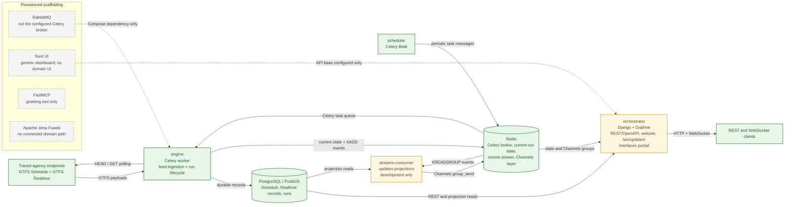

# Infobús®

**Infobús®** is a public transit information system for acquiring, storing, and distributing GTFS Schedule and GTFS Realtime data. Its connected backend paths poll agency feeds on a schedule, persist durable feed and run records, maintain current run state in Redis, and provide schedule-oriented REST resources plus topic-based WebSocket updates. The system is still evolving, and this documentation labels partial and scaffolding components explicitly.

!!! warning "Work in Progress"

    Infobús® and this documentation are under active development, and components have different levels of maturity. Where `AGENTS.md`, `ARCHITECTURE.md`, or the root `README.md` disagree with executable code and configuration, this documentation follows the code. See [Decisions and Limitations](decisions-limitations.md) for current gaps and deliberate trade-offs.

## How it fits together

Green nodes and solid arrows represent implemented code paths. Amber nodes identify partial interfaces or production deployment gaps. Gray dashed nodes are provisioned scaffolding without a connected Infobús® domain path; dotted arrows represent configuration or container dependencies rather than an active data flow.

GTFS Realtime enters Infobús® through HTTP polling: Celery Beat dispatches the Realtime fan-out every 30 seconds (`backend/infobus/celery.py:37-39`); upstream agencies do not push into the platform. Redis—not the provisioned RabbitMQ container—is the configured Celery broker and also carries current run state, the `events` stream, and the Channels layer. The `updates` stream consumer exists as a separate development service, but it is absent from production Compose, so the event-to-WebSocket path should be treated as partial rather than production-ready.

## Start here

-   :lucide-lightbulb:{ .lg .middle } **Core concepts**

    ---

    Learn the vocabulary and domain boundaries used throughout Infobús®.

    [:octicons-arrow-right-24: Concepts](concepts.md)

-   :lucide-network:{ .lg .middle } **System architecture**

    ---

    See how the runtime services fit together, then examine the responsibilities and maturity of the Django applications.

    [:octicons-arrow-right-24: Architecture](architecture.md) ·
    [Django Applications](django-applications.md)

-   :lucide-database:{ .lg .middle } **Transit data**

    ---

    Follow acquisition and storage separately for static schedules and frequently polled Realtime feeds.

    [:octicons-arrow-right-24: GTFS Schedule](gtfs-schedule.md) ·
    [GTFS Realtime](gtfs-realtime.md)

-   :lucide-radio:{ .lg .middle } **Live data flow**

    ---

    Understand how observations become runs, lifecycle transitions, Redis events, projections, and topic-based WebSocket snapshots.

    [:octicons-arrow-right-24: Runs and Lifecycle](runs-lifecycle.md) ·
    [Updates and WebSockets](updates-websockets.md)

-   :lucide-plug:{ .lg .middle } **Interfaces**

    ---

    Review routed REST resources, query endpoints, the OpenAPI and Redoc surface, and known contract drift.

    [:octicons-arrow-right-24: API and OpenAPI](api-openapi.md)

-   :lucide-terminal:{ .lg .middle } **Operations**

    ---

    Set up the local environment and understand production services, domains, persistence, and operational gaps.

    [:octicons-arrow-right-24: Local Development](local-development.md) ·
    [Deployment and Operations](deployment-operations.md)

-   :lucide-flask-conical:{ .lg .middle } **Quality and trade-offs**

    ---

    See the current testing surface and the decisions, constraints, and incomplete paths that affect system behavior.

    [:octicons-arrow-right-24: Testing](testing.md) ·
    [Decisions and Limitations](decisions-limitations.md)

---

Infobús® is developed by [SIMOVI Lab](https://simovilab.org) at the [University of Costa Rica](https://www.ucr.ac.cr/). [Source code and contributions](https://github.com/simovilab/infobus).
